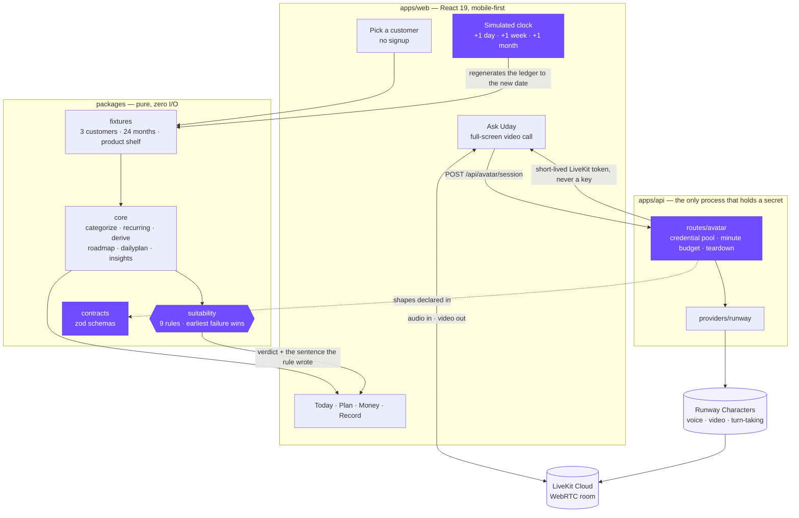
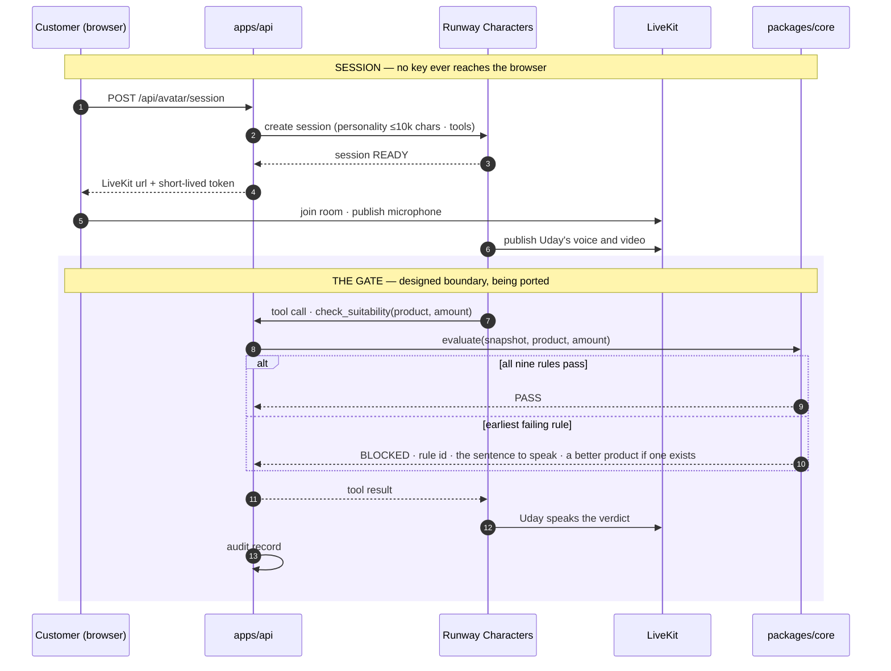
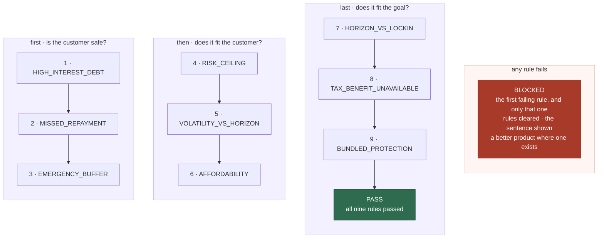
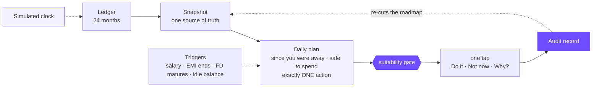
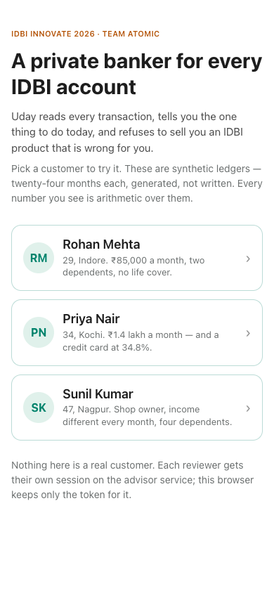
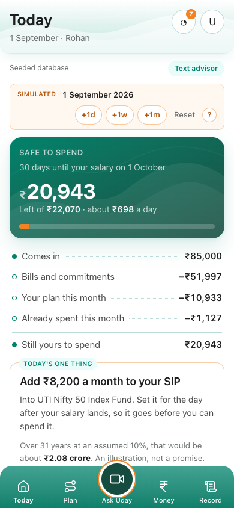
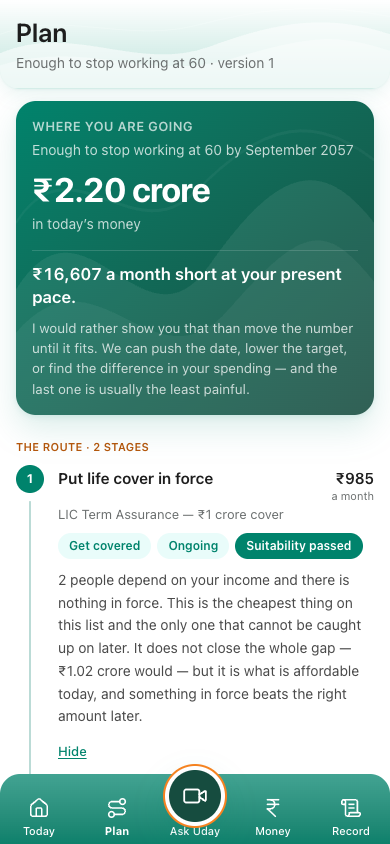
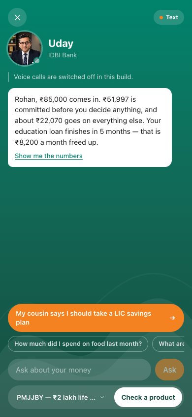
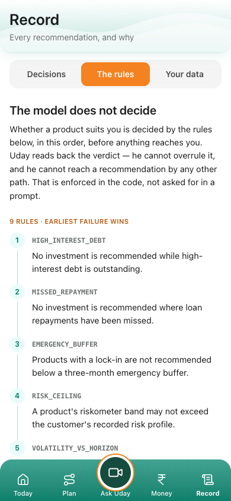

# dhan-sarthi

> A wealth advisor for the IDBI customer no relationship manager can afford to serve. It reads **twenty-four months of transactions**, tells the customer **the one thing to do today**, and **refuses to sell an IDBI product when that product is wrong for them**. Nine **deterministic suitability rules** sit between the advice and the shelf; every verdict leaves an **audit record**. The face and voice are a live **photorealistic avatar**; the decisions are never his.


> [!TIP]
> **Try it in two minutes.** `pnpm install && pnpm dev:web`, open the phone-sized page, pick
> **Rohan**. Press **+1 month** on the simulated clock and watch the plan re-cut itself. Open
> **Record → The rules** to see the nine rules and the two shelf products marked *Refused*. Ask
> Uday about "the LIC plan my cousin recommends" and he will refuse it, on the record.

> [!NOTE]
> Every customer, transaction and balance in this repository is synthetic, generated from a seed by
> `packages/fixtures`. No IDBI data, no personal data. The app runs end to end with no server and
> no API keys; only the live avatar call needs the API and a Runway credential.

---

## Architecture

Three rules decide where code goes. **Secrets and provider calls live only in `apps/api`**, so a
key can never reach a browser. **Decisions live only in `packages/core`, which does no I/O**, so
the suitability rules can be exercised and audited without standing anything up. **A route may not
return a shape not declared in `packages/contracts`.** The four pieces in **purple** are where the
interesting decisions live: the rules, the contracts, the one process allowed to hold a secret,
and the clock that lets a reviewer verify time-dependent behaviour in seconds.



### One avatar call

The avatar phrases; it does not judge. The tool boundary below is the design the repository is
built around: the deterministic screens already run every product action through the gate, and
registering the same gate as a Runway tool is the next port from the archived prototype.



Reasoning behind every decision, with what it costs to reverse, is in
**[docs/product/decisions.md](docs/product/decisions.md)**. The product spine is
**[docs/product/autopilot.md](docs/product/autopilot.md)**. Provider behaviour we verified against
billed sessions is in **[docs/engineering/runway.md](docs/engineering/runway.md)**.

---

## How a recommendation is decided

Nine rules as data, evaluated left to right and top to bottom. A product and a monthly amount go
in; the earliest failing rule is the one reported, and each rule writes both the sentence the
customer hears and the line the record keeps.



| # | Rule | Fires when | What the customer hears |
|---|---|---|---|
| 1 | `HIGH_INTEREST_DEBT` | any loan at 24% or more is outstanding | Not yet. You are paying 42% on the card; nothing on this shelf beats clearing that. |
| 2 | `MISSED_REPAYMENT` | a repayment is overdue | Let's not start anything this month. Bring the loan current first. |
| 3 | `EMERGENCY_BUFFER` | under three months of outflow in reach, and the product has a lock-in | Something with no lock-in first: a sweep-in deposit or a liquid fund. |
| 4 | `RISK_CEILING` | the product's riskometer band exceeds the recorded risk profile | That sits above the risk level on your profile. |
| 5 | `VOLATILITY_VS_HORIZON` | equity for a goal under three years away | Money you need in two years should not be in something that can fall. |
| 6 | `AFFORDABILITY` | the amount exceeds what the ledger says can be committed monthly | You said ₹10,000. I would take ₹6,000. |
| 7 | `HORIZON_VS_LOCKIN` | the lock-in outlasts the goal | Wrong shape for this goal. |
| 8 | `TAX_BENEFIT_UNAVAILABLE` | an ELSS for a customer on the new tax regime | Its only advantage is a deduction you cannot claim. |
| 9 | `BUNDLED_PROTECTION` | a product bundles cover and investment at twice the cost of term cover plus a fund | No. It costs about three times what a term plan costs for the same cover. IDBI sells this one, and I am still telling you not to buy it. |

Pure protection (term, health, the government schemes) is exempt from rules 1 to 3, because a
customer in debt with dependents needs cover more, not less. A ULIP is not protection, so every
rule applies to it.

---

## A day on Autopilot

Cleo moves money on its own. A bank cannot. So: Autopilot with the customer's hand on the wheel,
and every turn recorded.



Deployment decisions happen only on triggers; the daily loop is awareness. Every figure on every
screen is arithmetic over the ledger. Nothing is typed alongside the data.

---

## See it

| Pick | Today | Plan | Ask Uday | The rules |
|---|---|---|---|---|
|  |  |  |  |  |

Three customers, each chosen so a different rule fires:

| Customer | Who | What Sarthi finds |
|---|---|---|
| **Rohan Mehta** | 29, Indore. ₹85,000 a month, two dependents, no life cover | ₹1,22,841 has sat idle for eleven months; the education loan ends in five; a forgotten gym membership; and when his cousin's LIC ULIP comes up, **rule 9 refuses it** and offers term cover at ₹880 instead |
| **Priya Nair** | 34, Kochi. ₹1.4 lakh a month, a credit card revolving at 42% | Every investment is blocked by **rule 1** until the card is cleared; protection at ₹37 a month still passes |
| **Sunil Kumar** | 47, Nagpur. Shop owner, income different every month, four dependents | A missed instalment blocks every investment by **rule 2**; cover passes; the buffer, not equity, is the first job |

Advance the simulated clock and the ledger produces the days it always had: the loan actually
ends, the roadmap is re-cut, and nothing is scripted.

---

## What it does

| Area | How |
|---|---|
| **Enrichment** | Raw bank narrations → merchant and category by an ordered dictionary with whole-word matching, confidence recorded per transaction. |
| **Recurring detection** | Commitments inferred from periodicity, amount variance and day spread, never from a flag production will not have. Price rises detected; subscriptions costed per year. |
| **The snapshot** | Medians over complete months → income, commitments, discretionary spend and its drift, idle floor, buffer, debt, protection gap, and a **deployable surplus** net of irregular costs. One object every screen and the avatar read. |
| **Suitability** | Nine ordered rules over the snapshot and the shelf. `PASS` or `BLOCKED` with the rule, the rules cleared, the sentence, and an alternative. |
| **Roadmap** | Free up → get cover → clear debt → build buffer → grow, protection deliberately first; versioned, with the reason each version changed. |
| **Projections** | Always a band: cautious, assumed and optimistic rates, the rate visible and adjustable, a real-terms line at 5.5% inflation, and a disclaimer on every one. |
| **Daily plan** | Safe-to-spend as a pot and a per-day rate, what happened since last time, and exactly one primary action from a closed vocabulary of thirteen. |
| **The avatar** | Runway Characters owns voice, video and turn-taking over LiveKit. The API pools credentials, caps minutes per day, tears down on every path. The first five seconds have no video, so the portrait waits in a designed state. |
| **Fallback ladder** | Live avatar → an honest "Uday is with another customer" with text → fully deterministic phrasing from `packages/core`. A spinner is not a fallback. |
| **The record** | Every rule in plain English, the whole shelf including the products that will be refused, and every decision the customer took with the figures it rested on. |

---

## Design decisions (the short version)

| Topic | Decision | Rejected |
|---|---|---|
| Suitability | nine ordered deterministic rules behind a tool boundary | "be compliant" as a prompt instruction |
| Where the rules run | `packages/core`, zero I/O, provable with `pnpm test` | inside the API, reachable only with a server up |
| The avatar | Runway Characters owns voice, video and turn-taking | our own TTS plus a lip-sync pipeline |
| Context | pulled by the model through tools during the call | stuffed into the personality string up front |
| Autonomy | propose → gate → one-tap consent → record | Cleo-style automatic money movement |
| Projections | three-scenario band, adjustable rate, real-terms line | one confident corpus number |
| Actions | closed vocabulary of thirteen, `cover_bill` deliberately excluded | free text from the model |
| Failure | three tiers, the last fully deterministic | a spinner |
| Fonts | system stack, so the ₹ glyph always renders and first paint never waits | self-hosted or Google webfonts |
| Time | a visible simulated clock the reviewer operates | mocked notifications |

Each row is unpacked in [docs/product/decisions.md](docs/product/decisions.md).

---

## What the engine guarantees

Held by `pnpm test` over the three generated ledgers, with no provider configured:

| Guarantee | How it is held |
|---|---|
| Determinism | same seed → identical ledger on any machine |
| Coherence | running balance continuous and never negative; salary lands before spending |
| Time machine | days generated live are identical to the same days generated as history |
| Every rupee once | income, commitments, discretionary and unexplained partition the ledger exactly |
| Honest surplus | predicted surplus within 0.5×–1.8× of what the balance actually did |
| The refusal | the ULIP is `BLOCKED` by `BUNDLED_PROTECTION` and term cover is named as the alternative |
| Recognition | categorisation coverage above 98% with zero disagreements against the bank's own labels |
| Tests | **54 passing** · generator 20 · engine 21 · suitability 13 |

---

## What is real, what is simulated, what is known to be missing

**Real.** The deterministic engine and its tests. The live photorealistic avatar over WebRTC,
verified rendering at 1088×704 and about 26 fps in a real browser. The credential pool, daily
minute budget and teardown in the API. Every screen, running offline.

**Simulated.** The three customers and their twenty-four months of transactions. The product
shelf, built from IDBI's public pages, with rates and premiums marked `[verify]` where we could
not confirm them. Consent and execution, which write to the record but move no money.

**Known to be missing.** The `check_suitability` tool registration on the avatar path, so today the
avatar is asked by its brief to defer to the rules rather than forced to. Persistence of the audit
record beyond the browser session. A typed conversation for the second tier of the fallback.
Barge-in, which Runway documents nowhere and we do not claim. Hindi, which the engine is built to
take as a data file and the build does not yet ship. One concurrent avatar session on the current
Runway tier.

### Data

All customers, accounts, transactions, balances and identifiers are generated by the seeded
generator in `packages/fixtures`. There is no IDBI customer data and no personal data in this
repository. Names, cities and merchants are illustrative.

### Regulatory posture

Dhan Sarthi is a prototype. It is not a SEBI-registered investment adviser and does not give
investment advice. The engine implements the product-appropriateness check a distributor already
performs and records each verdict in a form designed for five-year retention. Nothing here has
been reviewed by IDBI's compliance function or any regulator.

---

## Run

Node 22 or newer. pnpm switches to the pinned version on its own.

```bash
pnpm install
pnpm dev:web                              # web → http://localhost:5173 · no keys, no server
```

```bash
cp .env.example apps/api/.env             # RUNWAY_API_KEY and RUNWAY_CHARACTER_ID for the live call
pnpm dev                                  # api → :3001 · web → :5173, /api proxied
```

```bash
pnpm test                                 # builds packages, then 54 tests · rules · ledger · time machine
pnpm --filter @dhan/fixtures summary      # the three customers' numbers, re-derived from the ledger
```

---

## API

| Method | Endpoint | Description |
|---|---|---|
| GET | `/api/health` | Liveness, and whether an avatar credential is configured. |
| GET | `/api/avatar/status` | Credentials, held leases, minutes used and left today. |
| GET | `/api/avatar/check` | Verifies the Runway credential without billing a session. |
| POST | `/api/avatar/session` | Creates a session and returns a LiveKit url and short-lived token. 409 when Uday is busy, 429 when the day's budget is spent, 503 when unconfigured. |
| POST | `/api/avatar/session/:id/end` | Releases the lease and cancels the Runway session. Always 204. |
| POST | `/api/avatar/release-all` | Operator escape hatch: cancels every held session. |

---

## Project layout

```
apps/
  web/                          React 19 + Vite 6 + Tailwind 4, mobile-first
    src/screens/                Pick · Today · Plan · Ask · Money · Record
    src/lib/                    view (engine in the browser) · session · avatar (LiveKit) · money
    src/components/             Clock · TabBar · ui primitives
  api/                          Fastify 5 — the only process that holds a secret
    src/routes/avatar.ts        credential pool · daily minute budget · reaper · teardown
    src/providers/runway.ts     Runway Characters transport
packages/
  core/                         pure engine — categorize · recurring · derive · suitability
                                · projection · roadmap · insights · dailyplan · actions · query
  contracts/                    request/response schemas (zod)
  fixtures/                     3 seeded customers · 24 months · product shelf · 54 tests
docs/                           product reasoning · Runway findings · IDBI integration spec · submission
```

[CONTRIBUTING.md](CONTRIBUTING.md) is the engineering contract: where code goes, the invariant
that matters most, conventions, and what is still to port.

---

## Team

Team Atomic: Krishna Faujdar · Rajveer Bishnoi · Mohit Kumar. Built for IDBI Innovate 2026,
Problem Statement 1, Digital Wealth Management.

Copyright © 2026 Team Atomic. All rights reserved. Submitted to IDBI Innovate 2026 under the event
terms; no other licence is granted.
