<div align="center">

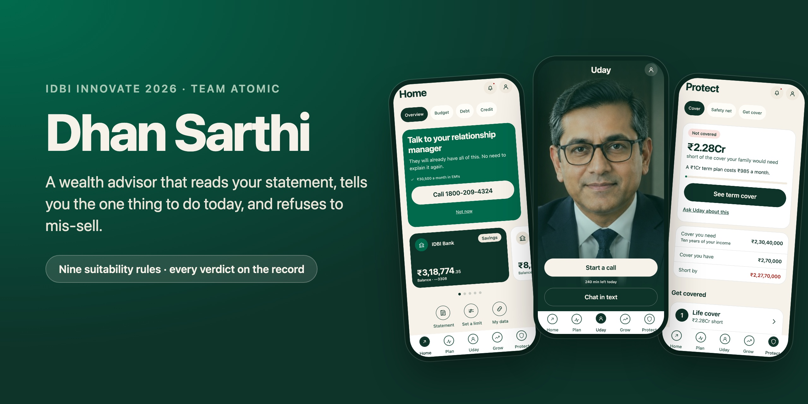

<h3>A wealth advisor for the IDBI customer no relationship manager can afford to serve.</h3>

**[Open the live app](https://d31q2ik7f7eu67.cloudfront.net)** · [How it decides](#how-a-recommendation-is-decided) · [Architecture](#architecture) · [Run it locally](#run-it-locally) · [Docs](docs/README.md)

[](https://github.com/dhan-sarthi/dhan-sarthi/actions/workflows/ci.yml)


<br>


</div>

---

Dhan Sarthi reads **twenty-four months of a customer's transactions**, tells them **the one thing to
do today**, and **refuses to sell an IDBI product when that product is wrong for them**. Nine
**deterministic suitability rules** sit between the advice and the shelf, and every verdict leaves
an **audit record** sealed against the one before it. The face and voice are **Uday**, a live
photorealistic avatar; the decisions are never his.

Built by Team Atomic for **IDBI Innovate 2026**, Problem Statement 1: Digital Wealth Management.

> [!TIP]
> **Try it in two minutes.** Open **[the live app](https://d31q2ik7f7eu67.cloudfront.net)** on a
> phone (a desktop browser shows it in a phone frame). Tap **Get started**, pick **Karan** from the
> demo customers under the phone number, and type any six digits as the code. Then:
>
> - **Home → Credit** shows what his IDBI file says about his credit, and what his card costs him.
> - **Plan** shows the route: clear the 34.8% card first, in 11 months at ₹21,516 a month.
> - **Uday → Chat in text**, ask *"Should I buy the LIC ULIP my cousin recommends?"* and he refuses
>   it, on the record: *"IDBI sells it and I am still telling you not to buy it."*
> - **Profile (top right) → Your record → Rules** lists the nine rules. The record's **Consent**
>   pane holds the simulation clock: **+30 days** moves time forward and the plan re-cuts itself.

> [!NOTE]
> Every customer, transaction and balance here is synthetic, generated from a seed by
> `packages/fixtures`. There is no IDBI customer data and no personal data in this repository.

## See it

<table>
  <tr>
    <td align="center" width="25%"><br><sub><b>Welcome</b> · no questionnaire</sub></td>
    <td align="center" width="25%">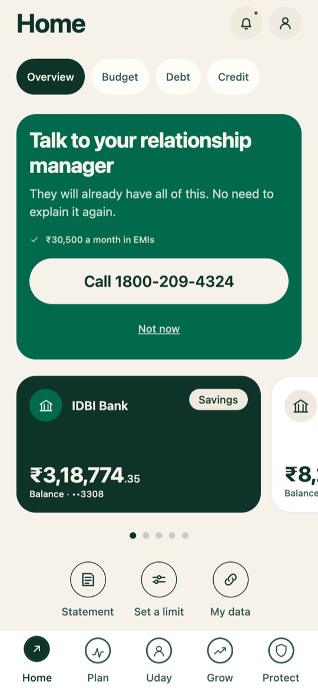<br><sub><b>Home</b> · one thing to do today</sub></td>
    <td align="center" width="25%">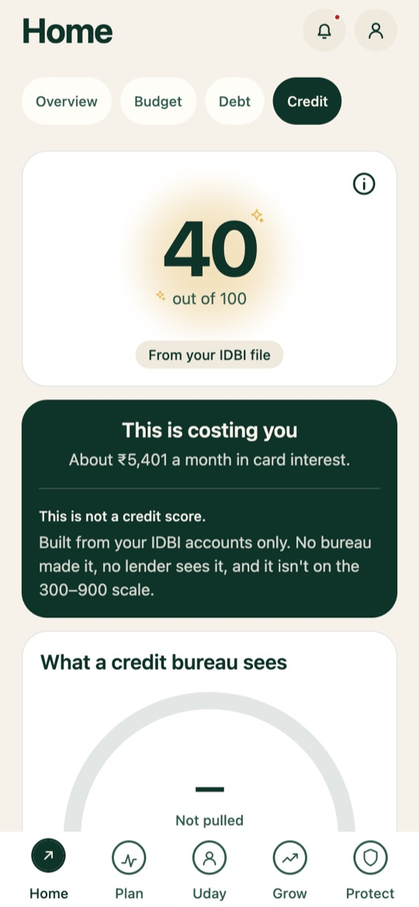<br><sub><b>Credit</b> · what the card costs</sub></td>
    <td align="center" width="25%">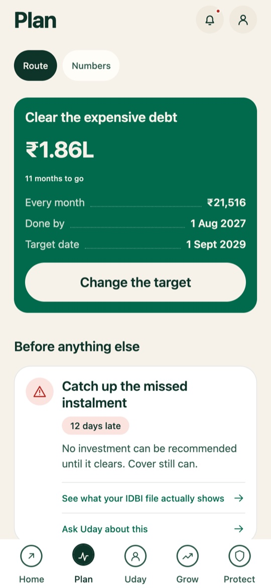<br><sub><b>Plan</b> · the route, in order</sub></td>
  </tr>
  <tr>
    <td align="center"><br><sub><b>Uday</b> · a live video call</sub></td>
    <td align="center">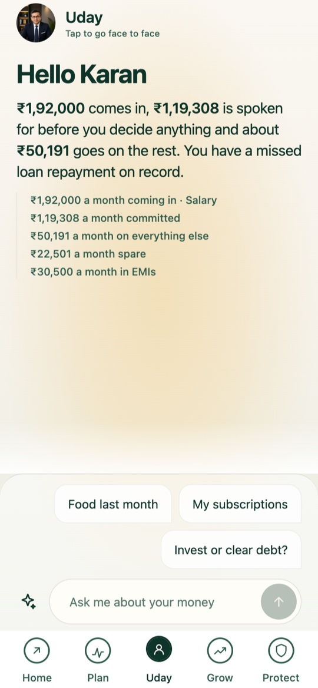<br><sub><b>Uday in text</b> · every figure from the ledger</sub></td>
    <td align="center">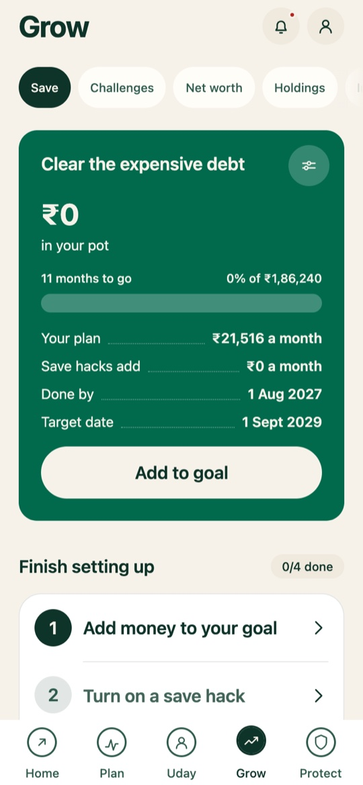<br><sub><b>Grow</b> · a pot behind the goal</sub></td>
    <td align="center">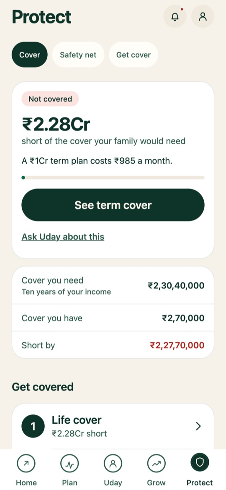<br><sub><b>Protect</b> · the cover gap, priced</sub></td>
  </tr>
</table>

The interaction design is modelled on Cleo AI's, screen by screen, in IDBI green: five tabs
(**Home · Plan · Uday · Grow · Protect**) with Uday in the centre slot where Cleo keeps its chat.

---

## How a recommendation is decided

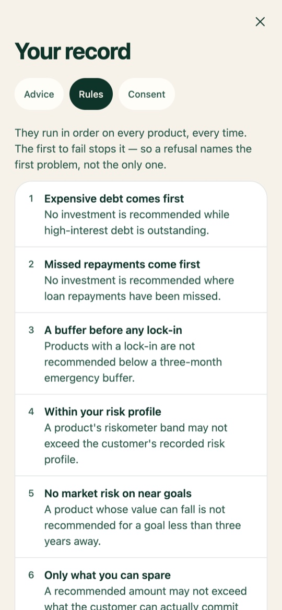

Nine rules as data, evaluated in order. A product and a monthly amount go in; the earliest failing
rule is the one reported, and each rule writes both the sentence the customer hears and the line
the record keeps. The model never decides suitability: it asks these rules through a tool call
and speaks the sentence they wrote.

Pure protection (term, health, the government schemes) is exempt from rules 1 to 3, because a
customer in debt with dependents needs cover more, not less. A ULIP is not protection, so every
rule applies to it.

<br clear="right">

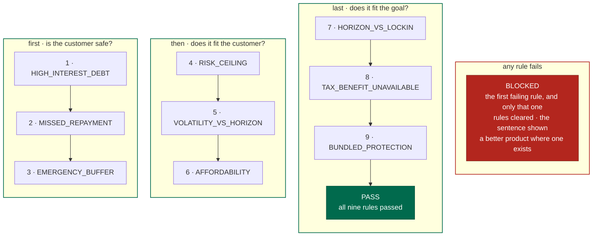

| # | Rule | Fires when | What the customer hears |
|---|---|---|---|
| 1 | `HIGH_INTEREST_DEBT` | any loan at 24% or more is outstanding | Not yet. You are paying 34.8% on ₹1,86,240. Nothing I can sell you returns that much, so clearing it first earns you more. |
| 2 | `MISSED_REPAYMENT` | a repayment is overdue | Not this month. You have a missed repayment on record. Fixing that protects your credit score. |
| 3 | `EMERGENCY_BUFFER` | under three months of outflow in reach, and the product has a lock-in | Something with no lock-in first: a sweep-in deposit or a liquid fund. |
| 4 | `RISK_CEILING` | the product's riskometer band exceeds the recorded risk profile | That is riskier than your profile allows. |
| 5 | `VOLATILITY_VS_HORIZON` | equity for a goal under three years away | Money you need in two years should not be in something that can fall. |
| 6 | `AFFORDABILITY` | the amount exceeds what the ledger says can be committed monthly | You said ₹10,000. I would take ₹6,000. |
| 7 | `HORIZON_VS_LOCKIN` | the lock-in outlasts the goal | Locked for 5 years, and you need it in 3. Wrong fit for this goal. |
| 8 | `TAX_BENEFIT_UNAVAILABLE` | an ELSS for a customer on the new tax regime | Its only advantage is a deduction you cannot claim. |
| 9 | `BUNDLED_PROTECTION` | a product bundles cover and investment at twice the cost of term cover plus a fund | No. It costs 3 times what a term plan costs for the same job, and the charges are hidden inside it. IDBI sells this one and I am still telling you not to buy it. |

---

## The four customers

Four generated customers, in the order the app lists them. Karan is the one the demo is told on
and carries the whole rule set by himself; the other three each exist so that one rule fires
cleanly on its own facts.

| Customer | Who | What Dhan Sarthi finds |
|---|---|---|
| **Karan Deshpande** | 30, Pune. ₹1,92,000 a month, spread over four banks and nine investments, two dependents | ₹12,45,774 of bank balance on one screen for the first time, and a card revolving at 34.8% with ₹1,86,240 on it, so **rule 1 blocks every investment** until it is cleared; the 2019 ULIP he believes is his life cover is refused by **rule 9**; and the ₹5 crore house is refused by **rule 6** on the EMI alone |
| **Rohan Mehta** | 29, Indore. ₹85,000 a month, two dependents, no life cover | ₹1,41,663 has sat idle for a year; the education loan ends in five months; a forgotten gym membership; and when his cousin's LIC ULIP comes up, **rule 9 refuses it** and offers term cover at ₹985 instead |
| **Priya Nair** | 34, Kochi. ₹1.4 lakh a month, a credit card revolving at 34.8% | Every investment is blocked by **rule 1** until the card is cleared; protection at ₹36 a month still passes |
| **Sunil Kumar** | 47, Nagpur. Shop owner, income different every month, four dependents | A missed instalment blocks every investment by **rule 2**; cover passes; the buffer, not equity, is the first job |

Advance the simulated clock and the ledger produces the days it always had: the loan actually
ends, the roadmap is re-cut, and nothing is scripted.

Point the API at `BANK_SOURCE=idbi-sandbox` and the list changes to **Priya Patil** and **Neha
Singh**, the bank's own sandbox customers, read live. Their statements are shorter and thinner than
anything we would have generated, and the screens say so rather than filling the gaps in.

---

## Architecture

Three rules decide where code goes. **Secrets and provider calls live only in `apps/api`**, so a
key can never reach the client. **Decisions live only in `packages/core`, which does no I/O**, so
the suitability rules can be exercised and audited without standing anything up. **A route may not
return a shape not declared in `packages/contracts`.** The green nodes are where the interesting
decisions live.

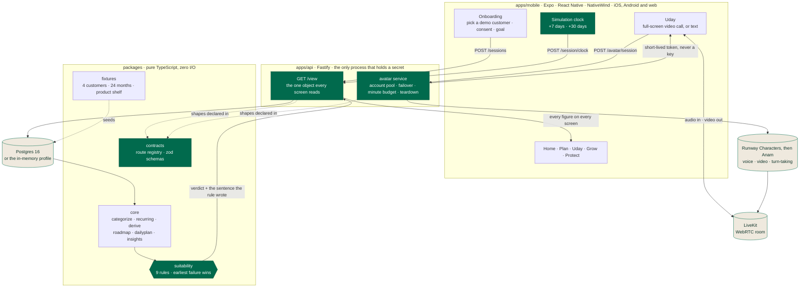

### One avatar call

The avatar phrases; it does not judge. On a live call the model called `check_suitability` for a
product the customer raised, the rules answered in 665 ms, and the customer heard that sentence.
The provider's own record of it is in
[docs/engineering/avatar-live-call.md](docs/engineering/avatar-live-call.md). Uday runs on Runway
Characters and fails over to Anam when an account is out of credit or busy; with neither, the
same engine answers in text.

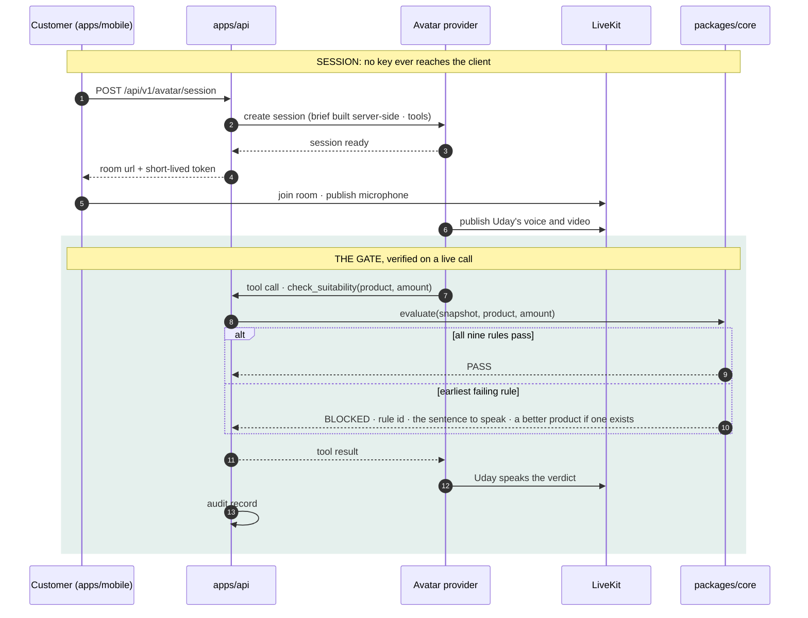

---

## What it does

| Area | How |
|---|---|
| **Enrichment** | Raw bank narrations become merchant and category through an ordered dictionary with whole-word matching; confidence is recorded per transaction. |
| **Recurring detection** | Commitments inferred from periodicity, amount variance and day spread, never from a flag production will not have. Price rises detected; subscriptions costed per year. |
| **The snapshot** | Medians over complete months give income, commitments, discretionary spend and its drift, idle floor, buffer, debt, protection gap, and a **deployable surplus** net of irregular costs. One object every screen and the avatar read. |
| **Accounts elsewhere** | Balances at other banks, arriving through an Account Aggregator consent, sit on the same screen as IDBI's; money swept between the customer's own accounts is recognised and never counted as spending. |
| **Suitability** | Nine ordered rules over the snapshot and the shelf. `PASS` or `BLOCKED` with the rule, the rules cleared, the sentence, and an alternative. |
| **Roadmap** | Free up, get cover, clear debt, build a buffer, grow: protection deliberately first. The customer picks the goal; versioned, with the reason each version changed. |
| **Projections** | Always a band: cautious, assumed and optimistic rates, the rate visible and adjustable, a real-terms line at 5.5% inflation, and a disclaimer on every one. |
| **Daily plan** | Safe-to-spend as a pot and a per-day rate, what happened since last time, and exactly one primary action from a closed vocabulary. |
| **The avatar** | Runway Characters first, Anam as the fallback, over LiveKit. The API pools numbered accounts, benches one that runs out of credit, caps minutes per day, and tears down on every path. |
| **Fallback ladder** | Live avatar, then an honest "Uday is with another customer" with text, then fully deterministic phrasing from `packages/core`. A spinner is not a fallback. |
| **The record** | Every rule in plain English, the whole shelf including the products that will be refused, and every decision the customer took with the figures it rested on, in a hash chain. |

## Design decisions, the short version

| Topic | Decision | Rejected |
|---|---|---|
| Suitability | nine ordered deterministic rules behind a tool boundary | "be compliant" as a prompt instruction |
| Where the rules run | `packages/core`, zero I/O, provable with `pnpm test` | inside the API, reachable only with a server up |
| The avatar | a provider owns voice, video and turn-taking; we own the brief and the tools | our own TTS plus a lip-sync pipeline |
| Context | pulled by the model through tools during the call | stuffed into the personality string up front |
| Autonomy | propose, gate, one-tap consent, record | Cleo-style automatic money movement |
| Projections | three-scenario band, adjustable rate, real-terms line | one confident corpus number |
| Actions | a closed vocabulary, `cover_bill` deliberately excluded | free text from the model |
| Failure | three tiers, the last fully deterministic | a spinner |
| Fonts | system stack, so the ₹ glyph always renders and first paint never waits | self-hosted or Google webfonts |
| Time | a visible simulated clock the reviewer operates | mocked notifications |

Each row is unpacked in [docs/product/decisions.md](docs/product/decisions.md).

## What the engine guarantees

Held by `pnpm test` over the four generated ledgers, with no provider configured:

| Guarantee | How it is held |
|---|---|
| Determinism | same seed, identical ledger on any machine |
| Coherence | running balance continuous and never negative; salary lands before spending |
| Time machine | days generated live are identical to the same days generated as history |
| Every rupee once | income, commitments, discretionary and unexplained partition the ledger exactly |
| Honest surplus | predicted surplus within 0.5× to 1.8× of what the balance actually did |
| The refusal | the ULIP is `BLOCKED` by `BUNDLED_PROTECTION` and term cover is named as the alternative |
| Recognition | categorisation coverage above 98% with zero disagreements against the bank's own labels |
| Statement realism | every narration matches a declared rail template; the account's IFSC is IDBI's and the salary remitter's is the employer's; MCC on every merchant line and on nothing else |
| Calibration | UPI debits per month, ticket distribution and the share of payments under ₹500 stay inside bands cited to NPCI and the RBI Payment System Report |
| Two data paths, one answer | the in-memory profile and Postgres load the same customer file for every customer at six clock positions (CI's Postgres job) |
| Tests | **865 passing**: core 218 · contracts 25 · fixtures 171 · api 256 · mobile 195, plus **73** Postgres integration tests that CI runs against a fresh database on every push to `main` |

---

## Deployment

The app is live on AWS in `ap-south-1` at
**[d31q2ik7f7eu67.cloudfront.net](https://d31q2ik7f7eu67.cloudfront.net)**, deployed from
[`infra/terraform`](infra/terraform) with the scripts in [`infra/scripts`](infra/scripts).

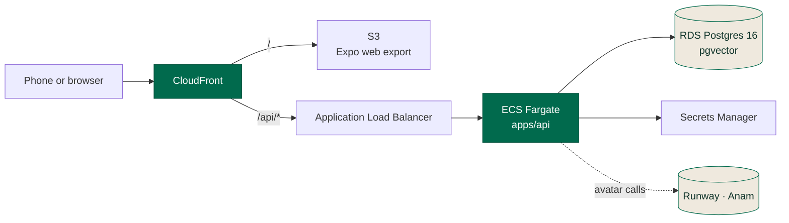

A release is four scripts: `deploy-api.sh` builds and rolls the API image, `seed-remote.sh` runs the
migrations and the reseed as a one-off task, `deploy-web.sh` publishes the web export, and
`smoke.sh` checks health, customers, a session, a view, a decision, the record chain and avatar
availability against the live URL. The runbook, from an empty account to a running deployment, is
[`infra/terraform/README.md`](infra/terraform/README.md).

---

## What is real, what is simulated, what is known to be missing

**Real.** The deterministic engine and its tests. The suitability gate on both paths: the screens
run every action through it, and on a live avatar call the model called the tool and spoke the
verdict our rules wrote. The live photorealistic avatar over WebRTC. The account pool, daily
minute budget and teardown in the API. The deployment on AWS. Every screen, served by the API.

**Real, and the reason this build exists.** The IDBI sandbox. Twenty-four operations across
twenty-nine paths, mapped from forty-two captured bodies rather than from the specification,
which described a shape the sandbox does not send. Two of the bank's own customers, read live:
their accounts, liens, loans, statements and consents. The six-call Account Aggregator flow,
including the webhook the bank posts back at us and the rule that a notification grants nothing
until 591 confirms it. And 428, so a recommendation somebody accepts becomes a lead the bank's
staff will work.

**Simulated.** The four customers and their twenty-four months of transactions, generated against
NPCI narration grammar, IDBI's own IFSC prefix, rate card and schedule of fees, and the published
UPI ticket distribution, with every constant cited in
[`docs/engineering/data-calibration.md`](docs/engineering/data-calibration.md). The product shelf,
built from IDBI's public pages, with rates and premiums marked `[verify]` where we could not
confirm them. Consent and execution, which write to the record but move no money.

**Known to be missing.** A guarantee that the model calls the tool on *every* turn: no provider
offers one, so we reconcile the provider's transcript against our own tool ledger after each call
and record the coverage rather than assume it. Barge-in, which Runway documents nowhere and we do
not claim. And three blocks IDBI's catalogue has no operation for at all (declared income, what the
customer already owns, and anything a consent has not reached), which the app asks for and labels
as declared everywhere it is used.

### Regulatory posture

Dhan Sarthi is a prototype. It is not a SEBI-registered investment adviser and does not give
investment advice. The engine implements the product-appropriateness check a distributor already
performs and records each verdict in a form designed for five-year retention. Nothing here has
been reviewed by IDBI's compliance function or any regulator.

---

## Run it locally

Node 22 or newer; pnpm switches to the pinned version on its own. No database and no keys needed:

```bash
pnpm install
BANK_SOURCE=memory AVATAR_PROVIDER=none pnpm dev:api   # API on :3001, the four customers from memory
pnpm --filter @dhan/mobile start                       # Expo: press w for the browser, or scan for a device
```

With Postgres and the live avatar:

```bash
docker compose up -d postgres                          # pgvector/pg16 on :5433, or use a shared Postgres
cp .env.example apps/api/.env                          # set DATABASE_URL; RUNWAY_API_KEY_1 / ANAM_API_KEY_1 for calls
pnpm --filter @dhan/api migrate && pnpm --filter @dhan/api seed
BANK_SOURCE=postgres AVATAR_PROVIDER=runway,anam pnpm dev:api
```

On IDBI's own sandbox data. Off the bank's IP allow-list, leave `IDBI_API_BASE` unset and the
adapter replays the captured responses in process: IDBI's own bytes, and the same numbers the live
sandbox gives.

```bash
BANK_SOURCE=idbi-sandbox AVATAR_PROVIDER=none pnpm dev:api
```

Checks:

```bash
pnpm test                                    # builds packages, then all 865 tests
pnpm lint && pnpm typecheck && pnpm format:check
pnpm --filter @dhan/api seed:check           # the database still matches the generator, by hash
curl -s localhost:3001/api/v1/openapi.json   # every route, generated from the registry
```

What the sandbox actually returns, and every trap in it, is
[`docs/integration/idbi-sandbox.md`](docs/integration/idbi-sandbox.md).

## API

Fifty-two routes, all under `/api/v1`, every one declared in `packages/contracts/src/registry.ts`,
which also generates the OpenAPI document, the client's types and the route tests, so a route that
is not in the registry cannot exist. The full table is
[`docs/architecture/DATA-AND-API.md`](docs/architecture/DATA-AND-API.md); a test walks it against
the registry in both directions so it cannot drift.

| Group | Routes | What they are for |
|---|---|---|
| Session | `POST /sessions` · `GET/DELETE /session` · `/session/clock` · `/session/goal` · `/session/caps` · `/session/consent` | A reviewer's own isolated session: its clock, its goal, its limits, its consent. |
| The view | `GET /view` · `GET /transactions` | The one object every screen reads, and the statement a page at a time. |
| Advice | `POST /actions/:id/decision` · `POST /suitability/evaluate` · `POST /ask` · `GET /ask/suggestions` | The gate, the decision, and the conversation. |
| The record | `GET /record` · `GET /record/verify` | The audit trail and its hash chain. |
| What the bank cannot answer | `/profile` · `/holdings` | The declared blocks no IDBI operation carries. |
| Account Aggregator | `/consent/aa` and its two IDBI webhooks | The six-call consent flow, verified before it grants anything. |
| The avatar | `/avatar/availability` · `/avatar/session` · the waitlist · the call record | Account pool, daily minute budget, reaper, teardown. |
| Operator | `/operator/avatar/status` · `/operator/seed` · `/operator/mapping-report` | Behind `X-Operator-Key`. |

## Project layout

```
apps/
  mobile/                       Expo + Expo Router + NativeWind: the product, and the only client
    app/(onboarding)/           welcome · mobile · otp · consent · reading · checklist · about · goal
                                · risk · ready
    app/(tabs)/                 Home (spend.tsx) · Plan · Uday · Grow · Protect
    app/                        detail routes: record · credit · profile · statement · challenge …
    src/api/                    client (typed from the registry) · storage (the bearer, and nothing else)
    src/avatar/                 the call: one transport per provider SDK
    src/screens/                screens shared by a tab and a route (CreditContent)
    src/ui/                     Text (eight type roles) · Sheet · Checklist · ScoreGlow · … · interop.ts
  api/                          Fastify 5: the only process that holds a secret
    src/application/            the services: advisory · decision · record · session · aa-consent · avatar
    src/adapters/idbi-sandbox/  the bank, written from 42 captured bodies rather than from the spec
    src/adapters/postgres/      the same ports over RDS; migrations in apps/api/migrations
    src/adapters/memory/        the same ports with no database
packages/
  core/                         pure engine: categorize · recurring · derive · suitability · projection
                                · roadmap · insights · dailyplan · actions · query
  contracts/                    the route registry and the zod domain
  fixtures/                     4 generated customers · 24 months · product shelf
  design/                       tokens.json, consumed as runtime values and as the NativeWind preset
  assets/                       generated imagery: icons, merchant marks, portraits
infra/
  terraform/                    VPC · ECS Fargate · RDS · S3 + CloudFront · Secrets Manager · alarms
  scripts/                      deploy-api · seed-remote · deploy-web · smoke
docs/                           product reasoning · architecture · provider findings · IDBI integration
```

[CONTRIBUTING.md](CONTRIBUTING.md) is the engineering contract: where code goes, the design system,
the invariant that matters most, and how tests are laid out.
[docs/README.md](docs/README.md) is the reading order for everything else.

---

## Team

**Team Atomic:** Krishna Faujdar · Rajveer Bishnoi · Mohit Kumar. Built for IDBI Innovate 2026,
Problem Statement 1, Digital Wealth Management.

Copyright © 2026 Team Atomic. All rights reserved. Submitted to IDBI Innovate 2026 under the event
terms; no other licence is granted.
