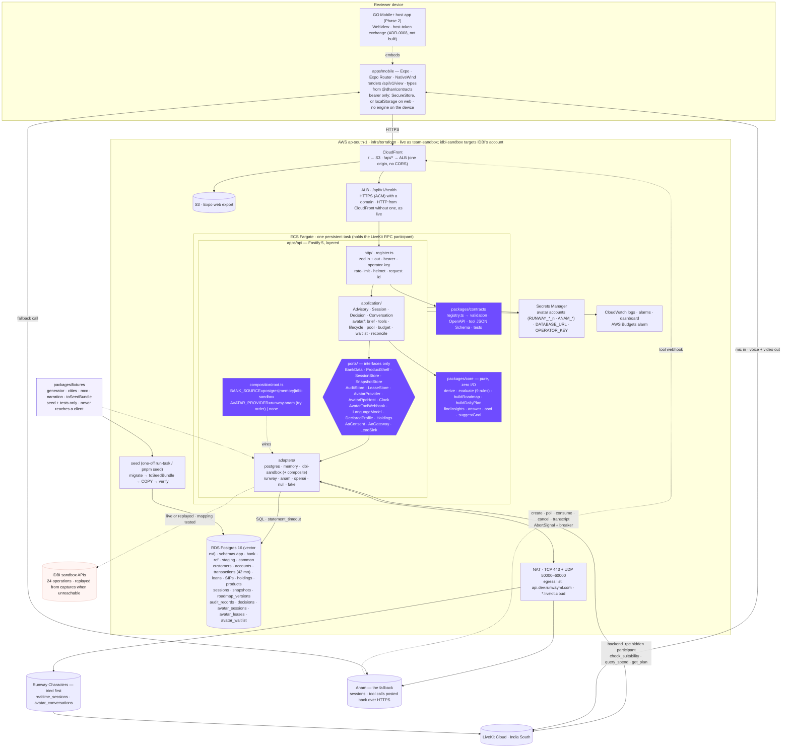

# High-level design

This document is the shape of the system: where the advisory engine runs, where data lives, what
the API owns, how the avatar is gated, and how the whole thing is deployed into an AWS account in
`ap-south-1`. It is written for an engineer at IDBI who wants to know, in one sitting, what runs
where and why. The module-level detail is in [`LLD.md`](LLD.md), the request flows in
[`lifecycles.md`](lifecycles.md), the tables and routes in [`DATA-AND-API.md`](DATA-AND-API.md),
and the reasoning behind each decision in [`adr/`](adr/).

Status: adopted 3 September 2026 · amended 2026-09-20 (the client changed, and the
`AvatarProvider` listing was re-read off the port) · amended 2026-09-22 (the folder tree, the
port list, CI and the live deployment; see below).

> **Amendment, 2026-09-20 — there is one client, and it is `apps/mobile`.** `apps/web` has been
> deleted from the repository; the Expo app is the product. Everything in this document about the
> engine, the API, the ports, the adapters, the data and the deployment stands as adopted — the
> change is on the client side of the ALB, not behind it. The sections below that describe a
> client have been corrected to describe the one that exists; the **Starting point** section is
> left exactly as adopted, because it is a record of 3 September and not a claim about today.
> The badged offline tier went with the app it lived in: see the amendments on
> [ADR-0001](adr/ADR-0001.md) and [ADR-0011](adr/ADR-0011.md).
>
> The one thing behind the ALB that did move is the **`AvatarProvider` and `AvatarRpcHost`
> listing** under *Ports*, which still published the signatures as adopted after
> [ADR-0013](adr/ADR-0013.md) had renamed and narrowed them. Both blocks are now read off
> `apps/api/src/ports/avatar-provider.port.ts` and `avatar-rpc-host.port.ts`, and the adapter
> tables gain the second provider that ADR brought in. A port listing that does not compile
> against the port is worse than no listing, because it is believed.
>
> **Amendment, 2026-09-22.** "Stands as adopted" held for the design and not for its listings.
> The folder tree still named seven migrations by names they never had (there are thirteen), nine
> of the sixteen ports, no Anam or model adapter, CI jobs that were never added, and a
> `cli/replay.ts` and an `infra/fault-inject.ts` that were never written. Those lines are
> corrected in place, and the requirements that leaned on those two files, on a TLS hop the live
> stack does not have, on load results nobody committed or on a minutes alarm no metric feeds now
> say so. The deployment is no longer only a design: the team-sandbox stack is live at
> https://d31q2ik7f7eu67.cloudfront.net.

## Starting point

At adoption the product is a static site. `apps/web/src/lib/view.ts` imports `@dhan/core` and
`@dhan/fixtures`, calls `generateCustomerFile(spec, {anchor, asOf, months: 24})` in the browser,
keeps the simulated clock, caps, goal override and accepted/declined ids in
`localStorage['dhan.session.v1']`, and `App.tsx` holds the audit trail in
`useState<AuditEntry[]>`. `apps/api` is a Runway broker only: `routes/avatar.ts` reads
`process.env`, pools credentials in a `Map`, meters minutes in module variables, casts `req.body`
without validation and forwards a client-built `personality` (`buildBrief` in `Ask.tsx`) to
`providers/runway.ts`, which never sends `tools`. `packages/contracts/src/index.ts` is
`export {}`. `@fastify/helmet`, `@fastify/rate-limit`, `pg`, `zod`, `@dhan/contracts` and
`@dhan/fixtures` are declared in `apps/api/package.json` and imported nowhere.
`/api/avatar/release-all` and `/api/avatar/status` have no authentication.

## Target architecture

The target moves every figure behind the API without changing the engine's public API.
`packages/core` stays pure and gains two pure modules: `asof.ts` (the as-of arithmetic that lives
inside `generateCustomerFile` at adoption: account aggregates from month-end balances,
`tenureRemaining = remaining − elapsed`, SIP instalments; the generator and every adapter call the
same functions, so parity is by construction) and `goal.ts` (`suggestGoal`, moved from the web
app). `packages/contracts` becomes the route registry: one readonly table of
`{method, path, auth, request, response, errors}` in zod, plus tool schemas, from which Fastify
validation, OpenAPI 3.1, Runway tool JSON Schema and the contract-test matrix are all generated.
`packages/fixtures` keeps its deterministic generator and gains city packs, MCCs, IBKL branch
IFSCs, per-employer remitter IFSCs and `toSeedBundle()`.

`apps/api` becomes a layered hexagon. `http/` parses, authenticates and serialises through
`register.ts`, the only way to add a route. `application/` orchestrates core over ports:
`AdvisoryService.view()` runs `derive → suggestGoal → buildRoadmap → buildDailyPlan → findInsights`
exactly as `buildView` does in the browser at adoption; `DecisionService` re-derives the action
server-side, runs `evaluate()`, appends the advice record, the decision and a new roadmap version
in one transaction; `ConversationService` answers text through `core/query.ts`; `avatar/*` owns
the brief, tools, lifecycle state machine, credential pool, budget, waitlist, RPC host and
transcript reconciliation. `ports/` is interfaces only. `adapters/` has postgres (demo source of
truth), memory (tests, CI, no-database mode, seeded from the same generator), idbi-sandbox (a stub
anti-corruption layer against `docs/integration/data-requirements.md`, composed with fixtures for
holdings, policies and the shelf that IDBI's catalogue lacks), runway, null and fake.
`composition/root.ts` picks adapters by `BANK_SOURCE` and `AVATAR_PROVIDER`; `config.ts` is the
only `process.env` reader.

Postgres holds 42 months of seeded, statement-realistic transactions per customer (anchor
2026-09-01, 24 back, 18 forward) written by `pnpm seed`. Every read is bounded by the session's
`as_of`, so the simulated clock, now a column on `sessions`, reveals rows the ledger always had,
which is the property the generator's anchor-keyed month streams already guarantee. Snapshots are
stored content-addressed by `(cif, as_of, sha256(inputs), engine_version)` and are both the cache
and the compliance artefact; advice records, decisions and roadmap versions are append-only at the
database (REVOKE plus a raising trigger) and hash-chained. Audit rows carry a `subject_id`, never
`cif`, so DPDP erasure deletes a mapping row and touches no audit row.

The avatar path: the brief is built server-side from the same View the screens render;
`check_suitability`, `query_spend` and `get_plan` are `backend_rpc` tools whose handlers are
opened (the LiveKit hidden participant joins) before a grant is ever issued; the lifecycle
state machine makes `issueGrant` from any state other than `gated` a thrown error; every tool call
writes `advice_records (source='avatar_tool')` before returning; after the call the transcript is
fetched with backoff and each tool result is reconciled against our own ledger. The single Tier-1
slot is a Postgres-backed FIFO waitlist with position, ETA and a 20-second claim window; the
deterministic text conversation runs underneath. The daily minute budget is
`sum(minutes_charged)` over `avatar_sessions` for today, so a redeploy cannot reset it.

The client becomes exactly that — a client. `apps/mobile/src/api/client.ts` is typed from the
registry and holds only a bearer token — SecureStore on a device, `localStorage` on the Expo web
build, and nothing else either way (`apps/mobile/src/api/storage.ts`); every screen renders from
what the API returns — `/api/v1/view` above all, with `/record`, `/transactions`, `/save`,
`/challenges` and `/holdings` beside it. It carries no engine at all: there is
no `offline/` chunk, no `VITE_OFFLINE_FALLBACK`, and no build in which `@dhan/fixtures` reaches a
device, so the CI grep that used to assert the fixtures package out of one bundle is no longer the
thing keeping it out — nothing imports it. `@dhan/core` *is* imported, for named helpers and
constants a label is computed from, never to build a View.

**Two tiers, always labelled:** live avatar → honest text over `/ask` and `/suitability/evaluate`
(same engine, same sentences, same advice records). The third rung, the badged local simulation,
lived inside `apps/web` and went with it; [ADR-0011](adr/ADR-0011.md)'s amendment records that the
ladder is now two rungs and why the invariant it protects is unaffected.

Deployment is Terraform to `ap-south-1`: one Fargate task (the RPC host is a held LiveKit
connection, so no Lambda) in a private subnet behind an ALB, NAT with the egress list a bank's
network team would enforce (`api.dev.runwayml.com`, `*.livekit.cloud`, UDP 50000–60000 with
TURN/TLS 443 fallback; the task's security group limits egress by port, not by hostname), RDS
Postgres 16 with the vector extension, S3 + CloudFront serving `/` and `/api/*` from one origin,
Secrets Manager injected at task start, CloudWatch alarms and an AWS Budgets alarm. The same image
runs under `docker compose up` locally, and `BANK_SOURCE=memory AVATAR_PROVIDER=none pnpm dev:api`
runs the API with no database and no keys — the client is a second terminal,
`pnpm --filter @dhan/mobile start`, because `apps/mobile` has no `dev` script and root `pnpm dev`
therefore runs the API and nothing else. An `infra/ec2-compose/` cloud-init covers a
sandbox that grants only the t3.medium the sandbox request asked for. It is live: the
team-sandbox stack, in the team's own AWS account, serves https://d31q2ik7f7eu67.cloudfront.net,
and [`infra/terraform/README.md`](../../infra/terraform/README.md) is its runbook.



The four purple boxes are the seams a bank engineer should read first: the ports (what the
product needs from a bank), the contracts (what the API promises a client), the core (the rules,
pure) and the composition root (the one file that names concrete adapters).

## Folder tree

```text
dhan-sarthi/
├── apps/
│   ├── api/                                  Fastify 5 · the only process with a secret or a provider call
│   │   ├── Dockerfile                        multi-stage · node:22-bookworm-slim (LiveKit native N-API) · non-root · HEALTHCHECK
│   │   ├── migrations/                       plain numbered SQL, applied by src/db/migrate.ts · its README maps every file
│   │   │   ├── 0001_foundation.sql           extensions (vector, pgcrypto) · schemas common, ref, staging, bank, app · roles dhan_migrate, dhan_app
│   │   │   ├── 0002_ref.sql                  products · spend categories · MCC and channel codes · engine versions · suitability_rules
│   │   │   ├── 0003_staging.sql              endpoint registry · field mappings · sync runs · raw payloads · seed_runs
│   │   │   ├── 0004_app_identity.sql         customers · consents · subjects · sessions · idempotency_keys
│   │   │   ├── 0005_bank.sql                 accounts · transactions · loan and deposit snapshots · mandates · mf_holdings · sip_registrations · insurance_policies
│   │   │   ├── 0006_app_engine.sql           snapshots · roadmap_versions · audit_records (hash chain) · decisions · avatar_* · the append-only triggers
│   │   │   ├── 0007_views_security.sql       *_current views · grants · REVOKE UPDATE/DELETE from dhan_app · RLS policies
│   │   │   └── 0008 … 0013                   additive: picker order, goal basis, spend limit, save and challenges, goal kind, other banks
│   │   ├── src/
│   │   │   ├── index.ts                      boot: loadConfig → buildRoot → listen. Nothing else.
│   │   │   ├── config.ts                     the ONLY process.env reader · zod-parsed Config
│   │   │   ├── composition/
│   │   │   │   ├── root.ts                   buildRoot(config): adapters → services → app · constructor injection · startup invariants
│   │   │   │   └── profiles.ts               memory | postgres | idbi-sandbox × an avatar chain (runway, anam) or none · the text model
│   │   │   ├── ports/                        interfaces only · no imports from adapters/ · index.ts is the barrel, its count tested
│   │   │   │   ├── bank-data.port.ts · product-shelf.port.ts · session-store.port.ts · snapshot-store.port.ts
│   │   │   │   ├── audit-store.port.ts · lease-store.port.ts · avatar-provider.port.ts · avatar-rpc-host.port.ts
│   │   │   │   ├── avatar-tool-webhook.port.ts · language-model.port.ts · declared-profile.port.ts · holdings.port.ts
│   │   │   │   ├── aa-consent.port.ts · aa-gateway.port.ts · lead-sink.port.ts
│   │   │   │   └── clock.port.ts
│   │   │   ├── application/                  orchestration · imports core, contracts, ports · never adapters or http
│   │   │   │   ├── advisory.service.ts       view(session): scope → derive → suggestGoal → roadmap → plan → insights · snapshot store
│   │   │   │   ├── session.service.ts        create · advanceClock · resetClock · setGoal · setCategoryCap · setConsent · erase
│   │   │   │   ├── decision.service.ts       re-derive action → evaluate() → advice_record + decision + roadmap_version, one txn
│   │   │   │   ├── conversation.service.ts   /ask over core.answer(), phrased by LanguageModelPort where a key is set · /suitability/evaluate
│   │   │   │   ├── save.service.ts · challenge.service.ts · profile.service.ts · record.service.ts · history.service.ts · operator.service.ts
│   │   │   │   ├── aa-consent.service.ts     590→592→497→593→591→595 · a notification grants nothing; only verify() can make a consent ACTIVE
│   │   │   │   ├── consent-scope.ts          strips CustomerFile blocks not in granted scopes
│   │   │   │   ├── hash.ts                   canonical JSON → sha256 (snapshot input hash, record chain)
│   │   │   │   ├── errors.ts                 DomainError → NotFound · Conflict · Unavailable · BeyondHorizon · Forbidden
│   │   │   │   └── avatar/
│   │   │   │       ├── avatar-session.service.ts   start(session): budget → claim → brief → create → ready → RPC open → consume → grant
│   │   │   │       ├── lifecycle.ts                state machine: claimed → creating → ready → gated → granted → live → ended|reaped|failed
│   │   │   │       ├── brief.builder.ts            build(view): {personality, startScript} · ≤10,000 / ≤2,000 asserted
│   │   │   │       ├── tools/check-suitability.tool.ts · query-spend.tool.ts · get-plan.tool.ts
│   │   │   │       ├── credential-pool.ts · minute-budget.ts · lease-reaper.ts · waitlist.ts
│   │   │   │       ├── provider-router.ts · credential-health.ts · live-calls.ts   the chain: Runway accounts, then Anam
│   │   │   │       ├── transcript.service.ts       GET avatar_conversations with backoff → avatar_sessions.transcript
│   │   │   │       └── reconciler.ts               toolResults ↔ avatar_tool_calls · gate_coverage
│   │   │   ├── adapters/
│   │   │   │   ├── postgres/                 pg Pool (src/db/pool.ts) · SQL template strings · no ORM
│   │   │   │   │   ├── unit-of-work.ts · codes.ts · seed-provenance.postgres.ts
│   │   │   │   │   ├── bank-data.postgres.ts · product-shelf.postgres.ts · session-store.postgres.ts
│   │   │   │   │   └── snapshot-store.postgres.ts · audit-store.postgres.ts · lease-store.postgres.ts
│   │   │   │   ├── memory/                   shipped implementations (no-DB profile) · seeded from toSeedBundle()
│   │   │   │   │   └── declared-profile · holdings · aa-consent   the three blocks no bank endpoint carries
│   │   │   │   ├── idbi-sandbox/             anti-corruption layer · written from 42 captured bodies, not from the spec
│   │   │   │   │   ├── api/transport.ts      one POST per operation · no credential (IP allow-list) · breaker · 3 s read cache · atlas trace on every log line
│   │   │   │   │   ├── api/operations.ts     the 24 real operations: code · op · envelope family · read|write|bureau · paging · variants
│   │   │   │   │   ├── api/envelope.ts       bare | result | finpro · verdict · the three refusal shapes
│   │   │   │   │   ├── api/schemas.ts        zod per operation, from the bodies the sandbox actually sent · every one passthrough
│   │   │   │   │   ├── api/scalars.ts        integer paise by shifting the decimal · six date formats · blank = absent | "" | "NULL" | null
│   │   │   │   │   ├── api/paging.ts         393 row cursor (sequential) · 595 pageDetails (page 1, then the rest together)
│   │   │   │   │   ├── api/gateway.ts        operations → domain reads · ordered candidate bodies · parallel fan-out · cross-checks
│   │   │   │   │   ├── api/to-domain.ts      IDBI wire straight to the domain, one hop · MappingReport
│   │   │   │   │   ├── api/replay.ts         the captured bodies as a transport · absence reproduces the sandbox's own 400
│   │   │   │   │   ├── api/customers.ts      the three sandbox customers: coverage · variants · AA pulls · declared seeds
│   │   │   │   │   ├── captured/*.json       42 response and request pairs · evidence, prettierignored
│   │   │   │   │   ├── composite.ts          IDBI for what it answers · the app's own stores for what no operation carries
│   │   │   │   │   └── lead-sink.idbi.ts     428: an accepted recommendation becomes a lead the bank's staff work
│   │   │   │   ├── runway/                   transport.ts (providers/runway.ts + tools + timeouts + breaker) · provider.ts · rpc-host.ts
│   │   │   │   ├── anam/                     provider.ts · transport.ts · tool-gate.ts · tool-webhook.ts · call-registry.ts — the fallback; its gate is HTTP (ADR-0013)
│   │   │   │   ├── openai/                   chat.openai.ts — LanguageModelPort for /ask; never throws, never retries, null without a key
│   │   │   │   ├── null/                     avatar-provider.null.ts · rpc-host.null.ts · tool-webhook.null.ts · language-model.null.ts
│   │   │   │   └── clock/                    system-clock.ts · fixed-clock.ts
│   │   │   ├── http/
│   │   │   │   ├── server.ts                 helmet · cors (dev only) · rate-limit · body limit 16 KB · request timeout · error mapper
│   │   │   │   ├── auth.ts                   bearer → session preHandler · X-Operator-Key preHandler
│   │   │   │   ├── register.ts               registerRoute(app, entry, handler) — validates in and out; the only way to add a route
│   │   │   │   ├── openapi.ts                registry → OpenAPI 3.1 at /api/v1/openapi.json
│   │   │   │   └── routes/                   health · customers · sessions · session · save · challenges · view · transactions · ask · suitability · actions · record · rules · shelf · profile · holdings · consent-aa · avatar · operator
│   │   │   ├── infra/                        circuit.ts · timeout.ts · logger.ts
│   │   │   ├── db/                           migrate.ts (ordered SQL runner · schema_migrations) · pool.ts (NUMERIC→number, DATE→'YYYY-MM-DD', SET ROLE) · seed-bundle.ts
│   │   │   └── cli/
│   │   │       ├── seed.ts                   pnpm seed [--check] [--force] [--anchor 2026-09-01] [--forward 18] [--history 24]
│   │   │       └── audit-verify.ts           pnpm audit:verify
│   │   └── test/
│   │       ├── contract/                     no-undeclared-route · documented-surface · app-owned-blocks · rate-limit · smoke
│   │       ├── adapters/                     the IDBI adapter against its own captures · coverage · failover · leads
│   │       ├── ports/                        bankDataPortContract, run on memory here and on Postgres from integration/
│   │       ├── application/                  the AA consent rule: a notification grants nothing · history · profile · the text model
│   │       ├── integration/                  every route over inject, on memory and on Postgres · the Postgres stores, append-only and the chain
│   │       ├── avatar/                       rpc-before-consume · budget survives restart · waitlist claim · reconciler · the Anam gate · failover
│   │       ├── architecture/                 dependency-cruiser rules · the ports barrel
│   │       └── fakes/                        FakeAvatarProvider · FakeRpcHost
│   └── mobile/                               Expo · Expo Router · NativeWind — the only client
│       ├── app/                               file-routed screens
│       │   ├── (onboarding)/                 welcome · mobile · otp · consent · reading · checklist · about · goal · risk · ready
│       │   ├── (tabs)/                       spend (labelled Home) · plan · uday · grow · protect — the five tabs
│       │   └── *.tsx                         the modals and detail routes: record · credit · challenge · save-hack · statement · …
│       └── src/
│           ├── api/client.ts                 typed fetch from registry · bearer · idempotency keys · ETag
│           ├── api/storage.ts                the bearer: SecureStore on a device, localStorage on web. Nothing else is persisted
│           ├── state/snapshot.tsx            SnapshotStore: the one View, its loading state, refresh
│           ├── avatar/                       useAvatarCall · AvatarStage · transports/ (one per provider SDK)
│           ├── lib/                          pure per-screen derivations, each with its own tests
│           └── ui/                           Text (the eight type roles) · Screen · Card · … · interop.ts
├── packages/
│   ├── core/src/                             the engine: derive · suitability · roadmap · dailyplan · query · asof · goal · credit · save · challenge · …
│   ├── contracts/src/
│   │   ├── common.ts · domain.ts (zod mirrors of Snapshot, Roadmap, DailyPlan, Verdict, Answer, Product)
│   │   └── route.ts · routes/*.ts · tools/*.ts · registry.ts · index.ts
│   ├── fixtures/src/                         generate · personas · merchants · narration · bank-lines · calendar · calibration · shelf · seed-bundle.ts · realism.test.ts
│   ├── design/                               tokens.json, consumed by src/index.ts (raw values) and tailwind-preset.cjs (NativeWind)
│   └── assets/                               generated icons, logos and portraits the app ships with
├── infra/
│   ├── terraform/                            main.tf · vpc.tf · rds.tf · ecs.tf · alb.tf · cdn.tf · secrets.tf · observability.tf · budget.tf
│   │   └── envs/team-sandbox.tfvars · idbi-sandbox.tfvars
│   ├── ec2-compose/                          cloud-init.yaml (t3.medium hedge)
│   ├── fly/                                  README.md: the API alone on Fly.io (fly.api.toml sits at the root)
│   └── scripts/                              deploy-api.sh · deploy-web.sh · seed-remote.sh · put-avatar-secret.sh · smoke.sh · load.sh
├── docker-compose.yml                        postgres (pgvector/pgvector:pg16, :5433) · seed (profile) · api
├── docs/architecture/                        HLD.md · LLD.md · lifecycles.md · DATA-AND-API.md · adr/ · THREAT-MODEL.md · TESTING-AND-DEPLOYMENT.md · BUILD-PLAN.md
├── docs/engineering/                         runway.md · anam.md · avatar-accounts.md · data-calibration.md · schema/ (the relational design, the field mapping)
└── .github/workflows/                        ci.yml (quality · hygiene · integration); no deploy workflow — infra/scripts deploy from a laptop
```

## Ports

Ports are the interfaces the application layer depends on. Each one lists its adapters; a bank
integration is a new adapter behind an existing port, never a change to the application. The
sections below are the nine the design started with. Seven more have been earned since and are
not written up here — `DeclaredProfileStore`, `HoldingsStore`, `AaConsentStore`, `AaGatewayPort`,
`LeadSinkPort`, `AvatarToolWebhook` and `LanguageModelPort` — and `apps/api/src/ports/index.ts`
is the list.

### BankDataPort

```ts
listCustomers(): Promise<CustomerSummary[]>
getCustomer(cif): Promise<Customer>
getAccounts(cif, asOf): Promise<Account[]>
getTransactions(cif, { from, to }): Promise<Transaction[]>
getLiabilities(cif, asOf): Promise<Liability[]>
getHoldings(cif, asOf): Promise<{ holdings: Holding[]; policies: Holding[] }>
getConsent(cif): Promise<Consent>   // block 08 shape: consent_id, purpose, scopes, status, valid_to
loadCustomerFile(cif, asOf, windowMonths): Promise<{ file: CustomerFile; provenance: Record<Block, 'idbi'|'fixture'|'postgres'|'memory'> }>
ledgerHorizon(cif): Promise<{ from: IsoDate; to: IsoDate }>
describe(): { source: 'postgres'|'memory'|'idbi-sandbox'; simulatedClock: boolean; dataFreshnessDate: IsoDate }
health(): Promise<{ ok: boolean; latencyMs: number }>
```

| Adapter | Role |
|---|---|
| `PostgresBankData` | Demo source of truth; rows ≤ asOf; as-of facts via `core/asof` |
| `InMemoryBankData` | Seeded at construction from `toSeedBundle()`; tests, CI, `BANK_SOURCE=memory` |
| `IdbiSandboxBankData` | Over IDBI's twenty-four sandbox operations through `api/gateway.ts`: live with `IDBI_API_BASE`, the captured bodies replayed otherwise. `simulatedClock=true`, because the sandbox's ledger ends in May 2025 and the session runs as of the last day it holds; holdings and policies throw `NotAvailableFromBank` |
| `CompositeBankData` | IDBI for what the catalogue exposes, the app's own `HoldingsStore` for holdings and policies; provenance per block |

### ProductShelfPort

```ts
list(): Promise<Product[]>
byId(productId): Promise<Product | null>
resolve(spokenName): Promise<Product | null>   // exact → alias → normalised substring → null
```

| Adapter | Role |
|---|---|
| `PostgresProductShelf` | `products` table seeded from `PRODUCT_SHELF` with `aliases[]`, `source`, `verified` |
| `InMemoryProductShelf` | `PRODUCT_SHELF` directly (IDBI's catalogue has no shelf endpoint; [ADR-0007](adr/ADR-0007.md)) |

### SessionStore

```ts
create(cif, tokenHash, anchor): Promise<Session>
getByTokenHash(hash): Promise<Session | null>
patch(id, patch: { asOf?; lastSeen?; goalTarget?; goalBasis?; goalKind?; caps?; spendLimit?; save?; challenge?; scopeOverrides? }, expectedVersion): Promise<Session | null>   // null on a version mismatch → 409
touch(id): Promise<void>
erase(id): Promise<void>
putIdempotent(id, key, requestHash, response) / getIdempotent(id, key)
expireIdle(days): Promise<number>
```

| Adapter | Role |
|---|---|
| `PostgresSessionStore` | `sessions`, `idempotency_keys`; optimistic `version` column |
| `InMemorySessionStore` | Memory profile and tests |

### SnapshotStore

```ts
find(cif, asOf, inputHash, engineVersion): Promise<StoredSnapshot | null>
put({ cif, sessionId, asOf, inputHash, engineVersion, snapshot }): Promise<StoredSnapshot>
putRoadmap({ sessionId, version, snapshotId, goal, roadmap, reasonForChange }): Promise<void>
latestRoadmap(sessionId): Promise<RoadmapVersion | null>
```

| Adapter | Role |
|---|---|
| `PostgresSnapshotStore` | `UNIQUE (subject_id, as_of, input_hash, engine_version)`, found by `cif`, so a second reviewer reads the first one's derivation; never updated |
| `InMemorySnapshotStore` | LRU of 64 |

### AuditStore

```ts
appendAdvice(record: AdviceRecordInput): Promise<AdviceRecord>   // computes prev_hash/record_hash
appendDecision(record: DecisionInput): Promise<DecisionRecord>
appendToolCall(record: AvatarToolCallInput): Promise<{ id }>
appendAvatarSession(row) / markAvatarEnded(id, reason, minutesCharged) / attachTranscript(id, transcript, reconciliation)
listForSession(sessionId): Promise<RecordView>
verifyChain(sessionId): Promise<{ ok: boolean; length: number; brokenAt?: string }>
// no update, no delete — the interface enforces what migration 0007 enforces
```

| Adapter | Role |
|---|---|
| `PostgresAuditStore` | INSERT only as `dhan_app`; UPDATE/DELETE raise |
| `InMemoryAuditStore` | Push-only arrays |

### LeaseStore

```ts
tryAcquire(label, sessionId, expiresAt, taskId): Promise<Lease | null>   // INSERT … ON CONFLICT DO NOTHING RETURNING — atomic
attach(label, runwaySessionId): Promise<void>
release(label, minutesCharged, reason): Promise<void>
reapExpired(now): Promise<Lease[]>
listHeld(): Promise<Lease[]>
minutesUsed(day): Promise<number>   // sum(minutes_charged) over avatar_sessions
enqueue(sessionId) / peek() / markClaimable(ticket, holdUntil) / expire(ticket) / dequeue(ticket) / position(ticket)
```

| Adapter | Role |
|---|---|
| `PostgresLeaseStore` | `avatar_leases` + `avatar_waitlist`; survives restarts and the two-task overlap of a deploy |
| `InMemoryLeaseStore` | The `Map` from `routes/avatar.ts` at adoption, for the memory profile |

### AvatarProvider

```ts
readonly transport: AvatarTransport                               // 'livekit' | 'anam' — the one provider fact the browser learns
probe(cred): Promise<{ ok: boolean; character: string | null }>   // unbilled
createSession(cred, { personality, startScript, tools, maxSeconds }): Promise<{ runwaySessionId }>
awaitIssuable(cred, id, { timeoutMs }): Promise<void>
issueGrant(cred, id): Promise<{ url; token }>
cancel(cred, id): Promise<void>
getConversation(cred, id): Promise<ConversationTurn[] | null>
breakerState(): 'closed'|'open'|'half-open'
```

The wait and the grant carry nothing between them: whatever an adapter learns while waiting that
it needs at issue time it keeps in a private per-call map — Runway its one-shot `/consume` bearer,
Anam its minted JWT — so the step count is the adapter's business and Anam's `awaitIssuable` is
honestly empty rather than a pass-through. [ADR-0013](adr/ADR-0013.md)'s amendment records the
narrowing; `awaitIssuable` and `issueGrant` were `waitUntilReady` and `consume` as adopted.

| Adapter | Role |
|---|---|
| `RunwayAvatarProvider` | Over `adapters/runway/transport.ts`; `transport: 'livekit'` |
| `AnamAvatarProvider` | Over `adapters/anam/transport.ts`; `transport: 'anam'` ([ADR-0013](adr/ADR-0013.md)) |
| `NullAvatarProvider` | Every call fails with `not_configured`; `AVATAR_PROVIDER=none` or `AVATAR_ENABLED=false` |
| `FakeAvatarProvider` (test) | Scripted READY / queued-for-the-window / FAILED; counts `issueGrant()` calls |

### AvatarRpcHost

```ts
open(runwaySessionId, cred, handlers: Record<ToolName, ToolHandler>): Promise<RpcHandle>   // resolves only once the tools are answerable
close(handle): Promise<void>
liveness(handle): Promise<'connected'|'gone'|'unknown'>   // never throws, never guesses
openCount(): number
```

| Adapter | Role |
|---|---|
| `RunwayRpcHost` | `@runwayml/avatars-node-rpc`; hidden LiveKit participant for the call's life (why the API is a persistent process) |
| `AnamToolGate` | The handlers in the registry the webhook route reads; `liveness` polls `GET /v1/sessions` for our `clientLabel` ([ADR-0013](adr/ADR-0013.md)) |
| `NullRpcHost` | Only legal with `NullAvatarProvider` (startup invariant in `composition/root.ts`) |
| `FakeRpcHost` (test) | Records `open()` order relative to the grant; can be scripted to reject |

### Clock

```ts
now(): Date
today(): IsoDate   // wall clock for leases, TTLs, budget days — the simulated clock is session DATA, not this
```

Adapters: `SystemClock`, `FixedClock` (tests).

### There is no host-identity port

Phase 2 puts the app inside GO Mobile+, where the host app says who the customer is instead of a
picker, and that exchange has to land somewhere. It is not a port today. One was written for it,
`apps/api/src/ports/host-identity.port.ts`, and deleted on 20 September 2026 with no adapter, no
importer and no entry in `Deps` behind it: an interface nobody implements and nobody calls is a
design note that happens to compile, and this document asserting an adapter for it that had never
been written is what that costs. The intention is unchanged and lives in
[ADR-0008](adr/ADR-0008.md); the interface comes back with its first adapter, in one change, when
IDBI supplies the host-token format.

## Non-functional requirements

- **Latency.** `GET /api/v1/view` p95 ≤ 300 ms warm (ETag/snapshot hit ≤ 30 ms), ≤ 1 s cold
  (derive over ~1,300 transactions ≈ 20 ms in-process; the rest is one indexed range scan per
  block); `POST /actions/:id/decision` p95 ≤ 500 ms including the roadmap version;
  `POST /ask` p95 ≤ 50 ms.
- **Latency, avatar.** `check_suitability` RPC handler p99 ≤ 500 ms against Runway's 6 s tool
  timeout (snapshot precomputed at grant; `evaluate()` plus one INSERT); avatar grant p95 ≤ 15 s
  from tap to LiveKit credentials (READY ≈ 2 s, RPC join ≤ 8 s, consume); first decodable frame
  ≤ 7 s after grant with the portrait held until then.
- **Availability.** ≥ 99.5 % for the API over the 15-day review window on one Fargate task with
  ECS replacement and RDS automated backups (7-day PITR); the product remains usable at 0 % avatar
  availability through Tier 1; Multi-AZ RDS is one variable if IDBI asks.
- **Scalability.** 50 concurrent reviewer sessions and 20 req/s sustained on 1 vCPU / 2 GB with
  zero 5xx (the autocannon script is `infra/scripts/load.sh`; no run's results are committed
  yet); content-addressed snapshots mean N reviewers on one customer cost one derivation per
  clock position; Runway concurrency is 1 per credential and is handled by the chain of accounts
  ([`avatar-accounts.md`](../engineering/avatar-accounts.md)) and then the waitlist, not by
  capacity.
- **Robustness.** Every outbound call has a timeout and a breaker; no request path can wait
  longer than 45 s; no user-facing end state is a spinner; every tier transition is a typed
  `ErrorBody {code, message, cause?, retryAfterSeconds?, ticket?}` and the client's call states
  (idle · connecting · live · ended · unavailable, in `apps/mobile/src/avatar/useAvatarCall.ts`,
  where unavailable says why and the text tier answers) each have a designed screen.
  `FAULT_INJECT` was to demonstrate each rung on demand; today it is parsed, refused in production
  and echoed by `/health`, and nothing injects a fault (`infra/fault-inject.ts` was never written).
- **Correctness.** API figures equal the generator's figures to the rupee at anchor, +1d, +7d,
  +30d, +6m, +18m for every persona (parity test in CI); the same View feeds screens, brief and
  tools, so no surface can quote a number another does not show. `pnpm replay <advice_record_id>`,
  which would reproduce the stored sentence byte-for-byte, was never written; `app.verdicts` and
  `app.actions` are reserved for it.
- **Cost.** Infrastructure ≈ US$115–130/month in `ap-south-1` (Fargate 1 vCPU/2 GB ≈ $35, RDS
  db.t4g.micro ≈ $18, NAT ≈ $35, ALB ≈ $20, CloudFront/S3/Secrets/CloudWatch ≈ $8); Runway
  hard-capped at 240 min/day (≤ US$48/day) with the meter in Postgres, an alarm at 80 % that is
  defined but not yet fed a metric, AWS Budgets alarm at US$100; the text tier's model is a few
  hundred tokens a message on a small model, which rounds to nothing beside the avatar minutes
  and stops entirely when the key is removed.
- **Security.** Zero secrets on the device (the CI secret scan runs over the whole tree, not over
  one app's `dist/`, now that the only client build is the Expo export); every route validated in and
  out from the registry; bearers 256-bit random stored hashed; helmet; TLS to CloudFront and to
  RDS (`sslmode=require`), and from CloudFront to the ALB only when a domain is set — the live
  stack has none, so that hop is HTTP inside AWS; rate limits 120/min, 20 sessions/hour, 5
  grants/hour per IP; 16 KB bodies; operator routes behind a separate key; the execution role
  reads three secret ARNs and the task role writes only its own logs and metrics; task and RDS in
  private subnets.
- **Auditability and compliance posture.** One append-only, hash-chained record per proposal with
  the exact sentence shown, snapshot id, consent id, rule id, engine version and source;
  UPDATE/DELETE revoked and trigger-blocked; avatar tool results reconciled against the provider
  transcript with gate coverage shown; synthetic data only, no PII columns, `ap-south-1` only, no
  cross-border model calls; five-year retention design for record tables, 30-day session expiry,
  `DELETE /session` erasure via the subjects mapping.
- **Determinism.** Same seed → identical Postgres rows on any machine (`seed_runs` hash,
  `--check` in CI); the clock reveals seeded rows rather than generating new ones, so two
  reviewers advancing the same customer see identical months.
- **Portability and operability.** `pnpm dev:api` with `BANK_SOURCE=memory AVATAR_PROVIDER=none`
  runs the API with no database and no keys, and `pnpm --filter @dhan/mobile start` the client; `docker compose up` gives the full stack in
  under three minutes; fresh AWS account to running deployment in under 45 minutes following the
  runbook (rehearsed on Day 8); `/api/v1/health` answers db, bank source, seed hash, engine
  version, avatar provider, breaker and RPC count in one call; every log line carries a request
  id.
- **Data realism.** *Met as of 3 September 2026, and held by `packages/fixtures/src/realism.test.ts`.*
  100 % of narrations match a declared IDBI-format template; 100 % of merchant debits carry an
  MCC and nothing else does; utilities, transit and local merchants are city-correct for Indore,
  Kochi and Nagpur; the customer's IFSC matches `^IBKL0[A-Z0-9]{6}$`; the salary remitter's IFSC
  is per employer, never the shared `IDIB000M` prefix; masked account numbers are unique per
  persona; UPI debits per month, the mean P2M ticket and the share under ₹500 stay inside bands
  cited to NPCI and the RBI Payment System Report; every distribution parameter is cited or
  marked `[verify]` in `docs/engineering/data-calibration.md`, including the one published figure
  that is arithmetically unreachable at these envelopes and the reason why.
