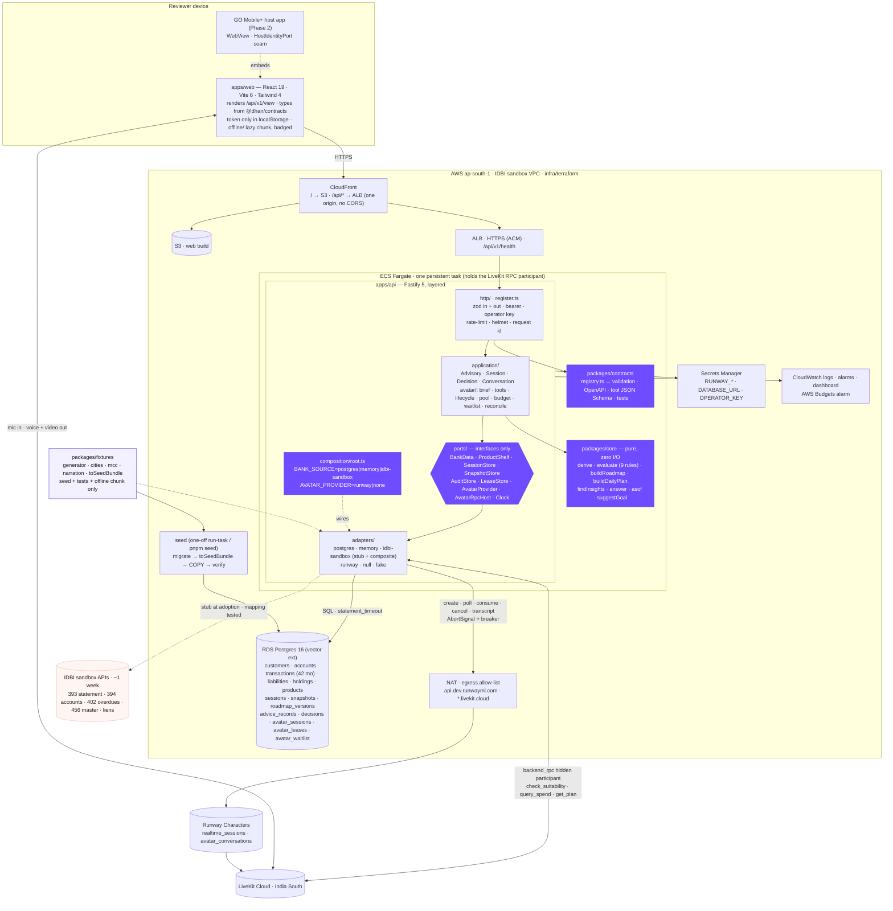

# High-level design

This document is the shape of the system: where the advisory engine runs, where data lives, what
the API owns, how the avatar is gated, and how the whole thing is deployed into an AWS account in
`ap-south-1`. It is written for an engineer at IDBI who wants to know, in one sitting, what runs
where and why. The module-level detail is in [`LLD.md`](LLD.md), the request flows in
[`lifecycles.md`](lifecycles.md), the tables and routes in [`DATA-AND-API.md`](DATA-AND-API.md),
and the reasoning behind each decision in [`adr/`](adr/).

Status: adopted 3 September 2026.

## Starting point

At adoption the product is a static site. `apps/web/src/lib/view.ts` imports `@dhan/core` and
`@dhan/fixtures`, calls `generateCustomerFile(spec, {anchor, asOf, months: 24})` in the browser,
keeps the simulated clock, caps, goal override and accepted/declined ids in
`localStorage['dhan.session.v1']`, and `App.tsx` holds the audit trail in
`useState<AuditEntry[]>`. `apps/api` is a Runway broker only: `routes/avatar.ts` reads
`process.env`, pools credentials in a `Map`, meters minutes in module variables, casts `req.body`
without validation and forwards a client-built `personality` (`buildBrief` in `Ask.tsx`) to
`providers/runway.ts`, which never sends `tools`. `packages/contracts/src/index.ts` is
`export {}`. `@fastify/helmet`, `@fastify/rate-limit`, `pg`, `zod`, `@dhan/contracts` and
`@dhan/fixtures` are declared in `apps/api/package.json` and imported nowhere.
`/api/avatar/release-all` and `/api/avatar/status` have no authentication.

## Target architecture

The target moves every figure behind the API without changing the engine's public API.
`packages/core` stays pure and gains two pure modules: `asof.ts` (the as-of arithmetic that lives
inside `generateCustomerFile` at adoption: account aggregates from month-end balances,
`tenureRemaining = remaining − elapsed`, SIP instalments; the generator and every adapter call the
same functions, so parity is by construction) and `goal.ts` (`suggestGoal`, moved from the web
app). `packages/contracts` becomes the route registry: one readonly table of
`{method, path, auth, request, response, errors}` in zod, plus tool schemas, from which Fastify
validation, OpenAPI 3.1, Runway tool JSON Schema and the contract-test matrix are all generated.
`packages/fixtures` keeps its deterministic generator and gains city packs, MCCs, IBKL branch
IFSCs, per-employer remitter IFSCs and `toSeedBundle()`.

`apps/api` becomes a layered hexagon. `http/` parses, authenticates and serialises through
`register.ts`, the only way to add a route. `application/` orchestrates core over ports:
`AdvisoryService.view()` runs `derive → suggestGoal → buildRoadmap → buildDailyPlan → findInsights`
exactly as `buildView` does in the browser at adoption; `DecisionService` re-derives the action
server-side, runs `evaluate()`, appends the advice record, the decision and a new roadmap version
in one transaction; `ConversationService` answers text through `core/query.ts`; `avatar/*` owns
the brief, tools, lifecycle state machine, credential pool, budget, waitlist, RPC host and
transcript reconciliation. `ports/` is interfaces only. `adapters/` has postgres (demo source of
truth), memory (tests, CI, no-database mode, seeded from the same generator), idbi-sandbox (a stub
anti-corruption layer against `docs/integration/data-requirements.md`, composed with fixtures for
holdings, policies and the shelf that IDBI's catalogue lacks), runway, null and fake.
`composition/root.ts` picks adapters by `BANK_SOURCE` and `AVATAR_PROVIDER`; `config.ts` is the
only `process.env` reader.

Postgres holds 42 months of seeded, statement-realistic transactions per customer (anchor
2026-09-01, 24 back, 18 forward) written by `pnpm seed`. Every read is bounded by the session's
`as_of`, so the simulated clock, now a column on `sessions`, reveals rows the ledger always had,
which is the property the generator's anchor-keyed month streams already guarantee. Snapshots are
stored content-addressed by `(cif, as_of, sha256(inputs), engine_version)` and are both the cache
and the compliance artefact; advice records, decisions and roadmap versions are append-only at the
database (REVOKE plus a raising trigger) and hash-chained. Audit rows carry a `subject_id`, never
`cif`, so DPDP erasure deletes a mapping row and touches no audit row.

The avatar path: the brief is built server-side from the same View the screens render;
`check_suitability`, `query_spend` and `get_plan` are `backend_rpc` tools whose handlers are
opened (the LiveKit hidden participant joins) before `/consume` is ever called; the lifecycle
state machine makes `consume()` from any state other than `gated` a thrown error; every tool call
writes `advice_records (source='avatar_tool')` before returning; after the call the transcript is
fetched with backoff and each tool result is reconciled against our own ledger. The single Tier-1
slot is a Postgres-backed FIFO waitlist with position, ETA and a 20-second claim window; the
deterministic text conversation runs underneath. The daily minute budget is
`sum(minutes_charged)` over `avatar_sessions` for today, so a redeploy cannot reset it.

`apps/web` becomes a client: `api/client.ts` typed from the registry, only a bearer token in
localStorage, every screen rendered from `/api/v1/view`, `/record` and `/transactions`. The
in-browser engine survives only as a lazy-loaded `offline/` chunk behind `VITE_OFFLINE_FALLBACK`,
shown with a persistent "Offline — local simulation, nothing recorded" badge and decision buttons
disabled; the bank build sets the flag false and CI asserts `@dhan/fixtures` is absent from that
bundle. Three tiers, always labelled: live avatar → honest text over `/ask` and
`/suitability/evaluate` (same engine, same sentences, same advice records) → offline simulation.

Deployment is Terraform to `ap-south-1`: one Fargate task (the RPC host is a held LiveKit
connection, so no Lambda) in a private subnet behind an ALB, NAT with an egress allow-list
(`api.dev.runwayml.com`, `*.livekit.cloud`, UDP 50000–60000 with TURN/TLS 443 fallback), RDS
Postgres 16 with the vector extension, S3 + CloudFront serving `/` and `/api/*` from one origin,
Secrets Manager injected at task start, CloudWatch alarms and an AWS Budgets alarm. The same image
runs under `docker compose up` locally, and `BANK_SOURCE=memory AVATAR_PROVIDER=none pnpm dev`
runs the whole product with no database and no keys. An `infra/ec2-compose/` cloud-init covers a
sandbox that grants only the t3.medium the sandbox request asked for.



The four purple boxes are the seams a bank engineer should read first: the ports (what the
product needs from a bank), the contracts (what the API promises a client), the core (the rules,
pure) and the composition root (the one file that names concrete adapters).

## Folder tree

```text
dhan-sarthi/
├── apps/
│   ├── api/                                  Fastify 5 · the only process with a secret or a provider call
│   │   ├── Dockerfile                        multi-stage · node:22-bookworm-slim (LiveKit native N-API) · non-root · HEALTHCHECK
│   │   ├── migrations/                       plain numbered SQL, applied by src/db/migrate.ts
│   │   │   ├── 0001_extensions_roles.sql     CREATE EXTENSION IF NOT EXISTS vector, pgcrypto · roles dhan_migrate, dhan_app
│   │   │   ├── 0002_bank.sql                 customers · consents · accounts · transactions · liabilities · holdings · products · seed_runs
│   │   │   ├── 0003_sessions.sql             subjects · sessions · idempotency_keys
│   │   │   ├── 0004_snapshots.sql            snapshots · roadmap_versions
│   │   │   ├── 0005_record.sql               advice_records · decisions (hash chain columns)
│   │   │   ├── 0006_avatar.sql               avatar_sessions · avatar_tool_calls · avatar_leases · avatar_waitlist
│   │   │   └── 0007_append_only.sql          REVOKE UPDATE/DELETE from dhan_app + BEFORE triggers that RAISE
│   │   ├── src/
│   │   │   ├── index.ts                      boot: loadConfig → buildRoot → listen. Nothing else.
│   │   │   ├── config.ts                     the ONLY process.env reader · zod-parsed Config
│   │   │   ├── composition/
│   │   │   │   ├── root.ts                   buildRoot(config): adapters → services → app · constructor injection · startup invariants
│   │   │   │   └── profiles.ts               memory | postgres | idbi-sandbox × runway | none
│   │   │   ├── ports/                        interfaces only · no imports from adapters/
│   │   │   │   ├── bank-data.port.ts · product-shelf.port.ts · session-store.port.ts · snapshot-store.port.ts
│   │   │   │   ├── audit-store.port.ts · lease-store.port.ts · avatar-provider.port.ts · avatar-rpc-host.port.ts
│   │   │   │   └── clock.port.ts · host-identity.port.ts (stub seam for GO Mobile+)
│   │   │   ├── application/                  orchestration · imports core, contracts, ports · never adapters or http
│   │   │   │   ├── advisory.service.ts       view(session): scope → derive → suggestGoal → roadmap → plan → insights · snapshot store
│   │   │   │   ├── session.service.ts        create · advanceClock · resetClock · setGoal · setScope · erase
│   │   │   │   ├── decision.service.ts       re-derive action → evaluate() → advice_record + decision + roadmap_version, one txn
│   │   │   │   ├── conversation.service.ts   /ask over core.answer() · /suitability/evaluate
│   │   │   │   ├── consent-scope.ts          strips CustomerFile blocks not in granted scopes
│   │   │   │   ├── hash.ts                   canonical JSON → sha256 (snapshot input hash, record chain)
│   │   │   │   ├── errors.ts                 DomainError → NotFound · Conflict · Unavailable · BeyondHorizon · Forbidden
│   │   │   │   └── avatar/
│   │   │   │       ├── avatar-session.service.ts   start(session): budget → claim → brief → create → ready → RPC open → consume → grant
│   │   │   │       ├── lifecycle.ts                state machine: claimed → creating → ready → gated → granted → live → ended|reaped|failed
│   │   │   │       ├── brief.builder.ts            build(view): {personality, startScript} · ≤10,000 / ≤2,000 asserted
│   │   │   │       ├── tools/check-suitability.tool.ts · query-spend.tool.ts · get-plan.tool.ts
│   │   │   │       ├── credential-pool.ts · minute-budget.ts · lease-reaper.ts · waitlist.ts
│   │   │   │       ├── transcript.service.ts       GET avatar_conversations with backoff → avatar_sessions.transcript
│   │   │   │       └── reconciler.ts               toolResults ↔ avatar_tool_calls · gate_coverage
│   │   │   ├── adapters/
│   │   │   │   ├── postgres/                 pg Pool · SQL template strings · no ORM
│   │   │   │   │   ├── pool.ts (type parsers: NUMERIC→number, DATE→'YYYY-MM-DD') · unit-of-work.ts
│   │   │   │   │   ├── bank-data.postgres.ts · product-shelf.postgres.ts · session-store.postgres.ts
│   │   │   │   │   └── snapshot-store.postgres.ts · audit-store.postgres.ts · lease-store.postgres.ts
│   │   │   │   ├── memory/                   shipped implementations (no-DB profile) · seeded from toSeedBundle()
│   │   │   │   ├── idbi-sandbox/             anti-corruption layer · STUB against data-requirements.md
│   │   │   │   │   ├── client.ts             HTTP client · consent_id on every call · AbortSignal
│   │   │   │   │   ├── endpoints.ts          456 master · 394 accounts · 393 statement (paged) · 402 overdues · 362 liens
│   │   │   │   │   ├── wire.ts               zod schemas of the 93 fields · DD-MM-YY · snake_case
│   │   │   │   │   ├── mapping.ts            wire → CustomerFile · block 08 → Consent
│   │   │   │   │   ├── composite.ts          IDBI for profile/accounts/txn/liabilities · fixtures for holdings/policies · provenance per block
│   │   │   │   │   └── fixtures/*.json       one sample payload per block
│   │   │   │   ├── runway/                   transport.ts (providers/runway.ts + tools + timeouts + breaker) · provider.ts · rpc-host.ts
│   │   │   │   ├── null/                     avatar-provider.null.ts · rpc-host.null.ts
│   │   │   │   └── clock/                    system-clock.ts · fixed-clock.ts
│   │   │   ├── http/
│   │   │   │   ├── server.ts                 helmet · cors (dev only) · rate-limit · body limit 16 KB · request timeout · error mapper
│   │   │   │   ├── auth.ts                   bearer → session preHandler · X-Operator-Key preHandler
│   │   │   │   ├── register.ts               registerRoute(app, entry, handler) — validates in and out; the only way to add a route
│   │   │   │   ├── openapi.ts                registry → OpenAPI 3.1 at /api/v1/openapi.json
│   │   │   │   └── routes/                   health · customers · sessions · session · view · transactions · ask · suitability · decisions · record · avatar · operator
│   │   │   ├── infra/                        circuit.ts · timeout.ts · lru.ts · fault-inject.ts (refused in production)
│   │   │   ├── db/migrate.ts                 ordered SQL runner · schema_migrations
│   │   │   └── cli/
│   │   │       ├── seed.ts                   pnpm seed [--check] [--force] [--anchor 2026-09-01] [--forward 18]
│   │   │       ├── replay.ts                 pnpm replay <advice_record_id>
│   │   │       └── audit-verify.ts           pnpm audit:verify
│   │   └── test/
│   │       ├── contract/                     one file per registry entry · no-undeclared-route · openapi snapshot
│   │       ├── ports/                        bankDataPortContract · auditStoreContract · leaseStoreContract · sessionStoreContract
│   │       ├── integration/                  Postgres service: migrate → seed → parity → append-only → chain
│   │       ├── avatar/                       rpc-before-consume · budget survives restart · waitlist claim · reconciler
│   │       ├── architecture/                 dependency-cruiser rules
│   │       └── fakes/                        FakeAvatarProvider · FakeRpcHost
│   └── web/
│       ├── Dockerfile                        nginx · /api proxied to api:3001 (compose only)
│       └── src/
│           ├── api/client.ts                 typed fetch from registry · bearer · ETag · 6 s timeout · GET retry
│           ├── api/session.ts                token only (dhan.session.v2)
│           ├── lib/view.ts                   useView(): server View, else offline chunk
│           ├── offline/                      lazy: core + fixtures + old buildView · VITE_OFFLINE_FALLBACK
│           ├── components/                   Clock · TabBar · ui · TierBadge · QueueCard · OfflineBadge · ProvenanceLine
│           └── screens/                      Pick · Today · Plan · Ask · Money · Record (same layouts, data from the API)
├── packages/
│   ├── core/src/                             unchanged public API + asof.ts (pure as-of helpers) + goal.ts (suggestGoal)
│   ├── contracts/src/
│   │   ├── common.ts · domain.ts (zod mirrors of Snapshot, Roadmap, DailyPlan, Verdict, Answer, Product)
│   │   └── routes/*.ts · tools/*.ts · registry.ts · index.ts
│   └── fixtures/src/                         generate · personas · merchants · cities/{indore,kochi,nagpur}.ts · mcc.ts · ifsc.ts · seed-bundle.ts · realism.test.ts
├── infra/
│   ├── terraform/                            main.tf · vpc.tf · rds.tf · ecs.tf · alb.tf · cdn.tf · secrets.tf · observability.tf · budget.tf
│   │   └── envs/team-sandbox.tfvars · idbi-sandbox.tfvars
│   ├── ec2-compose/                          cloud-init.yaml (t3.medium hedge)
│   └── scripts/                              deploy-api.sh · deploy-web.sh · seed-remote.sh · smoke.sh · load.sh
├── docker-compose.yml                        postgres (pgvector/pgvector:pg16, :5433) · seed (profile) · api · web
├── docs/architecture/                        HLD.md · LLD.md · lifecycles.md · DATA-AND-API.md · adr/ · THREAT-MODEL.md · TESTING-AND-DEPLOYMENT.md · BUILD-PLAN.md
├── docs/data/                                seed-pipeline.md · statement-formats.md · calibration.md · field-mapping.md
└── .github/workflows/                        ci.yml (quality · hygiene · contract · integration · architecture · docker · infra) · deploy.yml (workflow_dispatch)
```

## Ports

Ports are the interfaces the application layer depends on. Each one lists its adapters; a bank
integration is a new adapter behind an existing port, never a change to the application.

### BankDataPort

```ts
listCustomers(): Promise<CustomerSummary[]>
getCustomer(cif): Promise<Customer>
getAccounts(cif, asOf): Promise<Account[]>
getTransactions(cif, { from, to }): Promise<Transaction[]>
getLiabilities(cif, asOf): Promise<Liability[]>
getHoldings(cif, asOf): Promise<{ holdings: Holding[]; policies: Holding[] }>
getConsent(cif): Promise<Consent>   // block 08 shape: consent_id, purpose, scopes, status, valid_to
loadCustomerFile(cif, asOf, windowMonths): Promise<{ file: CustomerFile; provenance: Record<Block, 'idbi'|'fixture'|'postgres'|'memory'> }>
ledgerHorizon(cif): Promise<{ from: IsoDate; to: IsoDate }>
describe(): { source: 'postgres'|'memory'|'idbi-sandbox'; simulatedClock: boolean; dataFreshnessDate: IsoDate }
health(): Promise<{ ok: boolean; latencyMs: number }>
```

| Adapter | Role |
|---|---|
| `PostgresBankData` | Demo source of truth; rows ≤ asOf; as-of facts via `core/asof` |
| `InMemoryBankData` | Seeded at construction from `toSeedBundle()`; tests, CI, `BANK_SOURCE=memory` |
| `IdbiSandboxBankData` | Stub over endpoints 456/394/393/402/362 with `wire.ts` + `mapping.ts`; `simulatedClock=false`; holdings and policies throw `NotAvailableFromBank` |
| `CompositeBankData` | IDBI for what the catalogue exposes, secondary for holdings, policies and shelf; provenance per block |

### ProductShelfPort

```ts
list(): Promise<Product[]>
byId(productId): Promise<Product | null>
resolve(spokenName): Promise<Product | null>   // exact → alias → normalised substring → null
```

| Adapter | Role |
|---|---|
| `PostgresProductShelf` | `products` table seeded from `PRODUCT_SHELF` with `aliases[]`, `source`, `verified` |
| `InMemoryProductShelf` | `PRODUCT_SHELF` directly (IDBI's catalogue has no shelf endpoint; [ADR-0007](adr/ADR-0007.md)) |

### SessionStore

```ts
create(cif, tokenHash, anchor): Promise<Session>
getByTokenHash(hash): Promise<Session | null>
patch(id, patch: { asOf?; lastSeen?; goalTarget?; caps?; scopeOverrides? }, expectedVersion): Promise<Session>   // Conflict on mismatch
touch(id): Promise<void>
erase(id): Promise<void>
putIdempotent(id, key, requestHash, response) / getIdempotent(id, key)
expireIdle(days): Promise<number>
```

| Adapter | Role |
|---|---|
| `PostgresSessionStore` | `sessions`, `idempotency_keys`; optimistic `version` column |
| `InMemorySessionStore` | Memory profile and tests |

### SnapshotStore

```ts
find(cif, asOf, inputHash, engineVersion): Promise<StoredSnapshot | null>
put({ cif, sessionId, asOf, inputHash, engineVersion, snapshot }): Promise<StoredSnapshot>
putRoadmap({ sessionId, version, snapshotId, goal, roadmap, reasonForChange }): Promise<void>
latestRoadmap(sessionId): Promise<RoadmapVersion | null>
```

| Adapter | Role |
|---|---|
| `PostgresSnapshotStore` | `UNIQUE (cif, as_of, input_hash, engine_version)`; never updated |
| `InMemorySnapshotStore` | LRU of 64 |

### AuditStore

```ts
appendAdvice(record: AdviceRecordInput): Promise<AdviceRecord>   // computes prev_hash/record_hash
appendDecision(record: DecisionInput): Promise<DecisionRecord>
appendToolCall(record: AvatarToolCallInput): Promise<{ id }>
appendAvatarSession(row) / markAvatarEnded(id, reason, minutesCharged) / attachTranscript(id, transcript, reconciliation)
listForSession(sessionId): Promise<RecordView>
verifyChain(sessionId): Promise<{ ok: boolean; length: number; brokenAt?: string }>
// no update, no delete — the interface enforces what migration 0007 enforces
```

| Adapter | Role |
|---|---|
| `PostgresAuditStore` | INSERT only as `dhan_app`; UPDATE/DELETE raise |
| `InMemoryAuditStore` | Push-only arrays |

### LeaseStore

```ts
tryAcquire(label, sessionId, expiresAt, taskId): Promise<Lease | null>   // INSERT … ON CONFLICT DO NOTHING RETURNING — atomic
attach(label, runwaySessionId): Promise<void>
release(label, minutesCharged, reason): Promise<void>
reapExpired(now): Promise<Lease[]>
listHeld(): Promise<Lease[]>
minutesUsed(day): Promise<number>   // sum(minutes_charged) over avatar_sessions
enqueue(sessionId) / peek() / markClaimable(ticket, holdUntil) / expire(ticket) / dequeue(ticket) / position(ticket)
```

| Adapter | Role |
|---|---|
| `PostgresLeaseStore` | `avatar_leases` + `avatar_waitlist`; survives restarts and the two-task overlap of a deploy |
| `InMemoryLeaseStore` | The `Map` from `routes/avatar.ts` at adoption, for the memory profile |

### AvatarProvider

```ts
probe(cred): Promise<{ ok: boolean; character: string | null }>   // unbilled
createSession(cred, { personality, startScript, tools, maxSeconds }): Promise<{ runwaySessionId }>
waitUntilReady(cred, id, { timeoutMs }): Promise<{ sessionKey }>
consume(id, sessionKey): Promise<{ url; token }>
cancel(cred, id): Promise<void>
getConversation(cred, id): Promise<ConversationTurn[] | null>
breakerState(): 'closed'|'open'|'half-open'
```

| Adapter | Role |
|---|---|
| `RunwayAvatarProvider` | Over `adapters/runway/transport.ts` |
| `NullAvatarProvider` | Every call resolves `Unavailable('not configured')`; `AVATAR_PROVIDER=none` or `AVATAR_ENABLED=false` |
| `FakeAvatarProvider` (test) | Scripted READY / QUEUED-for-window / FAILED; counts `consume()` calls |

### AvatarRpcHost

```ts
open(runwaySessionId, cred, handlers: Record<ToolName, ToolHandler>): Promise<RpcHandle>   // resolves only on onConnected
close(handle): Promise<void>
openCount(): number
```

| Adapter | Role |
|---|---|
| `RunwayRpcHost` | `@runwayml/avatars-node-rpc`; hidden LiveKit participant for the call's life (why the API is a persistent process) |
| `NullRpcHost` | Only legal with `NullAvatarProvider` (startup invariant in `composition/root.ts`) |
| `FakeRpcHost` (test) | Records `open()` order relative to `consume()`; can be scripted to reject |

### Clock

```ts
now(): Date
today(): IsoDate   // wall clock for leases, TTLs, budget days — the simulated clock is session DATA, not this
```

Adapters: `SystemClock`, `FixedClock` (tests).

### HostIdentityPort (stub)

```ts
exchange(hostToken: string): Promise<{ cif: string } | null>   // Phase 2: GO Mobile+ hands the WebView a short-lived JWT; verified against the bank's JWKS; picker route disabled under this adapter
```

Adapter: `NotImplementedHostIdentity` returns null and logs; documented in
`docs/integration/go-mobile-plus.md`.

## Non-functional requirements

- **Latency.** `GET /api/v1/view` p95 ≤ 300 ms warm (ETag/snapshot hit ≤ 30 ms), ≤ 1 s cold
  (derive over ~1,300 transactions ≈ 20 ms in-process; the rest is one indexed range scan per
  block); `POST /actions/:id/decision` p95 ≤ 500 ms including the roadmap version;
  `POST /ask` p95 ≤ 50 ms.
- **Latency, avatar.** `check_suitability` RPC handler p99 ≤ 500 ms against Runway's 6 s tool
  timeout (snapshot precomputed at grant; `evaluate()` plus one INSERT); avatar grant p95 ≤ 15 s
  from tap to LiveKit credentials (READY ≈ 2 s, RPC join ≤ 8 s, consume); first decodable frame
  ≤ 7 s after grant with the portrait held until then.
- **Availability.** ≥ 99.5 % for the API over the 15-day review window on one Fargate task with
  ECS replacement and RDS automated backups (7-day PITR); the product remains usable at 0 % avatar
  availability through Tiers 1–2; Multi-AZ RDS is one variable if IDBI asks.
- **Scalability.** 50 concurrent reviewer sessions and 20 req/s sustained on 1 vCPU / 2 GB with
  zero 5xx (autocannon script committed with results); content-addressed snapshots mean N
  reviewers on one customer cost one derivation per clock position; Runway concurrency is 1 per
  credential and is handled by the waitlist, not capacity.
- **Robustness.** Every outbound call has a timeout and a breaker; no request path can wait
  longer than 45 s; no user-facing end state is a spinner; every tier transition is a typed
  `ErrorBody {code, message, cause?, retryAfterSeconds?, ticket?}` and the client state machine
  (idle · connecting · live · waitlisted · text · offline) has a designed screen per state;
  `FAULT_INJECT` demonstrates each rung on demand.
- **Correctness.** API figures equal the generator's figures to the rupee at anchor, +1d, +7d,
  +30d, +6m, +18m for every persona (parity test in CI); the same View feeds screens, brief and
  tools, so no surface can quote a number another does not show; `pnpm replay <advice_record_id>`
  reproduces the stored sentence byte-for-byte.
- **Cost.** Infrastructure ≈ US$115–130/month in `ap-south-1` (Fargate 1 vCPU/2 GB ≈ $35, RDS
  db.t4g.micro ≈ $18, NAT ≈ $35, ALB ≈ $20, CloudFront/S3/Secrets/CloudWatch ≈ $8); Runway
  hard-capped at 240 min/day (≤ US$48/day) with the meter in Postgres, alarm at 80 %, AWS Budgets
  alarm at US$100; no model spend.
- **Security.** Zero secrets in the browser (CI grep on `dist/`); every route validated in and
  out from the registry; bearers 256-bit random stored hashed; helmet; TLS end to end (CloudFront,
  ALB, RDS `sslmode=require`); rate limits 120/min, 20 sessions/hour, 5 grants/hour per IP; 16 KB
  bodies; operator routes behind a separate key; task role limited to three secret ARNs and log
  writes; task and RDS in private subnets.
- **Auditability and compliance posture.** One append-only, hash-chained record per proposal with
  the exact sentence shown, snapshot id, consent id, rule id, engine version and source;
  UPDATE/DELETE revoked and trigger-blocked; avatar tool results reconciled against the provider
  transcript with gate coverage shown; synthetic data only, no PII columns, `ap-south-1` only, no
  cross-border model calls; five-year retention design for record tables, 30-day session expiry,
  `DELETE /session` erasure via the subjects mapping.
- **Determinism.** Same seed → identical Postgres rows on any machine (`seed_runs` hash,
  `--check` in CI); the clock reveals seeded rows rather than generating new ones, so two
  reviewers advancing the same customer see identical months.
- **Portability and operability.** `pnpm dev` with `BANK_SOURCE=memory AVATAR_PROVIDER=none` runs
  the whole product with no database and no keys; `docker compose up` gives the full stack in
  under three minutes; fresh AWS account to running deployment in under 45 minutes following the
  runbook (rehearsed on Day 8); `/api/v1/health` answers db, bank source, seed hash, engine
  version, avatar provider, breaker and RPC count in one call; every log line carries a request
  id.
- **Data realism.** 100 % of narrations match a declared IDBI-format template; 100 % of merchant
  debits carry an MCC; utilities, transit and local merchants are city-correct for Indore, Kochi
  and Nagpur; the customer's IFSC matches `^IBKL0[A-Z0-9]{6}$`; salary remitter IFSC is per
  employer, never the shared `IDIB000M` prefix; masked account numbers are unique per persona; UPI
  share by count within 70–90 % and median UPI ticket within ₹200–₹2,000; every distribution
  parameter is cited or marked `[verify]` in `docs/data/calibration.md`.
