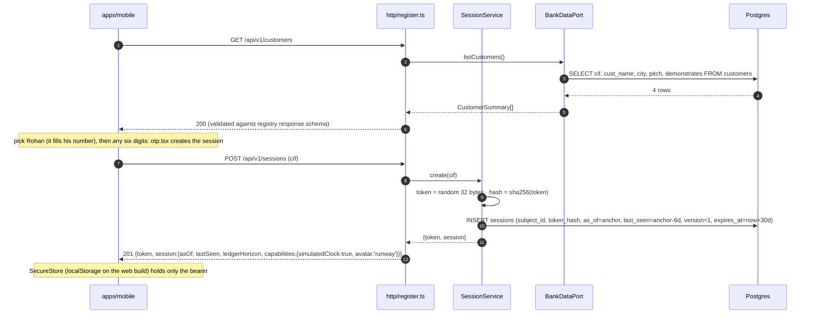
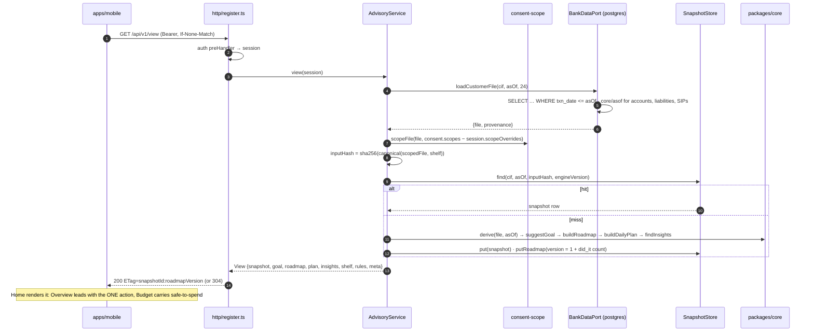
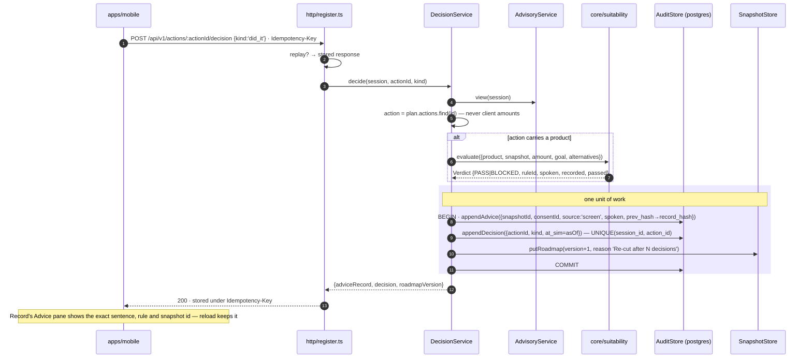
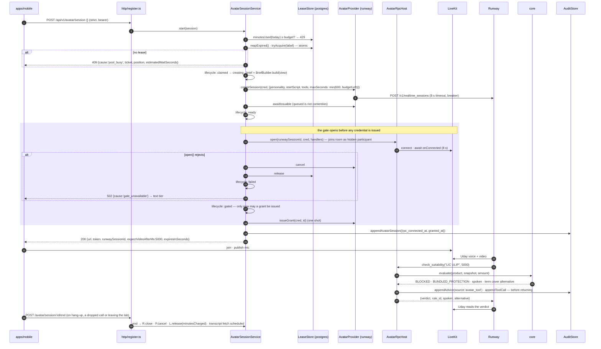
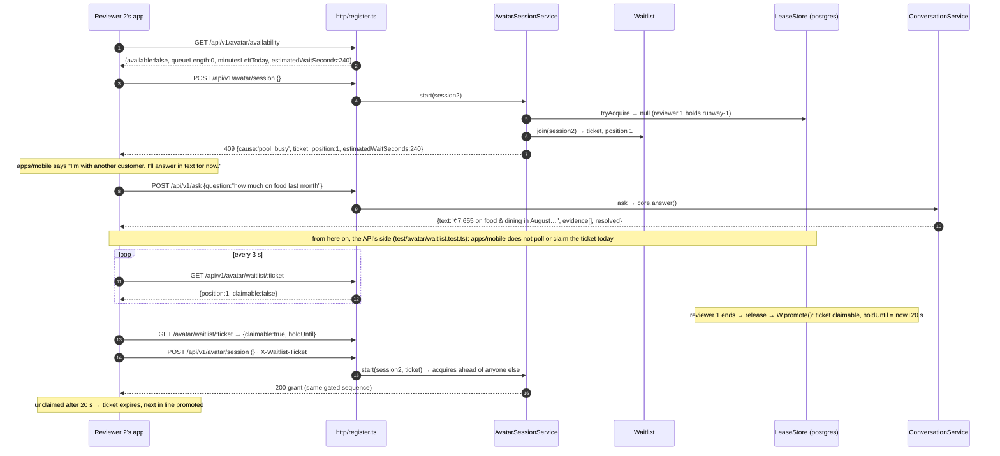
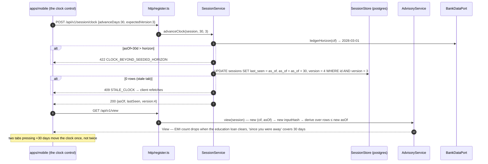

# Lifecycles

Six sequence diagrams, one per flow that a reviewer is likely to exercise or ask about: opening
the app, rendering Home, recording a decision, granting a gated avatar session, a second person
hitting the single avatar slot, and advancing the simulated clock. Each names the module that
owns every step, so a question about a flow can be answered with a filename. The modules are
specified in [`LLD.md`](LLD.md); the routes and tables they touch are in
[`DATA-AND-API.md`](DATA-AND-API.md).

Status: adopted 3 September 2026 · amended 2026-09-20 (the participant on the left, and two
renamed provider calls) · amended 2026-09-22 (what the app does at either end of the flows).

> **Amendment, 2026-09-20.** `apps/web` has been deleted and `apps/mobile` is the only client
> ([ADR-0001](adr/ADR-0001.md)). Every one of these flows is unchanged — same routes, same order,
> same services — so the only correction is the participant each diagram starts from, which used
> to be the browser and is now the app. The storage note on the first diagram is the same claim
> about the same one value — the bearer is all the client keeps — only the place changed:
> SecureStore on a device, and still `localStorage` on the Expo web build, which
> `apps/mobile/src/api/storage.ts:1-7` argues is acceptable because that target exists for review
> builds over a synthetic customer.
>
> The grant diagram carries one correction that is not about the client: it called the provider's
> `waitUntilReady` and `consume(id, sessionKey)`, which [ADR-0013](adr/ADR-0013.md)'s amendment
> renamed to `awaitIssuable` and `issueGrant(cred, id)` when it stopped the port carrying a
> session key between two of its own calls. The order in the diagram is the order in the code and
> did not move.
>
> **Amendment, 2026-09-22.** The server's half of every flow still holds; the app's half had
> drifted and is corrected in the notes. Sign-in now asks for a mobile number and any six-digit
> code before `POST /sessions`; the daily plan renders on Home, not Today; Record is a screen, not
> a tab; `/end` is an ordinary request on hang-up, not a beacon; and `apps/mobile` does not poll or
> claim a waitlist ticket, so the busy-slot diagram's queue is the API's protocol with no client
> driving it today.

## Open app and pick a customer

## The daily plan on Home (GET /view)

## Decide an action (audit record)

## Start avatar session with the gate (RPC before credentials)

## Second reviewer hits the busy slot

## Simulated clock advance (server-side)

