# Dhan Sarthi — relational schema proposal for the wealth-advisory module in IDBI GO Mobile+

> **Status: design record, 3 September 2026.** This is the schema the API is being built on. The
> DDL files beside this document are the exact text that was loaded and smoke-tested; they are
> applied to the shared database incrementally through the migrations in `apps/api`, starting
> with the tables the demo reads. Anything marked `[inference]` or `[practitioner]` was not
> confirmed from a primary source and is written so that being wrong costs a mapping row, not
> a migration.

**Target:** PostgreSQL 17 + pgvector on RDS (ap-south-1). **Status:** proposal, 3 September 2026.
**Tested:** every DDL statement in section B was loaded, in order, into an embedded PostgreSQL 16.2 with pgvector 0.6.2, followed by a smoke test that exercises idempotent re-ingestion, the snapshot hash, the audit hash chain, and the append-only triggers (section B.7 shows the script and its output). Nothing here is PostgreSQL 17-specific except that `pg_trgm`/`btree_gist` are assumed present, as they are on RDS.

**How to read the evidence marks.** Every external fact carries a link. Statements marked **[inference]** are our reading of the evidence, not a source. Statements marked **[practitioner]** are widely known to Finacle users but no public URL was retrieved. Two of the four research tracks ran out of web budget part-way; the gaps are named rather than papered over.

---

## 0. What the research established, and what it changes in the design

### 0.1 IDBI's stack and data surface

| Finding | Evidence | Design consequence |
|---|---|---|
| IDBI's core banking system is Infosys **Finacle**. IDBI chose Finacle in 2004 ("deploy Finacle as the bank's core banking platform across 101 locations, by March 2005"); a 2016 programme upgraded it to Finacle 10.x. | [Infosys Form 6-K, Q2 FY05](https://www.sec.gov/Archives/edgar/data/0001067491/000095013404015257/f02440exv99w6.htm); [FinTech Futures, May 2016](https://www.fintechfutures.com/2016/05/idbi-bank-in-major-tech-upgrade-and-business-process-re-engineering/) (article body behind Cloudflare; version from the search summary, **[inference]**) | Bank mirrors are named and typed after Finacle's GAM / DTD-HTD / TAM / LAM / SIM entities (`scheme_type SBA/CAA/TDA/LAA`, `tran_type T/C/L`, `part_tran_type C/D`, `freeze_code D/C/T`, `value_date` vs `tran_date`), so whatever IDBI's sandbox exposes will be a projection of fields we already have columns for. |
| IDBI is **Live as both FIP and FIU** on the Account Aggregator network (Sahamati table, 31 July 2026, row "IDBI Bank … FIP: Live, FIU: Live"). Which FI types it serves as a FIP is behind a Zoho iframe and could not be read. | [Sahamati FIP/FIU list](https://sahamati.org.in/fip-fiu-in-account-aggregators-ecosystem/); [Sahamati certified entities](https://sahamati.org.in/certified-entities/); [account types activated](https://sahamati.org.in/account-types-activated-by-banks-on-aas/) | The AA FI schemas (ReBIT) are the second first-class source, not an afterthought: every bank mirror maps each ReBIT attribute to a column (section C.2), and `app.consents` + `bank.aa_consent_artefacts` model the ReBIT `ConsentDetail`. |
| IDBI runs a login-gated **API developer portal** (`developer-api.idbi.bank.in`, Software AG webMethods API Portal); its catalogue is not public. No public source mentions numbered services 393/394/362/402/442/456. | [IDBI API Portal](https://developer-api.idbi.bank.in/); [API Tracker](https://apitracker.io/a/idbibank-in) | The numbered catalogue is treated as an *internal* list seen only inside the hackathon sandbox. It is registered in `staging.endpoint_registry` with `verified = false` and adapters are written against the staging layer, not against guessed field names. |
| **GO Mobile+** shows, per customer: accounts with balance, mini/detailed statement (date range, amount range, debit/credit filter), monthly average balance (added Dec 2025), FD/RD booking with interest payout, maturity instruction, auto-sweep and nominee, SSP-RD, PPF view, Demat holdings (ISIN, company, value), debit-card controls, UPI history with RRN, BBPS billers with auto-pay, scheduled transfers, nominee name + relationship, multiple nomination (Nov 2025), mPassbook with user expense-category tagging. Loan servicing (repayment and disbursement schedule), lien inquiry, LIC premium payment and PMJJBY/PMSBY/APY enrolment are evidenced on i-Net, not in the app manual. | [GO Mobile+ manual (2020)](https://www.idbi.bank.in/pdf/Mobile-banking-manual.pdf); [feature page](https://www.idbi.bank.in/go_mobile_app_android_version.aspx); [App Store release notes](https://apps.apple.com/us/app/idbi-bank-go-mobile/id1318206368); [i-Net user guide](https://www.idbi.bank.in/pdf/Retail_Internet_Banking_User_Manual.pdf); [mPassbook features](https://www.idbi.bank.in/pdf/GO-mobile-plus-Features.pdf) | Everything the app already holds has a home: `avg_monthly_balance_*`, `nominees` (up to four), `liens`, `loan_schedules`, `govt_scheme_accounts` (PPF/SSA), `equity_holdings`, `mandates` (BBPS auto-pay, scheduled transfers, NACH). The customer's own mPassbook tags become `spend_category_bank` when the bank shares them. |
| Mutual-fund investing exists in GO Mobile+ ("Start your Mutual Fund journey via IDBI Bank's Go Mobile+ App", Jan 2025) and IDBI is AMFI distributor ARN-0058, but **no public document shows MF holdings, folio, NAV or a SIP book in the app**, and the numbered catalogue has no MF, insurance, shelf or order API. | [IDBI Facebook post](https://www.facebook.com/IDBIBank/posts/start-your-mutual-fund-journey-via-idbi-banks-go-mobile-app-and-manage-your-inve/1018295850333746/); [IDBI mutual funds page](https://www.idbi.bank.in/mutual-funds.aspx); archived prototype `providers/bank.js` | `bank.mf_holdings`, `bank.sip_registrations`, `bank.insurance_policies` and `ref.products` are designed to ReBIT / RTA-CAS / BSE StAR shapes and populated from fixtures through the same staging path until a real source (IDBI, AA, CAS) appears. `app.executions.mode` is `simulated` until an order API exists. |
| IDBI's own schedule of charges: MAB ₹10,000 / 5,000 / 2,500 / 1,000 by branch category (Advantage Savings, Feb 2026), non-maintenance charge 6% per month of the shortfall capped at ₹600/300/150/60, one-month grace; SMS alerts ₹0.25 each; NEFT/IMPS/RTGS free on net and mobile; "Charges are Exclusive of GST"; accounts with no transactions for two years are inoperative. | [IDBI Advantage Savings SoF](https://www.idbi.bank.in/pdf/soc/RSADV-Advantage-Savings-Account.pdf); [IDBI Core Savings SoF](https://www.idbi.bank.in/pdf/soc/Core-Savings-Account.pdf); [IDBI BSBDA SoF](https://www.idbi.bank.in/pdf/soc/Basic-Saving-account-with-complete-KYC.pdf) | `amb_required`, `amb_month_to_date`, `status = 'INOPERATIVE'`, the `CHG` channel with a `GST` line, and the generator rules in section F. |

### 0.2 Canonical field vocabularies we adopted

- **Finacle** (verified from public SQL and training material): `foracid`/`acid`, `cif_id`/`cust_id`, `sol_id`, `schm_code`/`schm_type` (SBA, CAA, TDA, ODA, CCA, LAA), `acct_opn_date`, `acct_cls_flg`, `clr_bal_amt`, `un_clr_bal_amt`, `lien_amt`, `frez_code` (D/C/T), `frez_reason_code`, `sanct_lim`, `drwng_power`, `mode_of_oper_code`, `nom_available_flg`; transactions `tran_id`, `tran_date`, `value_date`, `pstd_date`, `part_tran_srl_num`, `tran_type` (T/C/L), `tran_sub_type` (CI/BI/NP/NR/EO/EI), `part_tran_type` (C/D), `tran_particular`, `instrmnt_num`, `tran_amt`. Sources: [orafaq GAM column list](https://www.orafaq.com/forum/t/81823/), [public Finacle statement SQL](https://raw.githubusercontent.com/zinmyoswe/AGD-Bank-Report/main/FIN_BANK_STATEMENT_NEW.sql), [Finacle table catalogue](https://pdfcoffee.com/finaclemenuandtables-5-pdf-free.html), [TM transaction codes](http://finaclecommands.blogspot.com/2012/11/finacle-command-tm-for-transaction.html), [freeze codes](http://finaclecommands.blogspot.com/2012/11/freezingunfreezing-of-accounts-using.html), [SI maintenance](http://finaclecommands.blogspot.com/2013/01/sim-standing-instruction-maintenance.html), [scheme types](https://www.slideshare.net/slideshow/introduction-to-finacle/14961692).
- **ReBIT AA FI schemas** (read directly from the XSDs in Sahamati's standards repository): [deposit.xsd](https://github.com/Sahamati/account-aggregator-standards/blob/main/schemas/deposit/deposit.xsd), [term_deposit.xsd](https://github.com/Sahamati/account-aggregator-standards/blob/main/schemas/term_deposit/term_deposit.xsd), [recurring_deposit.xsd](https://github.com/Sahamati/account-aggregator-standards/blob/main/schemas/recurring_deposit/recurring_deposit.xsd), [sip.xsd](https://github.com/Sahamati/account-aggregator-standards/blob/main/schemas/systematic_investment_plan/sip.xsd), [mutual_funds.xsd](https://github.com/Sahamati/account-aggregator-standards/blob/main/schemas/mutual_funds/mutual_funds.xsd), [insurance_policies.xsd](https://github.com/Sahamati/account-aggregator-standards/blob/main/schemas/insurance_policies/insurance_policies.xsd), [nps.xsd](https://github.com/Sahamati/account-aggregator-standards/blob/main/schemas/national_pension_system/nps.xsd), [equities.xsd](https://github.com/Sahamati/account-aggregator-standards/blob/main/schemas/equity_shares/equities.xsd), [etf.xsd](https://github.com/Sahamati/account-aggregator-standards/blob/main/schemas/exchange_traded_funds/etf.xsd), [others_creditcard.xsd](https://github.com/Sahamati/account-aggregator-standards/blob/main/schemas/credit_card/others_creditcard.xsd), [others_ppf.xsd](https://github.com/Sahamati/account-aggregator-standards/blob/main/schemas/public_provident_fund/others_ppf.xsd), [others_ulip.xsd](https://github.com/Sahamati/account-aggregator-standards/blob/main/schemas/unit_linked_insurance_plan/others_ulip.xsd). The consent artefact and `fiTypes` enumeration come from [specs/aa.yaml](https://github.com/Sahamati/account-aggregator-standards/blob/main/specs/aa.yaml) (title "Account Aggregator API", version 1.1.2): `consentMode` VIEW/STORE/QUERY/STREAM, `fetchType` ONETIME/PERIODIC, `consentTypes` PROFILE/SUMMARY/TRANSACTIONS, `fiTypes` DEPOSIT, TERM_DEPOSIT, RECURRING_DEPOSIT, SIP, CP, GOVT_SECURITIES, EQUITIES, BONDS, DEBENTURES, MUTUAL_FUNDS, ETF, IDR, CIS, AIF, INSURANCE_POLICIES, NPS, INVIT, REIT, OTHER; `DataLife.unit` MONTH/YEAR/DAY/INF; `Frequency.unit` HOUR/DAY/MONTH/YEAR/INF; `DataFilter.type` TRANSACTIONTYPE/TRANSACTIONAMOUNT. Purpose codes 101–105 (101 = wealth management) from [Setu's consent object docs](https://docs.setu.co/data/account-aggregator/consent-object); lifecycle statuses PENDING/ACTIVE/PAUSED/REVOKED/EXPIRED/REJECTED/FAILED from [Finvu's integration guide](https://finvu.github.io/sandbox/finvu_aa_integration). Version 2.x adds LIFE_INSURANCE / GENERAL_INSURANCE / GSTR1_3B **[inference — not read from a 2.x spec; the v2 adoption repo holds only FAQs]**.
- **Indian rails and statement conventions** (section F carries the detail): UPI RRN is 12 digits = year digit + Julian day + 8-digit STAN ([Freo](https://freo.money/upi/what-is-rrn-number-in-upi/), [Angel One](https://www.angelone.in/knowledge-center/income-tax/rrn-number-in-upi-transactions)); UPI transaction ids are 35 alphanumerics since Feb 2025 ([Lexplosion on the NPCI circular](https://lexplosion.in/npci-mandates-for-standardization-of-upi-transaction-id-technical-specifications/)); NEFT UTR is 16 characters ([Razorpay](https://razorpay.com/learn/what-is-utr-number/)), RTGS UTR is 22 ([RBI RTGS FAQ, Q20](https://www.rbi.org.in/Scripts/FAQView.aspx?Id=65)); UMRN is up to 20 alphanumerics, sponsor bank code 11, utility code 18 ([NPCI mandate form via PNB](https://www.pnbindia.in/document/rtgs/NACH_Mandate_Final_01_10_2015_English.pdf)); IFSC is 4 letters + 0 + 6 alphanumerics ([RBI NEFT FAQ](https://www.rbi.org.in/Scripts/FAQView.aspx?Id=60)) and IDBI's prefix is IBKL; savings interest is a daily product on the end-of-day balance, credited at least quarterly, rounded to the rupee ([RBI Master Direction on Interest Rate on Deposits, §3(iv), §4(f), §6(a), §11(a)](https://www.rbi.org.in/Scripts/BS_ViewMasDirections.aspx?id=10296)); re-KYC every 2/8/10 years by risk category ([RBI KYC Master Direction §38](https://www.rbi.org.in/Scripts/BS_ViewMasDirections.aspx?id=11566)); up to four nominees, simultaneous with shares or successive ([PRS on the Banking Laws (Amendment) Act 2025](https://prsindia.org/billtrack/the-banking-laws-amendment-bill-2024)); SMA-0/1/2 and NPA buckets at 30/60/90 days ([RBI IRAC clarification](https://www.rbi.org.in/Scripts/NotificationUser.aspx?Id=12194)); TDS on deposit interest 10% above ₹50,000 (₹1 lakh for seniors) ([Upstox on FY26 rates](https://upstox.com/learning-center/personal-finance/tds-rate-fy-2025-26/article-1756/)).

### 0.3 What could not be verified

- The exact text of NPCI UPI Circular 43 (narration standard) and OC 34/181 (MCC rules): URLs resolve but block non-browser fetches. Narration templates in section F are therefore **[inference]** built on third-party samples.
- A real IDBI statement's literal column headers and narration strings (Scribd samples returned 403). The Finacle e-statement layout `Txn Date | Value Date | Description | Cheque No. | CR/DR | CCY | Amount | Balance` is **[practitioner]**.
- IDBI account-number length: public sources disagree (12/13 vs 16 digits). The schema never stores the clear number; masks carry the last four digits only.
- IDBI's FI-type list as an AA FIP, and the contents of its developer portal.

---

## A. Principles

### A.1 Three kinds of table, four schemas

| Schema | Holds | Who writes | Mutability |
|---|---|---|---|
| `bank` | Mirrors of what IDBI's APIs or the Account Aggregator supplied: customer master, accounts, statement lines, deposits, loans, cards, liens, mandates, MF folios and SIPs, insurance policies, NPS, PPF, equities, nominees, bank-computed signals, AA consent artefacts. | The ingestion role only, through a projector. | **Snapshots per sync run.** A row is never edited; a re-sync adds a new row for the same entity with a new `sync_run_id`. `bank.*_current` views pick the latest. Transactions are the one append-only fact table with a two-key upsert. |
| `app` | Our own objects: customers (identity), consents, derived snapshots, transaction enrichments, recurring series, insights, goals, versioned roadmaps and stages, verdicts, daily plans, trigger events, actions, decisions, executions, category caps, the simulated clock, avatar sessions and tool calls, memories, audit records. | The API role. | Snapshots, verdicts, roadmaps, tool calls and audit records are **immutable by trigger**; everything else carries `updated_at` + `row_version` for optimistic concurrency. |
| `ref` | Reference data we curate: product shelf and deposit rate cards, MCC codes, spend categories, merchants and aliases, channel codes, narration grammar, bank holidays, GST state codes, engine versions and the suitability rule text per version. | Migrations and an operator. | Mutable, effective-dated where it matters (`valid_from/valid_to`, exclusion constraint on rate cards). |
| `staging` | The only place an unknown shape may land: `raw_payloads` (verbatim, immutable, content-hashed), `sync_runs` (one consented pull), `endpoint_registry`, `field_mappings`, `projections`. | The ingestion role. | `raw_payloads` immutable; the rest is bookkeeping. |

Every `bank.*` row carries the same four provenance columns: `source` (`fixtures` / `idbi_api` / `aa` / `manual`), `sync_run_id`, `as_of` (the business time the data represents, i.e. the response's `data_freshness_date`), `ingested_at`, plus `raw_payload_id` where a payload exists. The fixtures generator writes through exactly the same path with `source = 'fixtures'`, so the sandbox is a new adapter, not a new pipeline.

### A.2 Idempotent ingestion

- `staging.raw_payloads` is unique on `(source, endpoint_code, payload_hash)` — the same bytes fetched twice are one row (`ON CONFLICT DO NOTHING`).
- `bank.transactions` has two keys: the bank's own `(account_id, tran_id, part_tran_srl_num)` and a content hash `(account_id, dedupe_hash)` over `(account_ref | tran_date | value_date | type | amount | narration | balance_after | reference)`. If IDBI's `txn_id` proves unstable across statements (Finacle `tran_id` resets daily and is only unique with `tran_date` **[practitioner]**), the hash key still prevents duplicates.
- Versioned mirrors are unique on `(entity, sync_run_id)`; re-running the *same* run upserts, a *new* run appends. Nothing ever needs a `DELETE` to converge.
- Every AA `Account.maskedAccNumber` / `linkedAccRef`, every Finacle `foracid`, every fixture id maps to `bank.accounts.account_ref`, which is a *hash or opaque reference*, never the clear account number.

### A.3 Types

- Every rupee column is `common.inr = NUMERIC(18,2)`; currency is a 3-letter code defaulting to `INR` (the module is INR-only; NRE/FCNR would be a future `currency <> 'INR'` row, not a schema change).
- Units and NAVs are `NUMERIC(18,4)` as RTAs report them; rates and percentages `NUMERIC(7,4)`.
- All timestamps are `timestamptz`; statement dates (`tran_date`, `value_date`, `maturity_date`) are `date` because a bank statement has no time of day worth trusting; the AA `transactionTimestamp` lands in a separate nullable `tran_timestamp`.
- Every entity has a `uuid` surrogate (`gen_random_uuid()`) **and** the external text id (`cif`, `tran_id`, `folio_no`, `policy_number`, `umrn`, `pran`, `product_id`).
- Coded columns are `text` + `CHECK (... IN (...))`, never `ENUM` types, and every coded column that comes from the bank has a `<code>_raw` sibling holding the bank's verbatim value. An unanticipated code lands as `'OTHER'` plus the raw string; ingestion does not fail and nothing is lost.
- Domains carry the format rules bankers will check: `common.ifsc` (`^[A-Z]{4}0[A-Z0-9]{6}$`), `common.isin` (ISO 6166), `common.masked_acct`, `common.lang_tag` (BCP-47), plus column CHECKs for RRN (12 digits), UTR (16 or 22), UMRN (20), PRAN (12), MICR (9), PIN code, cheque number, MCC.

### A.4 Compliance properties the schema enforces, not merely documents

1. **No data without consent.** `staging.sync_runs` refuses to start unless the referenced `app.consents` row is `ACTIVE`, unexpired and belongs to the same customer (trigger). Every snapshot, verdict and audit record points back to that consent.
2. **The gate is structural.** `app.actions` rejects any product-bearing action (`open_sweep_in` … `buy_health_cover`) that lacks both a `product_id` and a `verdict_id`; `app.roadmap_stages` rejects a stage with a product but no verdict; `app.verdicts` rejects a `PASS` carrying a `rule_id` or a `BLOCKED` without one, and `(rules_version, rule_id)` must exist in `ref.suitability_rules`. `app.avatar_tool_calls` rejects a `check_suitability` call without a verdict.
3. **The audit trail cannot be edited.** `app.audit_records` is hash-chained per customer (`prev_hash` → `record_hash`, computed in a `BEFORE INSERT` trigger under an advisory lock), `UPDATE`/`DELETE`/`TRUNCATE` are rejected by trigger, the API role is granted `INSERT`/`SELECT` only, `retain_until` is set to five years, and `app.audit_chain_verify(customer)` returns the first broken sequence number or NULL.
4. **One snapshot, one source of truth.** `app.snapshots.snapshot_hash` is computed by the database from the canonical `jsonb`; a caller-supplied hash that disagrees is rejected. Audit records cite the hash, so "what did the customer see" is answerable years later.
5. **Revocation does something.** `app.memories` cascade from the customer; `app.audit_records` deliberately do **not** (RESTRICT) — erasure tombstones `app.customers.erased_at` and purges children, but the regulatory record stays, which is the DPDP/SEBI retention position we want to be able to defend.
6. **Row-level security** on the tables a request reads directly (`bank.transactions`, `app.snapshots`, `app.memories`, `app.audit_records`), keyed on `current_setting('app.customer_id')`, so a bug in a route cannot leak another customer's statement.

---

## B. Full DDL

Six files, applied in order. They are reproduced verbatim below and are the exact text that was loaded and smoke-tested (B.7). Column-level documentation is inline (`-- …`) next to each column, with `COMMENT ON TABLE` for every table whose purpose is not obvious from its name. Sixty base tables: `ref` 11, `staging` 5, `bank` 22, `app` 22.

| File | Contents |
|---|---|
| `00_common_ref.sql` | extensions, schemas, shared domains (`common.inr`, `common.ifsc`, `common.isin` …), the append-only and `updated_at` trigger functions, `common.sha256_hex`, reference tables and seeds (spend categories, channel codes, MCC, state codes) |
| `10_identity_staging.sql` | `app.customers`, `app.consents` (+ events), `staging.endpoint_registry`, `staging.field_mappings`, `staging.sync_runs` (+ the consent-required trigger), `staging.raw_payloads`, `staging.projections`, endpoint seeds |
| `20_bank.sql` | every bank mirror: customer profiles, accounts + snapshots + holders, transactions, term/recurring deposits, loans + schedules, cards, liens, mandates, MF holdings/transactions/SIP registrations, insurance policies/transactions, NPS, government schemes, equities, nominees, behavioural signals, AA consent artefacts |
| `30_app_engine.sql` | snapshots (hash trigger), transaction enrichments, recurring series, insights, goals, avatar sessions, verdicts, roadmaps + stages, daily plans, trigger events, actions, decisions, executions, category caps, sim clock, avatar tool calls, memories (pgvector HNSW), audit records (hash chain + immutability), rule seeds |
| `40_views_security.sql` | `bank.*_current` views, `app.customer_360`, `app.liabilities_current`, roles, grants, row-level security policies |
| `90_smoke.sql` | the smoke test (rolls back) |

Conventions used throughout, so the files read the same way: `uuid` surrogate + external text id; `text` + `CHECK` for codes with a `_raw` sibling on bank-sourced codes; `common.inr` for every rupee amount; `timestamptz` for instants, `date` for statement dates; `UNIQUE (<entity>, sync_run_id)` on every versioned mirror; provenance columns first, identity second, business columns third.


### B.1 `00_common_ref.sql`

```sql
-- =====================================================================================
-- Dhan Sarthi — wealth-advisory module for IDBI GO Mobile+
-- Part 0: extensions, schemas, shared domains, helper functions, reference tables
-- Target: PostgreSQL 17 (+ pgvector). Tested against embedded PostgreSQL 16 + pgvector.
-- =====================================================================================

CREATE EXTENSION IF NOT EXISTS vector;       -- app.memories.embedding (pgvector)
-- pg_trgm and btree_gist ship with every RDS / stock PostgreSQL build; they are guarded so the
-- schema still loads on a minimal build (the embedded server used to test this file lacks them).
DO $$ BEGIN
  CREATE EXTENSION IF NOT EXISTS pg_trgm;    -- fuzzy narration / merchant search
EXCEPTION WHEN OTHERS THEN RAISE NOTICE 'pg_trgm unavailable: trigram indexes skipped'; END $$;
DO $$ BEGIN
  CREATE EXTENSION IF NOT EXISTS btree_gist; -- exclusion constraints over (uuid, range)
EXCEPTION WHEN OTHERS THEN RAISE NOTICE 'btree_gist unavailable: rate-card exclusion skipped'; END $$;

CREATE SCHEMA IF NOT EXISTS common;
CREATE OR REPLACE FUNCTION common.has_ext(name text) RETURNS boolean LANGUAGE sql STABLE AS
  $$ SELECT EXISTS (SELECT 1 FROM pg_extension WHERE extname = $1) $$;

-- Four namespaces, one rule each:
--   bank     mirrors of what IDBI / the Account Aggregator supplied. Never edited by hand.
--   ref      reference data we curate: product shelf, MCC, merchants, holidays, rules.
--   app      our own objects: goals, roadmaps, plans, actions, decisions, audit, memory.
--   staging  raw payloads and projection bookkeeping; the only place unknown shapes land.
CREATE SCHEMA IF NOT EXISTS common;
CREATE SCHEMA IF NOT EXISTS ref;
CREATE SCHEMA IF NOT EXISTS staging;
CREATE SCHEMA IF NOT EXISTS bank;
CREATE SCHEMA IF NOT EXISTS app;

-- ---------- shared domains -----------------------------------------------------------
-- Every rupee column is common.inr = NUMERIC(18,2). Units and NAVs carry four decimals as
-- RTAs report them; rates carry four so 7.125% and MCLR + 235 bps both round-trip.
CREATE DOMAIN common.inr      AS numeric(18,2);
CREATE DOMAIN common.units    AS numeric(18,4);
CREATE DOMAIN common.nav      AS numeric(18,4);
CREATE DOMAIN common.pct      AS numeric(7,4);
CREATE DOMAIN common.currency AS char(3) DEFAULT 'INR' CHECK (VALUE ~ '^[A-Z]{3}$');
-- Where a row came from. 'fixtures' is the synthetic generator writing through the same
-- pipeline the sandbox will use, so day one of the sandbox is a new adapter, not a new path.
CREATE DOMAIN common.source   AS text CHECK (VALUE IN ('fixtures', 'idbi_api', 'aa', 'manual'));
-- BCP-47 tag as the customer-master carries it: en-IN, hi-IN, mr-IN ...
CREATE DOMAIN common.lang_tag AS text CHECK (VALUE ~ '^[a-z]{2,3}(-[A-Z][a-z]{3})?(-[A-Z]{2})?$');
-- ISIN: 2 letters, 9 alphanumerics, 1 check digit (ISO 6166).
CREATE DOMAIN common.isin     AS char(12) CHECK (VALUE ~ '^[A-Z]{2}[A-Z0-9]{9}[0-9]$');
-- IFSC: 4-letter bank code, literal 0, 6 alphanumerics (RBI). IDBI Bank's prefix is IBKL.
CREATE DOMAIN common.ifsc     AS char(11) CHECK (VALUE ~ '^[A-Z]{4}0[A-Z0-9]{6}$');
-- Masked account number as banks render it: X's then the last 4 digits.
CREATE DOMAIN common.masked_acct AS text CHECK (VALUE ~ '^[X*]{2,}[0-9]{4}$');

-- ---------- helper functions ---------------------------------------------------------
-- Optimistic concurrency + updated_at on every mutable row.
CREATE OR REPLACE FUNCTION common.set_updated_at() RETURNS trigger
LANGUAGE plpgsql AS $$
BEGIN
  NEW.updated_at  := now();
  NEW.row_version := OLD.row_version + 1;
  RETURN NEW;
END $$;

-- Append-only guard. Attached BEFORE UPDATE OR DELETE (row) and BEFORE TRUNCATE (statement)
-- to audit_records, snapshots, verdicts, roadmaps, raw_payloads and bank mirrors.
CREATE OR REPLACE FUNCTION common.forbid_mutation() RETURNS trigger
LANGUAGE plpgsql AS $$
BEGIN
  RAISE EXCEPTION '%.% is append-only: % rejected', TG_TABLE_SCHEMA, TG_TABLE_NAME, TG_OP
    USING ERRCODE = 'integrity_constraint_violation';
END $$;

-- Canonical JSON hashing for snapshots and audit records: jsonb normalises key order and
-- whitespace, so the same facts always hash the same way. Hex sha256, 64 chars.
CREATE OR REPLACE FUNCTION common.sha256_hex(p jsonb) RETURNS text
LANGUAGE sql IMMUTABLE STRICT AS $$
  SELECT encode(sha256(convert_to(p::text, 'UTF8')), 'hex')
$$;

-- ---------- reference: codes ---------------------------------------------------------
-- GST state codes; the sandbox spec adopts the GSTN convention for state_code.
CREATE TABLE ref.state_codes (
  state_code  char(2) PRIMARY KEY CHECK (state_code ~ '^[0-9]{2}$'),  -- '23' Madhya Pradesh
  name        text NOT NULL,
  is_metro_state boolean NOT NULL DEFAULT false                          -- cost-of-living proxy
);

-- Spend categories are the fifteen `SpendCategory` values in packages/core/src/types.ts.
-- Kept as a table so MCC and merchant rows can reference them.
CREATE TABLE ref.spend_categories (
  category      text PRIMARY KEY,                 -- 'Food & dining'
  never_discretionary boolean NOT NULL DEFAULT false, -- Investment, Insurance, Education, Loan EMI, Fees & charges, Income
  sort_order    smallint NOT NULL
);

-- ISO 18245 merchant category codes, restricted to those Indian retail spend actually hits.
CREATE TABLE ref.mcc_codes (
  mcc            char(4) PRIMARY KEY CHECK (mcc ~ '^[0-9]{4}$'),
  description    text NOT NULL,                                     -- as published by the networks
  spend_category text NOT NULL REFERENCES ref.spend_categories(category),
  discretionary_default boolean NOT NULL,                           -- starting point; engine may override
  source_url     text                                               -- where the description was checked
);

-- Payment rails / channels as they appear in Indian CBS exports and statement narrations.
CREATE TABLE ref.channel_codes (
  code        text PRIMARY KEY,      -- 'UPI','NEFT','IMPS','RTGS','ACH_DR','ACH_CR','SI','POS','ECOM','ATM','CDM','CHQ','TFR','INT','CHG','TDS','BBPS','CASH','REV','OTHER'
  description text NOT NULL,
  rail_owner  text,                  -- 'NPCI','RBI','Bank','Card network'
  same_day_value boolean NOT NULL DEFAULT true, -- false where value date can lag the posting date (cheques, some NEFT/ACH)
  implies_mandate boolean NOT NULL DEFAULT false -- ACH_DR / SI: a standing commitment, not a choice
);

-- Bank-specific narration grammar, data not code. `field_map` names capture groups:
-- {"1":"rrn","2":"counterparty_name","3":"counterparty_vpa"}. Priority: lower wins.
CREATE TABLE ref.narration_patterns (
  id           uuid PRIMARY KEY DEFAULT gen_random_uuid(),
  bank_code    text NOT NULL DEFAULT 'IBKL',     -- IFSC prefix of the issuing bank
  channel_code text NOT NULL REFERENCES ref.channel_codes(code),
  pattern      text NOT NULL,                     -- POSIX regex, anchored
  field_map    jsonb NOT NULL DEFAULT '{}'::jsonb,
  priority     smallint NOT NULL DEFAULT 100,
  example      text,                              -- one real-looking line the pattern matches
  active       boolean NOT NULL DEFAULT true,
  notes        text,
  UNIQUE (bank_code, channel_code, pattern)
);

-- Canonical merchants for enrichment. Aliases are the uppercase fragments that appear in
-- narrations; VPA handles are the UPI ids seen on the counterparty side.
CREATE TABLE ref.merchants (
  id              uuid PRIMARY KEY DEFAULT gen_random_uuid(),
  canonical_name  text NOT NULL UNIQUE,           -- 'Swiggy'
  aliases         text[] NOT NULL DEFAULT '{}',   -- {'SWIGGY','BUNDL TECHNOLOGIES'}
  vpa_handles     text[] NOT NULL DEFAULT '{}',   -- {'swiggy@icici','swiggyupi@axb'}
  mcc             char(4) REFERENCES ref.mcc_codes(mcc),
  spend_category  text NOT NULL REFERENCES ref.spend_categories(category),
  is_subscription boolean NOT NULL DEFAULT false, -- fixed amount, same day, cancellable
  is_utility      boolean NOT NULL DEFAULT false, -- recurring but variable
  is_lender       boolean NOT NULL DEFAULT false, -- EMI counterparties
  is_amc_or_rta   boolean NOT NULL DEFAULT false, -- SIP counterparties
  website         text,
  created_at      timestamptz NOT NULL DEFAULT now(),
  updated_at      timestamptz NOT NULL DEFAULT now(),
  row_version     integer NOT NULL DEFAULT 1
);
CREATE INDEX merchants_aliases_gin ON ref.merchants USING gin (aliases);
DO $$ BEGIN IF common.has_ext('pg_trgm') THEN
  CREATE INDEX merchants_name_trgm ON ref.merchants USING gin (canonical_name gin_trgm_ops);
END IF; END $$;
CREATE TRIGGER merchants_touch BEFORE UPDATE ON ref.merchants
  FOR EACH ROW EXECUTE FUNCTION common.set_updated_at();

-- Bank holidays drive value-date realism (NEFT settles next working day when it lands on a
-- holiday; cheques clear T+1 working day). state_code NULL = national / RBI holiday.
CREATE TABLE ref.bank_holidays (
  holiday_date date NOT NULL,
  state_code   char(2) REFERENCES ref.state_codes(state_code),
  state_scope  text GENERATED ALWAYS AS (coalesce(state_code, 'ALL')) STORED,
  description  text NOT NULL,
  PRIMARY KEY (holiday_date, state_scope)
);

-- ---------- reference: product shelf -------------------------------------------------
-- What IDBI can actually put a customer into. Mirrors `Product` in packages/core/src/types.ts
-- plus the sandbox spec's group 06 fields. Source 'fixtures' until a shelf API exists.
CREATE TABLE ref.products (
  id                uuid PRIMARY KEY DEFAULT gen_random_uuid(),
  product_id        text NOT NULL UNIQUE,         -- 'IDBI_SWEEP_001', 'MF_INDEX_103', 'LIC_ULIP_401'
  name              text NOT NULL,
  product_type      text NOT NULL CHECK (product_type IN ('DEPOSIT','MUTUAL_FUND','INSURANCE','GOVT_SCHEME','NPS')),
  category          text NOT NULL CHECK (category IN (
                      'Sweep-in FD','Fixed Deposit','Recurring Deposit','Liquid','Debt','Index Fund','Equity',
                      'ELSS','Term Insurance','Health Insurance','Government Insurance','NPS','PPF','ULIP','Endowment')),
  riskometer        text NOT NULL CHECK (riskometer IN ('Low','Low to Moderate','Moderate','Moderately High','High','Very High')),
  manufacturer      text NOT NULL,                -- 'IDBI Bank','LIC Mutual Fund','LIC of India','Government of India','PFRDA'
  isin              common.isin,                  -- MF / ETF only
  amfi_code         text,                         -- AMFI scheme code, MF only
  plan_type         text CHECK (plan_type IN ('Direct','Regular')),
  scheme_option     text CHECK (scheme_option IN ('Growth','IDCW Payout','IDCW Reinvestment')),
  min_investment    common.inr NOT NULL CHECK (min_investment >= 0),  -- min SIP ticket / premium / min deposit
  min_lumpsum       common.inr CHECK (min_lumpsum >= 0),
  lock_in_years     numeric(4,1) NOT NULL DEFAULT 0 CHECK (lock_in_years >= 0),
  exit_load         text,
  expense_ratio     common.pct CHECK (expense_ratio >= 0),
  indicative_return common.pct,                   -- contractual deposit rates only
  return_1y         common.pct, return_3y common.pct, return_5y common.pct,
  returns_as_of     date,
  insurance_product boolean NOT NULL DEFAULT false,
  bundles_protection_and_investment boolean NOT NULL DEFAULT false, -- the ULIP / endowment flag
  cover_amount      common.inr CHECK (cover_amount >= 0),
  cover_type        text CHECK (cover_type IN ('life','health','accident')),
  is_transactable   boolean NOT NULL DEFAULT false,
  is_transactable_sandbox boolean NOT NULL DEFAULT false,
  source            common.source NOT NULL DEFAULT 'fixtures',
  valid_from        date NOT NULL DEFAULT current_date,
  valid_to          date,
  note              text,
  created_at        timestamptz NOT NULL DEFAULT now(),
  updated_at        timestamptz NOT NULL DEFAULT now(),
  row_version       integer NOT NULL DEFAULT 1,
  CHECK (cover_type IS NULL OR insurance_product),
  CHECK (valid_to IS NULL OR valid_to > valid_from),
  CHECK ((return_1y IS NULL AND return_3y IS NULL AND return_5y IS NULL) OR returns_as_of IS NOT NULL)
);
CREATE TRIGGER products_touch BEFORE UPDATE ON ref.products
  FOR EACH ROW EXECUTE FUNCTION common.set_updated_at();

-- Deposit rate cards by tenure bucket, effective-dated; no two rows may overlap for a product.
CREATE TABLE ref.deposit_rate_cards (
  id               uuid PRIMARY KEY DEFAULT gen_random_uuid(),
  product_id       uuid NOT NULL REFERENCES ref.products(id),
  tenure_from_days integer NOT NULL CHECK (tenure_from_days >= 7),
  tenure_to_days   integer NOT NULL,
  rate_general     common.pct NOT NULL,
  rate_senior      common.pct,                    -- senior-citizen premium included
  min_amount       common.inr NOT NULL DEFAULT 0,
  max_amount       common.inr,                    -- bulk deposits (>= ₹3 crore) carry different cards
  effective_from   date NOT NULL,
  effective_to     date,
  source_url       text,
  CHECK (tenure_to_days >= tenure_from_days)
);
-- No two rate rows for one product may overlap in both tenure bucket and effective period.
DO $$ BEGIN IF common.has_ext('btree_gist') THEN
  ALTER TABLE ref.deposit_rate_cards ADD CONSTRAINT deposit_rate_cards_no_overlap
    EXCLUDE USING gist (
      product_id WITH =,
      int4range(tenure_from_days, tenure_to_days, '[]') WITH &&,
      daterange(effective_from, effective_to, '[)') WITH &&
    );
END IF; END $$;

-- ---------- reference: rules and engine versions --------------------------------------
-- The suitability rules live in packages/core; this table is the *text* a reviewer reads
-- against audit_records.rule_id, pinned by rules_version so old records stay explainable.
CREATE TABLE ref.engine_versions (
  version     text PRIMARY KEY,                   -- '2026.09.03-1' or the git sha
  released_at timestamptz NOT NULL DEFAULT now(),
  git_sha     text,
  notes       text
);

CREATE TABLE ref.suitability_rules (
  rules_version text NOT NULL REFERENCES ref.engine_versions(version),
  rule_id       text NOT NULL,                    -- 'HIGH_INTEREST_DEBT'
  ordinal       smallint NOT NULL,                -- evaluation order in the ladder
  title         text NOT NULL,
  description   text NOT NULL,                    -- the reviewer-facing sentence
  params        jsonb NOT NULL DEFAULT '{}'::jsonb, -- thresholds the rule reads, e.g. {"highInterestThreshold":24}
  PRIMARY KEY (rules_version, rule_id),
  UNIQUE (rules_version, ordinal)
);

-- ---------- seeds ----------------------------------------------------------------------
INSERT INTO ref.spend_categories (category, never_discretionary, sort_order) VALUES
  ('Income', true, 1), ('Rent & bills', false, 2), ('Groceries', false, 3), ('Food & dining', false, 4),
  ('Transport', false, 5), ('Shopping', false, 6), ('Entertainment', false, 7), ('Health', false, 8),
  ('Education', true, 9), ('Investment', true, 10), ('Insurance', true, 11), ('Loan EMI', true, 12),
  ('Cash', false, 13), ('Transfers', false, 14), ('Fees & charges', true, 15);

INSERT INTO ref.channel_codes (code, description, rail_owner, same_day_value, implies_mandate) VALUES
  ('UPI',   'Unified Payments Interface (P2P / P2M, incl. UPI Autopay)', 'NPCI', true,  false),
  ('NEFT',  'National Electronic Funds Transfer, half-hourly batches',    'RBI',  false, false),
  ('IMPS',  'Immediate Payment Service',                                   'NPCI', true,  false),
  ('RTGS',  'Real Time Gross Settlement (₹2 lakh and above)',              'RBI',  true,  false),
  ('ACH_DR','NACH debit under a mandate (EMI, SIP, insurance premium)',    'NPCI', false, true),
  ('ACH_CR','NACH credit (salary, dividend, pension)',                     'NPCI', false, false),
  ('SI',    'Bank standing instruction / internal auto-debit',             'Bank', true,  true),
  ('POS',   'Card present at a terminal',                                  'Card network', true, false),
  ('ECOM',  'Card not present (online)',                                   'Card network', true, false),
  ('ATM',   'ATM cash withdrawal',                                         'Bank', true,  false),
  ('CDM',   'Cash deposit machine / branch cash deposit',                  'Bank', true,  false),
  ('CHQ',   'Cheque (CTS clearing), inward or outward',                    'Bank', false, false),
  ('TFR',   'Intra-bank transfer between own or third-party accounts',     'Bank', true,  false),
  ('INT',   'Interest credit (savings, FD) or debit (loan)',               'Bank', true,  false),
  ('CHG',   'Bank charges incl. GST (AMB shortfall, SMS, card fee, ATM)',  'Bank', true,  false),
  ('TDS',   'Tax deducted at source on deposit interest',                  'Bank', true,  false),
  ('BBPS',  'Bharat Bill Payment System',                                  'NPCI', true,  false),
  ('CASH',  'Cash at branch counter',                                      'Bank', true,  false),
  ('REV',   'Reversal / refund of an earlier transaction',                 'Bank', true,  false),
  ('OTHER', 'Unclassified',                                                NULL,   true,  false);

-- ISO 18245 descriptions as published in Citi's public MCC list; the category mapping is ours.
INSERT INTO ref.mcc_codes (mcc, description, spend_category, discretionary_default, source_url) VALUES
  ('4111','Transportation - Suburban and Local Commuter Passenger, including Ferries','Transport',false,'https://www.citibank.com/tts/solutions/commercial-cards/assets/docs/govt/Merchant-Category-Codes.pdf'),
  ('4112','Passenger Railways','Transport',false,'https://www.citibank.com/tts/solutions/commercial-cards/assets/docs/govt/Merchant-Category-Codes.pdf'),
  ('4121','Taxicabs and Limousines','Transport',true,'https://www.citibank.com/tts/solutions/commercial-cards/assets/docs/govt/Merchant-Category-Codes.pdf'),
  ('4131','Bus Lines','Transport',false,'https://www.citibank.com/tts/solutions/commercial-cards/assets/docs/govt/Merchant-Category-Codes.pdf'),
  ('4511','Air Carriers, Airlines','Transport',true,'https://www.citibank.com/tts/solutions/commercial-cards/assets/docs/govt/Merchant-Category-Codes.pdf'),
  ('4722','Travel Agencies and Tour Operators','Shopping',true,'https://www.citibank.com/tts/solutions/commercial-cards/assets/docs/govt/Merchant-Category-Codes.pdf'),
  ('4784','Bridge and Road Fees, Tolls','Transport',false,'https://www.citibank.com/tts/solutions/commercial-cards/assets/docs/govt/Merchant-Category-Codes.pdf'),
  ('4814','Telecommunication Services','Rent & bills',false,'https://www.citibank.com/tts/solutions/commercial-cards/assets/docs/govt/Merchant-Category-Codes.pdf'),
  ('4816','Computer Network/Information Services','Rent & bills',false,'https://www.citibank.com/tts/solutions/commercial-cards/assets/docs/govt/Merchant-Category-Codes.pdf'),
  ('4829','Wire Transfer Money Orders','Transfers',false,'https://www.citibank.com/tts/solutions/commercial-cards/assets/docs/govt/Merchant-Category-Codes.pdf'),
  ('4899','Cable, Satellite, and Other Pay Television and Radio Services','Entertainment',true,'https://www.citibank.com/tts/solutions/commercial-cards/assets/docs/govt/Merchant-Category-Codes.pdf'),
  ('4900','Utilities - Electric, Gas, Heating Oil, Sanitary, Water','Rent & bills',false,'https://www.citibank.com/tts/solutions/commercial-cards/assets/docs/govt/Merchant-Category-Codes.pdf'),
  ('5311','Department Stores','Shopping',true,'https://www.citibank.com/tts/solutions/commercial-cards/assets/docs/govt/Merchant-Category-Codes.pdf'),
  ('5331','Variety Stores','Groceries',false,'https://www.citibank.com/tts/solutions/commercial-cards/assets/docs/govt/Merchant-Category-Codes.pdf'),
  ('5399','Miscellaneous General Merchandise Stores','Groceries',false,'https://www.citibank.com/tts/solutions/commercial-cards/assets/docs/govt/Merchant-Category-Codes.pdf'),
  ('5411','Grocery Stores, Supermarkets','Groceries',false,'https://www.citibank.com/tts/solutions/commercial-cards/assets/docs/govt/Merchant-Category-Codes.pdf'),
  ('5541','Service Stations','Transport',false,'https://www.citibank.com/tts/solutions/commercial-cards/assets/docs/govt/Merchant-Category-Codes.pdf'),
  ('5542','Automated Fuel Dispensers','Transport',false,'https://www.citibank.com/tts/solutions/commercial-cards/assets/docs/govt/Merchant-Category-Codes.pdf'),
  ('5691','Men''s and Women''s Clothing Stores','Shopping',true,'https://www.citibank.com/tts/solutions/commercial-cards/assets/docs/govt/Merchant-Category-Codes.pdf'),
  ('5722','Household Appliance Stores','Shopping',true,'https://www.citibank.com/tts/solutions/commercial-cards/assets/docs/govt/Merchant-Category-Codes.pdf'),
  ('5732','Electronics Sales','Shopping',true,'https://www.citibank.com/tts/solutions/commercial-cards/assets/docs/govt/Merchant-Category-Codes.pdf'),
  ('5812','Eating Places and Restaurants','Food & dining',true,'https://www.citibank.com/tts/solutions/commercial-cards/assets/docs/govt/Merchant-Category-Codes.pdf'),
  ('5813','Bars, Cocktail Lounges, Discotheques, Nightclubs and Taverns','Food & dining',true,'https://www.citibank.com/tts/solutions/commercial-cards/assets/docs/govt/Merchant-Category-Codes.pdf'),
  ('5814','Fast Food Restaurants','Food & dining',true,'https://www.citibank.com/tts/solutions/commercial-cards/assets/docs/govt/Merchant-Category-Codes.pdf'),
  ('5816','Digital Goods: Games','Entertainment',true,'https://www.citibank.com/tts/solutions/commercial-cards/assets/docs/govt/Merchant-Category-Codes.pdf'),
  ('5912','Drug Stores and Pharmacies','Health',false,'https://www.citibank.com/tts/solutions/commercial-cards/assets/docs/govt/Merchant-Category-Codes.pdf'),
  ('5945','Game, Toy and Hobby Shops','Shopping',true,'https://www.citibank.com/tts/solutions/commercial-cards/assets/docs/govt/Merchant-Category-Codes.pdf'),
  ('5999','Miscellaneous and Specialty Retail Stores','Shopping',true,'https://www.citibank.com/tts/solutions/commercial-cards/assets/docs/govt/Merchant-Category-Codes.pdf'),
  ('6011','Member Financial Institution - Automated Cash Disbursements','Cash',false,'https://www.citibank.com/tts/solutions/commercial-cards/assets/docs/govt/Merchant-Category-Codes.pdf'),
  ('6012','Member Financial Institution - Merchandise and Services','Loan EMI',false,'https://www.citibank.com/tts/solutions/commercial-cards/assets/docs/govt/Merchant-Category-Codes.pdf'),
  ('6211','Securities - Brokers and Dealers','Investment',false,'https://www.citibank.com/tts/solutions/commercial-cards/assets/docs/govt/Merchant-Category-Codes.pdf'),
  ('6300','Insurance Sales, Underwriting and Premiums','Insurance',false,'https://www.citibank.com/tts/solutions/commercial-cards/assets/docs/govt/Merchant-Category-Codes.pdf'),
  ('6513','Real Estate Agents and Managers - Rentals','Rent & bills',false,'https://www.citibank.com/tts/solutions/commercial-cards/assets/docs/govt/Merchant-Category-Codes.pdf'),
  ('6540','POI Funding Transactions','Transfers',false,'https://www.citibank.com/tts/solutions/commercial-cards/assets/docs/govt/Merchant-Category-Codes.pdf'),
  ('7011','Lodging - Hotels, Motels, Resorts','Shopping',true,'https://www.citibank.com/tts/solutions/commercial-cards/assets/docs/govt/Merchant-Category-Codes.pdf'),
  ('7230','Barber and Beauty Shops','Shopping',true,'https://www.citibank.com/tts/solutions/commercial-cards/assets/docs/govt/Merchant-Category-Codes.pdf'),
  ('7832','Motion Picture Theaters','Entertainment',true,'https://www.citibank.com/tts/solutions/commercial-cards/assets/docs/govt/Merchant-Category-Codes.pdf'),
  ('7997','Clubs - Country Clubs, Membership (Athletic, Recreation, Sports)','Health',true,'https://www.citibank.com/tts/solutions/commercial-cards/assets/docs/govt/Merchant-Category-Codes.pdf'),
  ('8011','Doctors','Health',false,'https://www.citibank.com/tts/solutions/commercial-cards/assets/docs/govt/Merchant-Category-Codes.pdf'),
  ('8062','Hospitals','Health',false,'https://www.citibank.com/tts/solutions/commercial-cards/assets/docs/govt/Merchant-Category-Codes.pdf'),
  ('8099','Health Practitioners, Medical Services NEC','Health',false,'https://www.citibank.com/tts/solutions/commercial-cards/assets/docs/govt/Merchant-Category-Codes.pdf'),
  ('8211','Schools, Elementary and Secondary','Education',false,'https://www.citibank.com/tts/solutions/commercial-cards/assets/docs/govt/Merchant-Category-Codes.pdf'),
  ('8220','Colleges, Universities, Professional Schools and Junior Colleges','Education',false,'https://www.citibank.com/tts/solutions/commercial-cards/assets/docs/govt/Merchant-Category-Codes.pdf'),
  ('9311','Tax Payments','Fees & charges',false,'https://www.citibank.com/tts/solutions/commercial-cards/assets/docs/govt/Merchant-Category-Codes.pdf'),
  ('9399','Government Services NEC','Fees & charges',false,'https://www.citibank.com/tts/solutions/commercial-cards/assets/docs/govt/Merchant-Category-Codes.pdf');

INSERT INTO ref.state_codes (state_code, name, is_metro_state) VALUES
  ('07','Delhi', true), ('19','West Bengal', true), ('23','Madhya Pradesh', false), ('24','Gujarat', false),
  ('27','Maharashtra', true), ('29','Karnataka', true), ('32','Kerala', false), ('33','Tamil Nadu', true),
  ('36','Telangana', true), ('09','Uttar Pradesh', false), ('08','Rajasthan', false), ('06','Haryana', false);
```


### B.2 `10_identity_staging.sql`

```sql
-- =====================================================================================
-- Part 1: customer identity, consent ledger, and the staging layer every payload lands in
-- =====================================================================================

-- ---------- app.customers: the one stable identity everything hangs off ---------------
-- The CIF is IDBI's key and the request parameter for every sandbox call; the uuid is ours so a
-- CIF re-issue, a masked CIF, or a fixtures customer without one never ripples through 50 tables.
CREATE TABLE app.customers (
  id                uuid PRIMARY KEY DEFAULT gen_random_uuid(),
  cif               text UNIQUE,                                -- 'IDBI0009182731'; NULL only for a customer who has not linked a bank yet
  cust_id           text NOT NULL UNIQUE,                       -- app handle: 'demo-rohan' (types.ts custId)
  display_name      text NOT NULL,
  preferred_language common.lang_tag NOT NULL DEFAULT 'en-IN',
  tax_regime        text CHECK (tax_regime IN ('old','new')),   -- ours, not the bank's: asked or inferred; gates ELSS
  retirement_age    smallint NOT NULL DEFAULT 60 CHECK (retirement_age BETWEEN 45 AND 75),
  data_source       common.source NOT NULL DEFAULT 'fixtures',  -- where this customer's bank data comes from today
  onboarding_state  text NOT NULL DEFAULT 'new'
                    CHECK (onboarding_state IN ('new','consented','goal_set','diagnosed','active','paused','closed')),
  last_seen_at      timestamptz,                                -- drives DailyPlan.since
  erased_at         timestamptz,                                -- DPDP erasure: children cascade, row stays as a tombstone
  created_at        timestamptz NOT NULL DEFAULT now(),
  updated_at        timestamptz NOT NULL DEFAULT now(),
  row_version       integer NOT NULL DEFAULT 1
);
CREATE TRIGGER customers_touch BEFORE UPDATE ON app.customers
  FOR EACH ROW EXECUTE FUNCTION common.set_updated_at();

-- ---------- app.consents: not a boolean -------------------------------------------------
-- One row per consent artefact, bank-issued or AA. Every sync run, every snapshot and every
-- audit record points at one of these, which is what makes "we had consent" provable per row.
CREATE TABLE app.consents (
  id                 uuid PRIMARY KEY DEFAULT gen_random_uuid(),
  customer_id        uuid NOT NULL REFERENCES app.customers(id) ON DELETE CASCADE,
  consent_reference  text NOT NULL UNIQUE,                      -- 'CONS_SYN_982731' / 'CONS_AA_982731'; echoed on every response
  kind               text NOT NULL CHECK (kind IN ('bank_issued','aa','synthetic')),
  purpose_code       text NOT NULL DEFAULT '101' CHECK (purpose_code IN ('101','102','103','104','105')), -- AA purpose codes; 101 = wealth management
  purpose_text       text NOT NULL DEFAULT 'Wealth advisory',
  scopes             text[] NOT NULL                             -- the sandbox data_blocks selector
                     CHECK (scopes <@ ARRAY['PROFILE','ACCOUNTS','TXN','HOLDINGS','LIABILITIES','SHELF','SIGNALS']::text[]
                            AND cardinality(scopes) > 0),
  fi_types           text[] NOT NULL DEFAULT '{}',              -- AA fiTypes requested, when kind = 'aa'
  data_period_from   date NOT NULL,
  data_period_to     date NOT NULL,
  fetch_type         text NOT NULL DEFAULT 'PERIODIC' CHECK (fetch_type IN ('ONETIME','PERIODIC')),
  frequency_unit     text CHECK (frequency_unit IN ('HOUR','DAY','MONTH','YEAR','INF')),
  frequency_value    integer CHECK (frequency_value > 0),
  data_life_unit     text CHECK (data_life_unit IN ('DAY','MONTH','YEAR','INF')),
  data_life_value    integer CHECK (data_life_value > 0),
  status             text NOT NULL DEFAULT 'PENDING'
                     CHECK (status IN ('PENDING','ACTIVE','PAUSED','REVOKED','EXPIRED','REJECTED')),
  granted_at         timestamptz,
  valid_from         timestamptz NOT NULL DEFAULT now(),
  valid_to           timestamptz NOT NULL,                      -- advice generation halts here, it does not degrade silently
  revoked_at         timestamptz,
  revocation_reason  text,
  created_at         timestamptz NOT NULL DEFAULT now(),
  updated_at         timestamptz NOT NULL DEFAULT now(),
  row_version        integer NOT NULL DEFAULT 1,
  CHECK (valid_to > valid_from),
  CHECK (data_period_to >= data_period_from),
  CHECK (status <> 'REVOKED' OR revoked_at IS NOT NULL),
  CHECK (status <> 'ACTIVE'  OR granted_at IS NOT NULL),
  CHECK (fetch_type = 'ONETIME' OR frequency_unit IS NOT NULL)
);
CREATE INDEX consents_customer_status ON app.consents (customer_id, status);
CREATE TRIGGER consents_touch BEFORE UPDATE ON app.consents
  FOR EACH ROW EXECUTE FUNCTION common.set_updated_at();

-- Consent history is append-only; the current state lives on app.consents.
CREATE TABLE app.consent_events (
  id          bigint GENERATED ALWAYS AS IDENTITY PRIMARY KEY,
  consent_id  uuid NOT NULL REFERENCES app.consents(id) ON DELETE CASCADE,
  event       text NOT NULL CHECK (event IN ('requested','granted','paused','resumed','revoked','expired','rejected','used')),
  occurred_at timestamptz NOT NULL DEFAULT now(),
  actor       text NOT NULL CHECK (actor IN ('customer','system','bank','aa')),
  detail      jsonb NOT NULL DEFAULT '{}'::jsonb                -- e.g. {"endpoint":"393","sync_run_id":"..."} on 'used'
);
CREATE INDEX consent_events_consent ON app.consent_events (consent_id, occurred_at);
CREATE TRIGGER consent_events_immutable BEFORE UPDATE OR DELETE ON app.consent_events
  FOR EACH ROW EXECUTE FUNCTION common.forbid_mutation();

-- ---------- staging: the only place an unknown shape is allowed to land ------------------
-- Endpoint registry: what we call, what it returns, which projector owns it. IDBI's numbered
-- catalogue (393/394/362/402/442/456), AA FI types and the fixtures generator all register here.
CREATE TABLE staging.endpoint_registry (
  id               uuid PRIMARY KEY DEFAULT gen_random_uuid(),
  source           common.source NOT NULL,
  endpoint_code    text NOT NULL,                               -- '393', 'FI/DEPOSIT', 'fixtures/customer-file'
  name             text NOT NULL,
  api_version      text NOT NULL DEFAULT 'unknown',
  http_method      text CHECK (http_method IN ('GET','POST')),
  path_template    text,                                        -- filled in when the sandbox spec arrives
  request_schema   jsonb,                                       -- JSON schema of the request we send
  response_sample  jsonb,                                       -- one redacted real response, kept for projector tests
  projector        text,                                        -- 'projectStatement393@2' — the code that maps payload -> bank.*
  status           text NOT NULL DEFAULT 'planned' CHECK (status IN ('planned','live','deprecated')),
  verified         boolean NOT NULL DEFAULT false,              -- false until we have seen a real response
  notes            text,
  UNIQUE (source, endpoint_code, api_version)
);

-- Declarative field mappings: payload path -> table.column with a named transform. A new IDBI
-- field is a new row here plus (maybe) a nullable column, never a rewrite.
CREATE TABLE staging.field_mappings (
  id             uuid PRIMARY KEY DEFAULT gen_random_uuid(),
  endpoint_id    uuid NOT NULL REFERENCES staging.endpoint_registry(id) ON DELETE CASCADE,
  source_path    text NOT NULL,                                 -- JSONPath: '$.transactions[*].txn_date'
  target_table   text NOT NULL,                                 -- 'bank.transactions'
  target_column  text NOT NULL,                                 -- 'value_date'
  transform      text NOT NULL DEFAULT 'identity',              -- 'ddmmyy_to_date','paise_to_inr','upper','mask_account','code_map:txn_mode'
  required       boolean NOT NULL DEFAULT false,
  notes          text,
  UNIQUE (endpoint_id, source_path, target_table, target_column)
);

-- One sync run = one consented pull for one customer. Every bank.* row carries the run that
-- produced it; the run carries the consent and the freshness date the response declared.
CREATE TABLE staging.sync_runs (
  id                  uuid PRIMARY KEY DEFAULT gen_random_uuid(),
  customer_id         uuid NOT NULL REFERENCES app.customers(id) ON DELETE CASCADE,
  consent_id          uuid NOT NULL REFERENCES app.consents(id),
  source              common.source NOT NULL,
  trigger             text NOT NULL CHECK (trigger IN ('manual','schedule','consent_granted','demo_clock','backfill')),
  data_blocks         text[] NOT NULL DEFAULT '{}',             -- what was asked for
  data_period_from    date,
  data_period_to      date,
  data_freshness_date date,                                     -- group 08: through which the feed is considered available
  as_of               timestamptz NOT NULL,                     -- business time the mirrored rows represent
  started_at          timestamptz NOT NULL DEFAULT now(),
  finished_at         timestamptz,
  status              text NOT NULL DEFAULT 'running' CHECK (status IN ('running','succeeded','partial','failed')),
  response_status     text,                                     -- group 08 response_status
  error_code          text,                                     -- group 08 error_code, e.g. CONSENT_EXPIRED
  error_detail        text,
  engine_version      text REFERENCES ref.engine_versions(version),
  CHECK (finished_at IS NULL OR finished_at >= started_at),
  CHECK (status = 'running' OR finished_at IS NOT NULL)
);
CREATE INDEX sync_runs_customer ON staging.sync_runs (customer_id, as_of DESC);

-- No data is pulled without an active, unexpired consent for the same customer. Enforced in the
-- database so no code path, including a replay, can forget it.
CREATE OR REPLACE FUNCTION staging.sync_runs_require_consent() RETURNS trigger LANGUAGE plpgsql AS $$
DECLARE c app.consents%ROWTYPE;
BEGIN
  SELECT * INTO c FROM app.consents WHERE id = NEW.consent_id;
  IF c.id IS NULL THEN RAISE EXCEPTION 'sync_run: unknown consent %', NEW.consent_id; END IF;
  IF c.customer_id <> NEW.customer_id THEN RAISE EXCEPTION 'sync_run: consent % belongs to another customer', c.consent_reference; END IF;
  IF c.status <> 'ACTIVE' OR c.valid_to <= NEW.started_at THEN
    RAISE EXCEPTION 'sync_run: consent % is % (valid_to %)', c.consent_reference, c.status, c.valid_to
      USING ERRCODE = 'insufficient_privilege';
  END IF;
  RETURN NEW;
END $$;
CREATE TRIGGER sync_runs_require_consent BEFORE INSERT ON staging.sync_runs
  FOR EACH ROW EXECUTE FUNCTION staging.sync_runs_require_consent();

-- Raw payloads, verbatim and immutable. Keyed by content hash so a re-sync that returns the
-- same bytes is a no-op (ON CONFLICT DO NOTHING) and a replay is always possible.
CREATE TABLE staging.raw_payloads (
  id              uuid PRIMARY KEY DEFAULT gen_random_uuid(),
  sync_run_id     uuid NOT NULL REFERENCES staging.sync_runs(id) ON DELETE CASCADE,
  endpoint_id     uuid REFERENCES staging.endpoint_registry(id),
  source          common.source NOT NULL,
  endpoint_code   text NOT NULL,
  customer_id     uuid NOT NULL REFERENCES app.customers(id) ON DELETE CASCADE,
  request_params  jsonb NOT NULL DEFAULT '{}'::jsonb,           -- customer_id, consent_id, data_period_*, data_blocks (secrets stripped)
  http_status     smallint,
  response_status text,
  fetched_at      timestamptz NOT NULL DEFAULT now(),
  payload         jsonb NOT NULL,                               -- the body as received; XML (AA) is converted to JSON by the adapter, original kept in payload_text
  payload_text    text,                                         -- original bytes when not JSON (AA FI XML)
  payload_hash    text NOT NULL CHECK (payload_hash ~ '^[0-9a-f]{64}$'),
  payload_bytes   integer NOT NULL CHECK (payload_bytes >= 0),
  contains_pii    boolean NOT NULL DEFAULT true,
  purge_after     timestamptz,                                  -- AA DataLife / DPDP retention; a job deletes, nothing else may
  UNIQUE (source, endpoint_code, payload_hash)
);
CREATE INDEX raw_payloads_run ON staging.raw_payloads (sync_run_id);
CREATE INDEX raw_payloads_customer_time ON staging.raw_payloads (customer_id, fetched_at DESC);
CREATE INDEX raw_payloads_payload_gin ON staging.raw_payloads USING gin (payload jsonb_path_ops);
-- Immutable except for the retention job, which runs as a role that owns the table.
CREATE TRIGGER raw_payloads_immutable BEFORE UPDATE ON staging.raw_payloads
  FOR EACH ROW EXECUTE FUNCTION common.forbid_mutation();

-- Projection bookkeeping: which projector version has been applied to which payload. Re-running
-- a *new* projector version over old payloads is how a schema change becomes a replay.
CREATE TABLE staging.projections (
  id                bigint GENERATED ALWAYS AS IDENTITY PRIMARY KEY,
  raw_payload_id    uuid NOT NULL REFERENCES staging.raw_payloads(id) ON DELETE CASCADE,
  projector         text NOT NULL,                              -- 'projectStatement393'
  projector_version text NOT NULL,                              -- '2'
  status            text NOT NULL DEFAULT 'pending' CHECK (status IN ('pending','projected','failed','skipped')),
  started_at        timestamptz NOT NULL DEFAULT now(),
  finished_at       timestamptz,
  rows_upserted     integer CHECK (rows_upserted >= 0),
  unmapped_paths    text[] NOT NULL DEFAULT '{}',               -- payload keys the projector did not know: the to-do list for field_mappings
  error             text,
  UNIQUE (raw_payload_id, projector, projector_version)
);

-- ---------- seed: what we expect to call --------------------------------------------------
INSERT INTO ref.engine_versions (version, notes) VALUES ('2026.09.03-schema-v1', 'Schema proposal baseline');

INSERT INTO staging.endpoint_registry (source, endpoint_code, name, projector, status, verified, notes) VALUES
  ('idbi_api', '456', 'Customer master (CIF)',        'projectCustomerMaster456', 'planned', false, 'Numbered catalogue seen in team notes; not publicly corroborated'),
  ('idbi_api', '394', 'Accounts',                     'projectAccounts394',       'planned', false, 'Numbered catalogue seen in team notes; not publicly corroborated'),
  ('idbi_api', '393', 'Account statement',            'projectStatement393',      'planned', false, 'Numbered catalogue seen in team notes; not publicly corroborated'),
  ('idbi_api', '362', 'Liens',                        'projectLiens362',          'planned', false, 'Numbered catalogue seen in team notes; not publicly corroborated'),
  ('idbi_api', '402', 'Loan overdues',                'projectLoanOverdues402',   'planned', false, 'Numbered catalogue seen in team notes; not publicly corroborated'),
  ('idbi_api', '442', 'Loan account details (assumed)','projectLoans442',         'planned', false, 'Mentioned alongside 402 in the archived prototype; purpose assumed'),
  ('aa', 'FI/DEPOSIT',            'AA FI fetch: DEPOSIT',            'projectAaDeposit',       'planned', false, 'ReBIT deposit.xsd'),
  ('aa', 'FI/TERM_DEPOSIT',       'AA FI fetch: TERM_DEPOSIT',       'projectAaTermDeposit',   'planned', false, 'ReBIT term_deposit.xsd'),
  ('aa', 'FI/RECURRING_DEPOSIT',  'AA FI fetch: RECURRING_DEPOSIT',  'projectAaRecurringDeposit','planned', false, 'ReBIT recurring_deposit.xsd'),
  ('aa', 'FI/SIP',                'AA FI fetch: SIP',                'projectAaSip',           'planned', false, 'ReBIT sip.xsd'),
  ('aa', 'FI/MUTUAL_FUNDS',       'AA FI fetch: MUTUAL_FUNDS',       'projectAaMutualFunds',   'planned', false, 'ReBIT mutual_funds.xsd'),
  ('aa', 'FI/INSURANCE_POLICIES', 'AA FI fetch: INSURANCE_POLICIES', 'projectAaInsurance',     'planned', false, 'ReBIT insurance_policies.xsd'),
  ('aa', 'FI/NPS',                'AA FI fetch: NPS',                'projectAaNps',           'planned', false, 'ReBIT nps.xsd'),
  ('aa', 'FI/EQUITIES',           'AA FI fetch: EQUITIES',           'projectAaEquities',      'planned', false, 'ReBIT equities.xsd'),
  ('fixtures', 'fixtures/customer-file', 'Synthetic CustomerFile from @dhan/fixtures', 'projectFixturesCustomerFile', 'live', true, 'Writes through the same staging path so the pipeline is exercised daily');
```


### B.3 `20_bank.sql`

```sql
-- =====================================================================================
-- Part 2: bank-sourced mirrors. Immutable per sync run; "current" views pick the latest run.
--
-- Conventions on every table here:
--   sync_run_id / source / as_of / ingested_at / raw_payload_id  — provenance, always present
--   <code>      normalised value we reason over (CHECKed)
--   <code>_raw  the bank's own code, verbatim, so nothing is lost when a value we did not
--               anticipate arrives: it lands as 'OTHER' + the raw string, and ingestion never fails.
--   UNIQUE (<entity>, sync_run_id)  — one row per entity per run; re-running a run upserts.
-- =====================================================================================

-- ---------- customer master (IDBI API 456 / Finacle CIF / AA Profile.Holders) ------------
CREATE TABLE bank.customer_profiles (
  id                     uuid PRIMARY KEY DEFAULT gen_random_uuid(),
  customer_id            uuid NOT NULL REFERENCES app.customers(id) ON DELETE CASCADE,
  sync_run_id            uuid NOT NULL REFERENCES staging.sync_runs(id),
  source                 common.source NOT NULL,
  as_of                  timestamptz NOT NULL,
  ingested_at            timestamptz NOT NULL DEFAULT now(),
  raw_payload_id         uuid REFERENCES staging.raw_payloads(id),
  cif                    text NOT NULL,                        -- Finacle cif_id / cust_id
  cust_name              text,                                 -- PII: minimised in the demo, present in production
  date_of_birth          date,                                 -- group 01 date_of_birth; horizon and retirement year
  age                    smallint CHECK (age BETWEEN 0 AND 120), -- group 01 age, when DOB is withheld
  gender                 text CHECK (gender IN ('Male','Female','Other','Undisclosed')),
  gender_raw             text,                                 -- Finacle cust_sex (M/F/O)
  marital_status         text CHECK (marital_status IN ('Single','Married','Widowed','Divorced','Undisclosed')),
  marital_status_raw     text,
  dependents_count       smallint CHECK (dependents_count >= 0),
  employment_type        text CHECK (employment_type IN ('Salaried','Self-employed','Business','Retired','Student','Homemaker','Other')),
  employment_type_raw    text,                                 -- Finacle occupation code
  occupation_code        text,
  declared_annual_income common.inr CHECK (declared_annual_income >= 0),
  income_band            text,                                 -- e.g. '5-10L' when the bank shares a band, not a figure
  constitution           text NOT NULL DEFAULT 'INDIVIDUAL',   -- Finacle cust_const; retail = INDIVIDUAL
  resident_status        text CHECK (resident_status IN ('RESIDENT','NRI','PIO','OCI')),
  pan_present            boolean,                              -- never the PAN itself
  ckyc_compliance        boolean,                              -- AA Holder.ckycCompliance
  kyc_status             text CHECK (kyc_status IN ('VERIFIED','PENDING','REKYC_DUE','EXPIRED','REJECTED')), -- gates every investment action
  kyc_status_raw         text,
  kyc_last_updated_on    date,
  kyc_next_due_on        date,                                 -- RBI periodic updation: 2y high / 8y medium / 10y low risk
  aml_risk_category      text CHECK (aml_risk_category IN ('LOW','MEDIUM','HIGH')),
  risk_profile           text CHECK (risk_profile IN ('Conservative','Balanced','Growth')), -- normalised to the engine's three bands
  risk_profile_raw       text,                                 -- the bank's own label, e.g. 'Moderate'
  risk_profile_date      date,                                 -- stale => re-profile prompt
  customer_since         date,
  home_branch_sol_id     text,                                 -- Finacle sol_id
  home_branch_ifsc       common.ifsc,
  city                   text,
  state_code             char(2) REFERENCES ref.state_codes(state_code),
  pincode                char(6) CHECK (pincode ~ '^[1-9][0-9]{5}$'),
  preferred_language     common.lang_tag,
  mobile_masked          text,
  email_masked           text,
  segment                text,                                 -- 'MASS','MASS_AFFLUENT','HNI','NRI','STAFF','PENSIONER'
  is_staff               boolean,
  nominee_registered     boolean,                              -- AA Holder.nominee REGISTERED/NOT-REGISTERED
  UNIQUE (customer_id, sync_run_id),
  CHECK (date_of_birth IS NULL OR date_of_birth < as_of::date),
  CHECK (date_of_birth IS NOT NULL OR age IS NOT NULL)
);
CREATE INDEX customer_profiles_latest ON bank.customer_profiles (customer_id, as_of DESC);
COMMENT ON TABLE bank.customer_profiles IS 'Versioned mirror of the CIF / customer master (API 456, AA Profile). One row per sync run.';

-- ---------- account identity + versioned attributes ---------------------------------------
-- Identity is stable across runs so transactions can reference it; attributes are per run.
CREATE TABLE bank.accounts (
  id                    uuid PRIMARY KEY DEFAULT gen_random_uuid(),
  customer_id           uuid NOT NULL REFERENCES app.customers(id) ON DELETE CASCADE,
  account_ref           text NOT NULL,                         -- stable external ref: sha256(foracid) from IDBI, AA linkedAccRef, or fixture id. Never the clear number.
  account_number_masked common.masked_acct NOT NULL,           -- 'XXXXXX7412'
  product_kind          text NOT NULL CHECK (product_kind IN ('CASA','TERM_DEPOSIT','RECURRING_DEPOSIT','LOAN','CREDIT_CARD','OVERDRAFT','PPF','NPS','OTHER')),
  scheme_type           text CHECK (scheme_type IN ('SBA','CAA','TDA','ODA','CCA','LAA','OTHER')), -- Finacle scheme types
  scheme_type_raw       text,
  scheme_code           text,                                  -- bank-configured, e.g. 'SBGEN','SBSAL'
  source                common.source NOT NULL,
  first_seen_run_id     uuid REFERENCES staging.sync_runs(id),
  last_seen_run_id      uuid REFERENCES staging.sync_runs(id),
  created_at            timestamptz NOT NULL DEFAULT now(),
  updated_at            timestamptz NOT NULL DEFAULT now(),
  row_version           integer NOT NULL DEFAULT 1,
  UNIQUE (customer_id, account_ref)
);
CREATE TRIGGER accounts_touch BEFORE UPDATE ON bank.accounts
  FOR EACH ROW EXECUTE FUNCTION common.set_updated_at();
COMMENT ON TABLE bank.accounts IS 'Stable identity for every bank product the customer holds (CASA, deposits, loans, cards). Attributes live in *_snapshots.';

CREATE TABLE bank.account_snapshots (
  id                     uuid PRIMARY KEY DEFAULT gen_random_uuid(),
  account_id             uuid NOT NULL REFERENCES bank.accounts(id) ON DELETE CASCADE,
  sync_run_id            uuid NOT NULL REFERENCES staging.sync_runs(id),
  source                 common.source NOT NULL,
  as_of                  timestamptz NOT NULL,
  ingested_at            timestamptz NOT NULL DEFAULT now(),
  raw_payload_id         uuid REFERENCES staging.raw_payloads(id),
  account_type           text NOT NULL CHECK (account_type IN ('SAVINGS','CURRENT','SALARY','OVERDRAFT','CASH_CREDIT','NRE','NRO','BSBDA','OTHER')),
  account_type_raw       text,                                 -- AA Summary.type / Finacle schm_code
  is_salary_account      boolean,                              -- payday triggers
  mode_of_operation      text CHECK (mode_of_operation IN ('SINGLE','JOINTLY','EITHER_OR_SURVIVOR','ANYONE_OR_SURVIVOR','FORMER_OR_SURVIVOR','LATTER_OR_SURVIVOR','OTHER')),
  mode_of_operation_raw  text,                                 -- Finacle mode_of_oper_code
  status                 text NOT NULL CHECK (status IN ('ACTIVE','INACTIVE','DORMANT','INOPERATIVE','FROZEN','CLOSED','OTHER')),
  status_raw             text,                                 -- AA StatusTypes / Finacle acct_cls_flg
  freeze_code            text NOT NULL DEFAULT 'NONE' CHECK (freeze_code IN ('NONE','DEBIT','CREDIT','TOTAL')), -- Finacle frez_code D/C/T
  freeze_reason_code     text,
  facility               text NOT NULL DEFAULT 'NONE' CHECK (facility IN ('NONE','OD','CC','SWEEP_IN')), -- AA Summary.facility
  branch_name            text,
  branch_ifsc            common.ifsc,
  branch_sol_id          text,
  micr_code              char(9) CHECK (micr_code ~ '^[0-9]{9}$'),
  currency               common.currency NOT NULL DEFAULT 'INR',
  opening_date           date,
  closing_date           date,
  current_balance        common.inr NOT NULL,                  -- AA currentBalance / Finacle clr_bal_amt
  clear_balance          common.inr,
  unclear_balance        common.inr,                           -- Finacle un_clr_bal_amt (cheques in clearing)
  lien_amount            common.inr NOT NULL DEFAULT 0 CHECK (lien_amount >= 0),
  available_balance      common.inr,                           -- clear - lien + usable limit; bank-computed when supplied
  od_sanctioned_limit    common.inr,                           -- AA drawingLimit
  od_available_limit     common.inr,                           -- AA currentODLimit
  interest_rate          common.pct,
  balance_as_of          timestamptz,                          -- AA balanceDateTime
  avg_monthly_balance_3m  common.inr,                          -- group 02; bank-supplied if present, else app derives
  avg_monthly_balance_12m common.inr,
  min_balance_12m         common.inr,
  amb_required           common.inr,                           -- the bank's minimum average balance for this scheme
  amb_month_to_date      common.inr,
  cheque_facility        boolean,
  nominee_registered     boolean,
  debit_card_linked      boolean,
  last_txn_date          date,
  UNIQUE (account_id, sync_run_id),
  CHECK (closing_date IS NULL OR opening_date IS NULL OR closing_date >= opening_date),
  CHECK (status <> 'CLOSED' OR current_balance = 0)
);
CREATE INDEX account_snapshots_latest ON bank.account_snapshots (account_id, as_of DESC);
COMMENT ON TABLE bank.account_snapshots IS 'Per-run CASA/OD attributes and balances (API 394, AA DEPOSIT Summary, Finacle GAM).';

CREATE TABLE bank.account_holders (
  id            uuid PRIMARY KEY DEFAULT gen_random_uuid(),
  account_id    uuid NOT NULL REFERENCES bank.accounts(id) ON DELETE CASCADE,
  sync_run_id   uuid NOT NULL REFERENCES staging.sync_runs(id),
  holder_rank   smallint NOT NULL CHECK (holder_rank >= 1),    -- 1 = primary
  holder_type   text NOT NULL CHECK (holder_type IN ('PRIMARY','JOINT','GUARDIAN','AUTHORISED_SIGNATORY')),
  customer_id   uuid REFERENCES app.customers(id),             -- set when the holder is also our customer
  holder_name_masked text,
  dob           date,
  ckyc_compliance boolean,
  UNIQUE (account_id, sync_run_id, holder_rank)
);

-- ---------- statement lines (IDBI API 393 / Finacle DTD-HTD / AA Transactions) -------------
CREATE TABLE bank.transactions (
  id                      uuid PRIMARY KEY DEFAULT gen_random_uuid(),
  account_id              uuid NOT NULL REFERENCES bank.accounts(id) ON DELETE CASCADE,
  customer_id             uuid NOT NULL REFERENCES app.customers(id) ON DELETE CASCADE, -- denormalised for RLS and hot filters
  source                  common.source NOT NULL,
  first_seen_run_id       uuid NOT NULL REFERENCES staging.sync_runs(id),
  raw_payload_id          uuid REFERENCES staging.raw_payloads(id),
  ingested_at             timestamptz NOT NULL DEFAULT now(),
  -- identity -------------------------------------------------------------------------------
  tran_id                 text NOT NULL,                       -- group 03 txn_id / AA txnId / Finacle tran_id
  part_tran_srl_num       smallint NOT NULL DEFAULT 1,         -- Finacle leg number; 1 unless the bank exposes legs
  dedupe_hash             text NOT NULL CHECK (dedupe_hash ~ '^[0-9a-f]{64}$'), -- sha256(account_ref|tran_date|value_date|type|amount|narration|balance_after|reference)
  -- when -----------------------------------------------------------------------------------
  tran_date               date NOT NULL,                       -- posting date (Finacle tran_date / pstd_date)
  value_date              date NOT NULL,                       -- AA valueDate; the date interest counts from
  tran_timestamp          timestamptz,                         -- AA transactionTimestamp when the source has a time of day
  entry_date              date,
  -- what -----------------------------------------------------------------------------------
  tran_type               text NOT NULL CHECK (tran_type IN ('CREDIT','DEBIT')),   -- Finacle part_tran_type C/D
  amount                  common.inr NOT NULL CHECK (amount > 0),                 -- always positive; direction is tran_type
  currency                common.currency NOT NULL DEFAULT 'INR',
  balance_after           common.inr,                          -- group 03 balance_after_txn / AA currentBalance per line
  channel_code            text NOT NULL DEFAULT 'OTHER' REFERENCES ref.channel_codes(code), -- group 03 txn_mode, normalised
  channel_raw             text,                                -- AA mode (CASH/ATM/CARD/UPI/FT/OTHERS) or the bank's code
  finacle_tran_type       char(1) CHECK (finacle_tran_type IN ('T','C','L')),      -- Transfer / Cash / Clearing
  finacle_tran_sub_type   text,                                -- CI, BI, NP, NR, EO, EI ...
  status                  text NOT NULL DEFAULT 'POSTED' CHECK (status IN ('POSTED','PENDING','REVERSED','FAILED')),
  narration               text NOT NULL,                       -- Finacle tran_particular; the raw line, never rewritten
  remarks                 text,                                -- Finacle tran_rmks
  reference               text,                                -- AA reference / Finacle ref_num; generic when the rail is unknown
  instrument_number       text CHECK (instrument_number ~ '^[0-9]{6,}$'), -- cheque number
  utr                     text CHECK (utr ~ '^[A-Z0-9]{16}$' OR utr ~ '^[A-Z0-9]{22}$'), -- NEFT 16 / RTGS 22
  rrn                     text CHECK (rrn ~ '^[0-9]{12}$'),    -- UPI / IMPS retrieval reference number
  upi_txn_id              text CHECK (upi_txn_id ~ '^[A-Za-z0-9]{4,35}$'), -- NPCI: 35 alphanumerics since Feb 2025; older ids were shorter
  counterparty_name       text,
  counterparty_vpa        text,                                -- group 03 counterparty_vpa (hashed/masked acceptable)
  counterparty_account_masked text,
  counterparty_ifsc       common.ifsc,
  merchant_name_bank      text,                                -- group 03 merchant_name, if the bank enriches
  mcc                     char(4) CHECK (mcc ~ '^[0-9]{4}$'),  -- group 03 mcc_code; card rails only
  card_last4              char(4) CHECK (card_last4 ~ '^[0-9]{4}$'),
  terminal_id             text,
  auth_code               text,
  spend_category_bank     text,                                -- group 03 spend_category, if any; ours lives in app.transaction_enrichments
  is_salary_credit_bank   boolean,                             -- group 03 is_salary_credit as *the bank* flags it
  is_recurring_bank       boolean,                             -- group 03 is_recurring as the bank flags it; the engine must still infer
  is_reversal             boolean NOT NULL DEFAULT false,
  reverses_tran_id        text,
  UNIQUE (account_id, tran_id, part_tran_srl_num),
  UNIQUE (account_id, dedupe_hash),
  CHECK (value_date BETWEEN tran_date - 31 AND tran_date + 31),
  CHECK (NOT is_reversal OR reverses_tran_id IS NOT NULL),
  CHECK (mcc IS NULL OR channel_code IN ('POS','ECOM','ATM','UPI','OTHER'))
);
CREATE INDEX transactions_account_date  ON bank.transactions (account_id, tran_date DESC, part_tran_srl_num);
CREATE INDEX transactions_customer_date ON bank.transactions (customer_id, tran_date DESC);
CREATE INDEX transactions_channel       ON bank.transactions (customer_id, channel_code, tran_date DESC);
CREATE INDEX transactions_reversals     ON bank.transactions (account_id, reverses_tran_id) WHERE is_reversal;
DO $$ BEGIN IF common.has_ext('pg_trgm') THEN
  CREATE INDEX transactions_narration_trgm ON bank.transactions USING gin (narration gin_trgm_ops);
END IF; END $$;
COMMENT ON TABLE bank.transactions IS 'Statement lines. Append-only in practice; corrections arrive as reversals. Two idempotency keys: the bank''s tran_id and a content hash.';

-- ---------- term / recurring deposits (Finacle TAM, AA TERM_DEPOSIT & RECURRING_DEPOSIT) ---
CREATE TABLE bank.term_deposit_snapshots (
  id                             uuid PRIMARY KEY DEFAULT gen_random_uuid(),
  account_id                     uuid NOT NULL REFERENCES bank.accounts(id) ON DELETE CASCADE,
  sync_run_id                    uuid NOT NULL REFERENCES staging.sync_runs(id),
  source                         common.source NOT NULL,
  as_of                          timestamptz NOT NULL,
  ingested_at                    timestamptz NOT NULL DEFAULT now(),
  raw_payload_id                 uuid REFERENCES staging.raw_payloads(id),
  deposit_type                   text NOT NULL CHECK (deposit_type IN ('FD','RD','TAX_SAVER','SWEEP_IN','SSP','OTHER')), -- SSP = IDBI Systematic Savings Plan (an RD)
  deposit_type_raw               text,                         -- AA accountType / Finacle schm_code
  scheme_code                    text,
  description                    text,                         -- AA Summary.description
  branch_name                    text,
  branch_ifsc                    common.ifsc,
  principal_amount               common.inr NOT NULL CHECK (principal_amount >= 0),   -- AA principalAmount
  current_value                  common.inr,                   -- AA currentValue (principal + accrued)
  maturity_amount                common.inr,                   -- AA maturityAmount
  opening_date                   date NOT NULL,                -- AA openingDate
  maturity_date                  date,                         -- AA maturityDate; group 04 maturity_date — a trigger in its own right
  tenure_days                    integer CHECK (tenure_days >= 0),
  tenure_months                  integer CHECK (tenure_months >= 0),
  tenure_years                   integer CHECK (tenure_years >= 0),
  interest_rate                  common.pct NOT NULL,          -- AA interestRate; group 04 interest_rate
  interest_payout                text CHECK (interest_payout IN ('MONTHLY','QUARTERLY','HALF_YEARLY','ANNUAL','ON_MATURITY')), -- AA interestPayout
  interest_payout_raw            text,
  interest_computation           text CHECK (interest_computation IN ('SIMPLE','COMPOUND')),         -- AA interestComputation
  compounding_frequency          text CHECK (compounding_frequency IN ('MONTHLY','QUARTERLY','HALF_YEARLY','ANNUAL','NONE')), -- AA compoundingFrequency
  interest_periodic_payout_amount common.inr,                  -- AA interestPeriodicPayoutAmount
  interest_on_maturity           common.inr,                   -- AA interestOnMaturity
  interest_paid_till_date        common.inr,
  auto_renewal                   text NOT NULL DEFAULT 'NONE' CHECK (auto_renewal IN ('NONE','PRINCIPAL_ONLY','PRINCIPAL_AND_INTEREST')),
  auto_renewal_raw               text,                         -- Finacle U (unlimited) / L (limited)
  linked_operative_account_id    uuid REFERENCES bank.accounts(id), -- where interest / maturity proceeds land
  lien_amount                    common.inr NOT NULL DEFAULT 0 CHECK (lien_amount >= 0),
  tds_deducted_fytd              common.inr,
  form_15g_15h_submitted         boolean,
  premature_closure_penalty_pct  common.pct,
  status                         text NOT NULL DEFAULT 'ACTIVE' CHECK (status IN ('ACTIVE','MATURED','CLOSED','PREMATURELY_CLOSED','RENEWED')),
  -- RD-only ----------------------------------------------------------------------------------
  recurring_amount               common.inr CHECK (recurring_amount > 0),          -- AA recurringAmount
  recurring_deposit_day          smallint CHECK (recurring_deposit_day BETWEEN 1 AND 31), -- AA recurringDepositDay
  instalments_paid               smallint CHECK (instalments_paid >= 0),
  instalments_missed             smallint CHECK (instalments_missed >= 0),
  next_instalment_date           date,
  default_fee_fytd               common.inr,
  UNIQUE (account_id, sync_run_id),
  CHECK (maturity_date IS NULL OR maturity_date > opening_date),
  CHECK (deposit_type NOT IN ('RD','SSP') OR (recurring_amount IS NOT NULL AND recurring_deposit_day IS NOT NULL))
);
CREATE INDEX term_deposit_snapshots_maturing ON bank.term_deposit_snapshots (maturity_date) WHERE status = 'ACTIVE';
COMMENT ON TABLE bank.term_deposit_snapshots IS 'FD / RD / tax-saver / sweep-in deposits per run. The maturity date is the reallocation trigger.';

-- ---------- loans (IDBI API 402 / 442, Finacle LAM-LDT-LRS, AA has no loan FI type) ---------
CREATE TABLE bank.loan_snapshots (
  id                        uuid PRIMARY KEY DEFAULT gen_random_uuid(),
  account_id                uuid NOT NULL REFERENCES bank.accounts(id) ON DELETE CASCADE,
  sync_run_id               uuid NOT NULL REFERENCES staging.sync_runs(id),
  source                    common.source NOT NULL,
  as_of                     timestamptz NOT NULL,
  ingested_at               timestamptz NOT NULL DEFAULT now(),
  raw_payload_id            uuid REFERENCES staging.raw_payloads(id),
  lender                    text NOT NULL DEFAULT 'IDBI Bank', -- other lenders arrive via bureau / AA / customer declaration
  loan_type                 text NOT NULL CHECK (loan_type IN ('HOME','AUTO','TWO_WHEELER','PERSONAL','EDUCATION','GOLD','LOAN_AGAINST_PROPERTY','BUSINESS','SHOP','AGRI','CONSUMER_DURABLE','CREDIT_CARD','OVERDRAFT','OTHER')),
  loan_type_raw             text,                              -- group 05 loan_type as the bank names it ('Home Loan')
  scheme_code               text,
  sanction_amount           common.inr CHECK (sanction_amount >= 0),   -- Finacle sanct_lim
  sanction_date             date,
  disbursed_amount          common.inr CHECK (disbursed_amount >= 0),
  first_disbursement_date   date,
  outstanding_principal     common.inr NOT NULL CHECK (outstanding_principal >= 0), -- group 05
  interest_accrued          common.inr,
  interest_rate             common.pct NOT NULL,               -- group 05 loan_interest_rate; the prepay-vs-invest comparison point
  rate_type                 text CHECK (rate_type IN ('FIXED','FLOATING','HYBRID')),
  benchmark                 text CHECK (benchmark IN ('REPO','MCLR','EBLR','T_BILL','BASE_RATE','NONE')),
  spread_bps                integer,
  next_reset_date           date,
  emi_amount                common.inr NOT NULL CHECK (emi_amount >= 0), -- group 05 emi_amount
  emi_due_day               smallint CHECK (emi_due_day BETWEEN 1 AND 31),
  next_emi_date             date,
  emi_frequency             text NOT NULL DEFAULT 'MONTHLY' CHECK (emi_frequency IN ('MONTHLY','QUARTERLY','BULLET')),
  tenure_months             integer CHECK (tenure_months >= 0),
  tenure_remaining_months   integer CHECK (tenure_remaining_months >= 0), -- group 05; the EMI-ending trigger reads this
  instalments_paid          integer CHECK (instalments_paid >= 0),
  instalments_total         integer CHECK (instalments_total >= 0),
  dpd                       integer NOT NULL DEFAULT 0 CHECK (dpd >= 0), -- group 05 dpd_status; > 0 blocks every investment action
  overdue_principal         common.inr NOT NULL DEFAULT 0 CHECK (overdue_principal >= 0),
  overdue_interest          common.inr NOT NULL DEFAULT 0 CHECK (overdue_interest >= 0),
  overdue_charges           common.inr NOT NULL DEFAULT 0 CHECK (overdue_charges >= 0),
  total_overdue             common.inr GENERATED ALWAYS AS (overdue_principal + overdue_interest + overdue_charges) STORED,
  asset_classification      text CHECK (asset_classification IN ('STANDARD','SMA_0','SMA_1','SMA_2','NPA_SUBSTANDARD','NPA_DOUBTFUL','NPA_LOSS')), -- RBI IRAC buckets
  asset_classification_raw  text,
  moratorium_until          date,
  prepayment_allowed        boolean,
  prepayment_penalty_pct    common.pct,
  security_type             text CHECK (security_type IN ('UNSECURED','PROPERTY','VEHICLE','GOLD','DEPOSIT','SHARES','OTHER')),
  co_borrower_present       boolean,
  maturity_date             date,
  status                    text NOT NULL DEFAULT 'ACTIVE' CHECK (status IN ('ACTIVE','CLOSED','WRITTEN_OFF','SETTLED')),
  is_revolving              boolean NOT NULL DEFAULT false,    -- Liability.isRevolving: card debt modelled as a liability too
  UNIQUE (account_id, sync_run_id),
  CHECK (dpd = 0 OR asset_classification IS NULL OR asset_classification <> 'STANDARD')
);
CREATE INDEX loan_snapshots_latest ON bank.loan_snapshots (account_id, as_of DESC);
CREATE INDEX loan_snapshots_ending ON bank.loan_snapshots (tenure_remaining_months) WHERE status = 'ACTIVE';
COMMENT ON TABLE bank.loan_snapshots IS 'Loan account state per run (API 402 overdues + 442 details). Sources for the prepay-vs-invest and EMI-ending logic.';

CREATE TABLE bank.loan_schedules (
  id                  uuid PRIMARY KEY DEFAULT gen_random_uuid(),
  account_id          uuid NOT NULL REFERENCES bank.accounts(id) ON DELETE CASCADE,
  sync_run_id         uuid NOT NULL REFERENCES staging.sync_runs(id),
  instalment_no       integer NOT NULL CHECK (instalment_no >= 1),
  due_date            date NOT NULL,
  emi_amount          common.inr NOT NULL CHECK (emi_amount >= 0),
  principal_component common.inr CHECK (principal_component >= 0),
  interest_component  common.inr CHECK (interest_component >= 0),
  outstanding_after   common.inr CHECK (outstanding_after >= 0),
  paid_on             date,
  paid_amount         common.inr CHECK (paid_amount >= 0),
  status              text NOT NULL CHECK (status IN ('DUE','PAID','PARTIAL','OVERDUE','WAIVED')),
  UNIQUE (account_id, sync_run_id, instalment_no),
  CHECK (status <> 'PAID' OR paid_on IS NOT NULL)
);
COMMENT ON TABLE bank.loan_schedules IS 'Repayment schedule (Finacle LRS). Lets "your EMI ends in March" be read off the bank''s schedule, not inferred.';

-- ---------- cards (separate CMS at most banks; AA has a credit-card "others" schema) --------
CREATE TABLE bank.card_snapshots (
  id                         uuid PRIMARY KEY DEFAULT gen_random_uuid(),
  account_id                 uuid NOT NULL REFERENCES bank.accounts(id) ON DELETE CASCADE, -- product_kind = CREDIT_CARD, or the CASA for a debit card
  sync_run_id                uuid NOT NULL REFERENCES staging.sync_runs(id),
  source                     common.source NOT NULL,
  as_of                      timestamptz NOT NULL,
  ingested_at                timestamptz NOT NULL DEFAULT now(),
  raw_payload_id             uuid REFERENCES staging.raw_payloads(id),
  card_type                  text NOT NULL CHECK (card_type IN ('CREDIT','DEBIT')),
  network                    text CHECK (network IN ('VISA','MASTERCARD','RUPAY','AMEX','DINERS','OTHER')),
  variant                    text,
  masked_card_number         text CHECK (masked_card_number ~ '^[0-9]{4,6}[X*]{6,8}[0-9]{4}$' OR masked_card_number ~ '^[X*]{12}[0-9]{4}$'),
  card_last4                 char(4) CHECK (card_last4 ~ '^[0-9]{4}$'),
  is_primary                 boolean NOT NULL DEFAULT true,
  issued_date                date,
  expiry_month               smallint CHECK (expiry_month BETWEEN 1 AND 12),
  expiry_year                smallint CHECK (expiry_year BETWEEN 2000 AND 2100),
  status                     text NOT NULL CHECK (status IN ('ACTIVE','BLOCKED','HOTLISTED','EXPIRED','CLOSED')),
  credit_limit               common.inr CHECK (credit_limit >= 0),          -- group 05 credit_card_limit
  cash_limit                 common.inr CHECK (cash_limit >= 0),
  available_credit           common.inr,
  current_outstanding        common.inr,                                    -- group 05 credit_card_outstanding
  last_statement_date        date,
  payment_due_date           date,
  total_due_amount           common.inr,
  min_due_amount             common.inr,
  previous_due_amount        common.inr,
  unbilled_amount            common.inr,
  finance_charges            common.inr,
  loyalty_points             integer CHECK (loyalty_points >= 0),
  revolving_rate_pm          common.pct,                                    -- monthly rate, e.g. 3.49 => ~42% a year
  annual_fee                 common.inr,
  UNIQUE (account_id, sync_run_id),
  CHECK (card_type <> 'CREDIT' OR credit_limit IS NOT NULL),
  CHECK (payment_due_date IS NULL OR last_statement_date IS NULL OR payment_due_date >= last_statement_date)
);
COMMENT ON TABLE bank.card_snapshots IS 'Card state per run. Credit cards also appear in loan_snapshots (is_revolving) so the debt rules see one liability list.';

-- ---------- liens (IDBI API 362 / Finacle ALM) --------------------------------------------
CREATE TABLE bank.liens (
  id             uuid PRIMARY KEY DEFAULT gen_random_uuid(),
  account_id     uuid NOT NULL REFERENCES bank.accounts(id) ON DELETE CASCADE,
  sync_run_id    uuid NOT NULL REFERENCES staging.sync_runs(id),
  source         common.source NOT NULL,
  as_of          timestamptz NOT NULL,
  ingested_at    timestamptz NOT NULL DEFAULT now(),
  lien_ref       text NOT NULL,
  lien_amount    common.inr NOT NULL CHECK (lien_amount > 0),
  lien_type      text NOT NULL DEFAULT 'OTHER' CHECK (lien_type IN ('LOAN_COLLATERAL','COURT_ORDER','IT_ATTACHMENT','MIN_BALANCE','CHEQUE_RETURN','SYSTEM','USER','OTHER')),
  reason_code    text,                                         -- Finacle lien reason code, verbatim
  reason_text    text,
  effective_from date,
  expires_on     date,                                         -- Finacle removes the lien automatically after this
  status         text NOT NULL DEFAULT 'ACTIVE' CHECK (status IN ('ACTIVE','RELEASED','EXPIRED')),
  UNIQUE (account_id, sync_run_id, lien_ref),
  CHECK (expires_on IS NULL OR effective_from IS NULL OR expires_on >= effective_from)
);
COMMENT ON TABLE bank.liens IS 'Liens on CASA / deposits (API 362). A lien makes "idle" balance not idle; the buffer maths must subtract it.';

-- ---------- standing instructions and mandates (Finacle SIM, NACH/e-NACH, UPI Autopay) ----
CREATE TABLE bank.mandates (
  id                      uuid PRIMARY KEY DEFAULT gen_random_uuid(),
  customer_id             uuid NOT NULL REFERENCES app.customers(id) ON DELETE CASCADE,
  debit_account_id        uuid REFERENCES bank.accounts(id),
  sync_run_id             uuid NOT NULL REFERENCES staging.sync_runs(id),
  source                  common.source NOT NULL,
  as_of                   timestamptz NOT NULL,
  ingested_at             timestamptz NOT NULL DEFAULT now(),
  kind                    text NOT NULL CHECK (kind IN ('SI','NACH','ENACH','UPI_AUTOPAY','ECS')),
  mandate_ref             text NOT NULL,                       -- Finacle si_srl_num / NPCI mandate reference / UPI mandate id
  umrn                    char(20) CHECK (umrn ~ '^[A-Z0-9]{20}$'), -- NPCI Unique Mandate Reference Number
  sponsor_bank_code       text,                                -- 11-char IFSC/MICR of the sponsor bank
  utility_code            text,                                -- 18-char NPCI utility code of the creditor
  creditor_name           text,                                -- 'AXIS MUTUAL FUND', 'BAJAJ FINANCE LTD', 'NETFLIX'
  purpose_category        text,                                -- NPCI category code / SI purpose
  debit_type              text CHECK (debit_type IN ('FIXED','MAXIMUM')),
  amount                  common.inr CHECK (amount > 0),
  max_amount              common.inr CHECK (max_amount > 0),
  frequency               text NOT NULL CHECK (frequency IN ('DAILY','WEEKLY','FORTNIGHTLY','MONTHLY','BIMONTHLY','QUARTERLY','HALF_YEARLY','YEARLY','AS_PRESENTED')),
  debit_day               smallint CHECK (debit_day BETWEEN 1 AND 31),
  start_date              date,
  end_date                date,
  until_cancelled         boolean NOT NULL DEFAULT false,
  next_execution_date     date,
  last_execution_date     date,
  last_execution_status   text CHECK (last_execution_status IN ('SUCCESS','FAILED','RETURNED')),
  failure_count           integer NOT NULL DEFAULT 0 CHECK (failure_count >= 0),
  status                  text NOT NULL CHECK (status IN ('INITIATED','ACTIVE','PAUSED','CANCELLED','EXPIRED','REJECTED','FAILED')),
  auth_mode               text CHECK (auth_mode IN ('PHYSICAL','NETBANKING','DEBIT_CARD','AADHAAR','UPI')),
  linked_loan_account_id  uuid REFERENCES bank.accounts(id),
  linked_sip_registration text,
  UNIQUE (customer_id, kind, mandate_ref, sync_run_id),
  CHECK (kind NOT IN ('NACH','ENACH') OR umrn IS NOT NULL),
  CHECK (debit_type IS DISTINCT FROM 'MAXIMUM' OR max_amount IS NOT NULL),
  CHECK (until_cancelled OR end_date IS NOT NULL OR kind = 'SI'),
  CHECK (end_date IS NULL OR start_date IS NULL OR end_date >= start_date)
);
CREATE INDEX mandates_customer_status ON bank.mandates (customer_id, status);
COMMENT ON TABLE bank.mandates IS 'Standing instructions and NACH / e-NACH / UPI Autopay mandates. The ground truth for "committed" outflows; the engine must still infer from transactions when this is absent.';

-- ---------- mutual funds (AA MUTUAL_FUNDS & SIP; RTA CAS; BSE StAR for orders) -------------
CREATE TABLE bank.mf_holdings (
  id                uuid PRIMARY KEY DEFAULT gen_random_uuid(),
  customer_id       uuid NOT NULL REFERENCES app.customers(id) ON DELETE CASCADE,
  sync_run_id       uuid NOT NULL REFERENCES staging.sync_runs(id),
  source            common.source NOT NULL,
  as_of             timestamptz NOT NULL,
  ingested_at       timestamptz NOT NULL DEFAULT now(),
  raw_payload_id    uuid REFERENCES staging.raw_payloads(id),
  folio_no          text NOT NULL,                             -- AA folioNo
  amc               text NOT NULL,                             -- AA amc
  amc_code          text,
  registrar         text,                                      -- AA registrar: CAMS / KFINTECH
  scheme_code       text,                                      -- AA schemeCode (RTA / BSE code)
  scheme_name       text NOT NULL,                             -- group 04 scheme_or_product_name
  amfi_code         text,                                      -- AA amfiCode
  isin              common.isin,                               -- group 04 isin; overlap analysis
  ucc               text,                                      -- AA ucc (exchange client code)
  scheme_plan       text CHECK (scheme_plan IN ('DIRECT','REGULAR')),          -- AA schemePlan
  scheme_option     text CHECK (scheme_option IN ('GROWTH','IDCW_PAYOUT','IDCW_REINVEST')), -- AA schemeOption / dividendType
  scheme_type       text CHECK (scheme_type IN ('EQUITY','DEBT','HYBRID','SOLUTION_ORIENTED','OTHER')), -- SEBI categorisation (AA schemeTypes)
  scheme_category   text,                                      -- AA schemeCategory: 'Flexi Cap Fund', 'Liquid Fund' ...
  asset_class       text NOT NULL CHECK (asset_class IN ('Equity','Debt','Hybrid','Gold','Cash')), -- group 04 asset_class, the engine's view
  holding_mode      text,                                      -- AA mode (DEMAT / PHYSICAL / SOA)
  units             common.units NOT NULL CHECK (units >= 0),  -- AA units / closingUnits
  lien_units        common.units CHECK (lien_units >= 0),      -- AA lienUnits
  lockin_units      common.units CHECK (lockin_units >= 0),    -- AA lockingUnits (ELSS)
  nav               common.nav CHECK (nav >= 0),               -- AA nav
  nav_date          date,
  avg_cost_nav      common.nav,                                -- AA rate (average purchase rate)
  cost_value        common.inr,                                -- AA Summary.investmentValue; group 04 invested_amount
  current_value     common.inr,                                -- AA Summary.currentValue; group 04 current_value
  fatca_status      text,                                      -- AA FatcaStatus
  kyc_status        text,                                      -- CAS 'KYC OK'
  distributor_arn   text,                                      -- ARN on the folio: IDBI's ARN => held via IDBI
  held_via          text NOT NULL DEFAULT 'UNKNOWN' CHECK (held_via IN ('IDBI','OTHER','UNKNOWN')), -- Holding.heldOutsideIdbi
  UNIQUE NULLS NOT DISTINCT (customer_id, folio_no, isin, scheme_code, sync_run_id),
  CHECK (units = 0 OR nav IS NULL OR current_value IS NULL OR abs(current_value - units * nav) <= greatest(1, current_value * 0.01))
);
CREATE INDEX mf_holdings_customer ON bank.mf_holdings (customer_id, as_of DESC);
COMMENT ON TABLE bank.mf_holdings IS 'Mutual fund folios per run (AA MUTUAL_FUNDS / RTA CAS). IDBI''s numbered catalogue has no MF API: fixtures until AA or CAS is wired.';

CREATE TABLE bank.mf_transactions (
  id              uuid PRIMARY KEY DEFAULT gen_random_uuid(),
  customer_id     uuid NOT NULL REFERENCES app.customers(id) ON DELETE CASCADE,
  sync_run_id     uuid NOT NULL REFERENCES staging.sync_runs(id),
  source          common.source NOT NULL,
  ingested_at     timestamptz NOT NULL DEFAULT now(),
  folio_no        text NOT NULL,
  amc             text,
  scheme_code     text,
  scheme_name     text,
  amfi_code       text,
  isin            common.isin,
  txn_id          text,                                        -- AA txnId
  txn_type        text NOT NULL CHECK (txn_type IN ('PURCHASE','PURCHASE_SIP','REDEMPTION','SWITCH_IN','SWITCH_OUT','IDCW_PAYOUT','IDCW_REINVEST','STT','STAMP_DUTY','TDS','REVERSAL','OTHER')),
  txn_type_raw    text,                                        -- AA type (BUY/SELL) or CAS description
  order_date      date,                                        -- AA orderDate
  execution_date  date NOT NULL,                               -- AA executionDate / CAS date
  nav             common.nav CHECK (nav >= 0),
  nav_date        date,
  units           common.units,
  amount          common.inr,
  stt             common.inr,
  stamp_duty      common.inr,
  lock_in_flag    boolean,
  lock_in_days    integer CHECK (lock_in_days >= 0),
  mode            text,
  narration       text,
  dedupe_hash     text NOT NULL CHECK (dedupe_hash ~ '^[0-9a-f]{64}$'),
  UNIQUE (customer_id, dedupe_hash)
);
CREATE INDEX mf_transactions_folio ON bank.mf_transactions (customer_id, folio_no, execution_date DESC);

CREATE TABLE bank.sip_registrations (
  id                     uuid PRIMARY KEY DEFAULT gen_random_uuid(),
  customer_id            uuid NOT NULL REFERENCES app.customers(id) ON DELETE CASCADE,
  sync_run_id            uuid NOT NULL REFERENCES staging.sync_runs(id),
  source                 common.source NOT NULL,
  as_of                  timestamptz NOT NULL,
  ingested_at            timestamptz NOT NULL DEFAULT now(),
  registration_ref       text NOT NULL,                        -- BSE RegId / RTA SIP registration number
  platform               text CHECK (platform IN ('BSE_STAR','MFU','NSE_NMF','AMC_DIRECT','RTA','OTHER')),
  folio_no               text,
  amc                    text,
  scheme_name            text NOT NULL,
  scheme_code            text,
  amfi_code              text,
  isin                   common.isin,
  amount                 common.inr NOT NULL CHECK (amount > 0),        -- AA Holding.amount; group 04 sip_amount
  frequency              text NOT NULL CHECK (frequency IN ('DAILY','WEEKLY','FORTNIGHTLY','MONTHLY','QUARTERLY')), -- AA frequency
  instalment_day         smallint CHECK (instalment_day BETWEEN 1 AND 31), -- AA instalmentDay; group 04 sip_debit_day
  start_date             date,                                 -- AA Investment.startDate
  end_date               date,                                 -- AA Investment.endDate
  until_cancelled        boolean NOT NULL DEFAULT false,
  instalments_completed  integer CHECK (instalments_completed >= 0),   -- AA completeInstalments
  instalments_pending    integer CHECK (instalments_pending >= 0),     -- AA pendingInstalments
  last_instalment_date   date,                                 -- AA lastInstalmentDate
  next_instalment_date   date,                                 -- AA nextInstalmentDate
  step_up_pct            common.pct,
  mandate_id             uuid REFERENCES bank.mandates(id),
  umrn                   char(20),
  status                 text NOT NULL CHECK (status IN ('ACTIVE','PAUSED','CEASED','COMPLETED','REJECTED')), -- group 04 sip_active = (status = 'ACTIVE')
  created_on             date,                                 -- AA creationDate
  modified_on            date,                                 -- AA modificationDate
  ceased_on              date,                                 -- AA ceasedDate
  held_via               text NOT NULL DEFAULT 'UNKNOWN' CHECK (held_via IN ('IDBI','OTHER','UNKNOWN')),
  UNIQUE (customer_id, registration_ref, sync_run_id),
  CHECK (status <> 'CEASED' OR ceased_on IS NOT NULL)
);
COMMENT ON TABLE bank.sip_registrations IS 'Live systematic plans (AA SIP). Decides start_sip vs increase_sip, and which days already carry a debit.';

-- ---------- insurance (AA INSURANCE_POLICIES / ULIP; LIC bancassurance feed if any) ----------
CREATE TABLE bank.insurance_policies (
  id                      uuid PRIMARY KEY DEFAULT gen_random_uuid(),
  customer_id             uuid NOT NULL REFERENCES app.customers(id) ON DELETE CASCADE,
  sync_run_id             uuid NOT NULL REFERENCES staging.sync_runs(id),
  source                  common.source NOT NULL,
  as_of                   timestamptz NOT NULL,
  ingested_at             timestamptz NOT NULL DEFAULT now(),
  raw_payload_id          uuid REFERENCES staging.raw_payloads(id),
  policy_number           text NOT NULL,                       -- AA policyNumber
  eia_number              text,                                -- AA eiaNumber (e-Insurance Account)
  insurer                 text NOT NULL,                       -- group 04 insurer_name
  insurer_code            text,
  plan_name               text NOT NULL,                       -- AA policyName; group 04 scheme_or_product_name
  plan_code               text,
  policy_description      text,                                -- AA policyDescription
  policy_type             text NOT NULL CHECK (policy_type IN ('TERM','ENDOWMENT','MONEY_BACK','WHOLE_LIFE','ULIP','ANNUITY','PENSION','HEALTH','PERSONAL_ACCIDENT','MOTOR','HOME','TRAVEL','GROUP','OTHER')), -- group 04 policy_type
  policy_type_raw         text,                                -- AA policyType
  cover_type              text NOT NULL CHECK (cover_type IN ('life','health','accident','general')), -- AA coverType, normalised to the engine's coverType
  sum_assured             common.inr CHECK (sum_assured >= 0), -- AA sumAssured; group 04 sum_assured
  cover_amount            common.inr CHECK (cover_amount >= 0),-- AA coverAmount
  premium_amount          common.inr CHECK (premium_amount >= 0), -- AA premiumAmount; group 04 premium_amount
  premium_frequency       text CHECK (premium_frequency IN ('SINGLE','MONTHLY','QUARTERLY','HALF_YEARLY','ANNUAL')), -- AA premiumFrequency
  premium_frequency_raw   text,
  premium_payment_years   integer CHECK (premium_payment_years >= 0),  -- AA premiumPaymentYears
  premium_payment_months  integer CHECK (premium_payment_months >= 0), -- AA premiumPaymentMonths
  policy_term_years       integer CHECK (policy_term_years >= 0),      -- AA tenureYears
  policy_term_months      integer CHECK (policy_term_months >= 0),     -- AA tenureMonths
  policy_start_date       date,                                -- AA policyStartDate
  policy_expiry_date      date,                                -- AA policyExpiryDate
  maturity_date           date,                                -- AA maturityDate; group 04 maturity_date
  next_premium_due_date   date,                                -- AA nextPremiumDueDate
  last_premium_paid_on    date,
  grace_period_days       smallint CHECK (grace_period_days >= 0),
  status                  text NOT NULL DEFAULT 'IN_FORCE' CHECK (status IN ('IN_FORCE','LAPSED','PAID_UP','SURRENDERED','MATURED','CLAIMED','FREE_LOOK_CANCELLED','OTHER')),
  status_raw              text,
  maturity_benefit        common.inr,                          -- AA maturityBenefit
  surrender_value         common.inr,
  fund_value              common.inr,                          -- ULIP current fund value
  loan_against_policy     common.inr,
  bundles_protection_and_investment boolean GENERATED ALWAYS AS (policy_type IN ('ENDOWMENT','MONEY_BACK','WHOLE_LIFE','ULIP')) STORED, -- what BUNDLED_PROTECTION reads
  riders                  jsonb NOT NULL DEFAULT '[]'::jsonb,  -- AA Riders[]: riderType, sumAssured, premiumAmount ...
  covers                  jsonb NOT NULL DEFAULT '[]'::jsonb,  -- AA Covers[]
  money_backs             jsonb NOT NULL DEFAULT '[]'::jsonb,  -- AA MoneyBacks[]
  fund_holdings           jsonb NOT NULL DEFAULT '[]'::jsonb,  -- AA ULIP Holding[]: name, type, units, cost, nav, allocationPercentage, currentValue
  sold_via                text NOT NULL DEFAULT 'UNKNOWN' CHECK (sold_via IN ('IDBI_BANCASSURANCE','OTHER','UNKNOWN')),
  life_assured_is_customer boolean,
  UNIQUE (customer_id, insurer, policy_number, sync_run_id),
  CHECK (maturity_date IS NULL OR policy_start_date IS NULL OR maturity_date > policy_start_date),
  CHECK (premium_frequency IS DISTINCT FROM 'SINGLE' OR next_premium_due_date IS NULL)
);
CREATE INDEX insurance_policies_customer ON bank.insurance_policies (customer_id, as_of DESC);
COMMENT ON TABLE bank.insurance_policies IS 'Policies in force per run (AA INSURANCE_POLICIES / ULIP). Protection gap = 10x income - life cover in force here.';

CREATE TABLE bank.insurance_transactions (
  id             uuid PRIMARY KEY DEFAULT gen_random_uuid(),
  customer_id    uuid NOT NULL REFERENCES app.customers(id) ON DELETE CASCADE,
  sync_run_id    uuid NOT NULL REFERENCES staging.sync_runs(id),
  source         common.source NOT NULL,
  ingested_at    timestamptz NOT NULL DEFAULT now(),
  insurer        text NOT NULL,
  policy_number  text NOT NULL,
  txn_id         text,
  txn_date       date NOT NULL,
  txn_type       text NOT NULL CHECK (txn_type IN ('PREMIUM','CHARGE_ADJUSTMENT','CREDIT_ADJUSTMENT','CLAIM','SURRENDER','LOAN','BONUS','OTHER')),
  amount         common.inr NOT NULL,
  narration      text,
  dedupe_hash    text NOT NULL CHECK (dedupe_hash ~ '^[0-9a-f]{64}$'),
  UNIQUE (customer_id, dedupe_hash)
);

-- ---------- NPS (AA NPS) --------------------------------------------------------------------
CREATE TABLE bank.nps_accounts (
  id                       uuid PRIMARY KEY DEFAULT gen_random_uuid(),
  customer_id              uuid NOT NULL REFERENCES app.customers(id) ON DELETE CASCADE,
  sync_run_id              uuid NOT NULL REFERENCES staging.sync_runs(id),
  source                   common.source NOT NULL,
  as_of                    timestamptz NOT NULL,
  ingested_at              timestamptz NOT NULL DEFAULT now(),
  pran                     char(12) NOT NULL CHECK (pran ~ '^[0-9]{12}$'),
  status                   text,                               -- AA Summary.status
  tier1_status             text,                               -- AA tier1Status
  tier2_status             text,                               -- AA tier2Status
  opening_date             date,
  current_value            common.inr,                         -- AA currentValue
  tier1_scheme_preference  text CHECK (tier1_scheme_preference IN ('AUTO','ACTIVE')), -- AA schemePreferenceType
  tier1_investment_cost    common.inr,
  tier1_investment_value   common.inr,
  tier2_scheme_preference  text CHECK (tier2_scheme_preference IN ('AUTO','ACTIVE')),
  tier2_investment_cost    common.inr,
  tier2_investment_value   common.inr,
  equity_asset_value       common.inr,                         -- AA equityAssetValue
  debt_asset_value         common.inr,                         -- AA debtAssetValue
  other_asset_value        common.inr,                         -- AA otherAssetValue
  pfm_name                 text,                               -- AA SchemeChoice.pfmName
  scheme_choices           jsonb NOT NULL DEFAULT '[]'::jsonb, -- AA SchemeChoice[]: schemeId, schemeName, allocationPercent
  holdings                 jsonb NOT NULL DEFAULT '[]'::jsonb, -- AA Tier1Holding / Tier2Holding rows
  last_contribution_date   date,
  UNIQUE (customer_id, pran, sync_run_id)
);

-- ---------- government small-savings schemes held via the bank (PPF, SSY, SCSS, APY) -------
CREATE TABLE bank.govt_scheme_accounts (
  id                   uuid PRIMARY KEY DEFAULT gen_random_uuid(),
  customer_id          uuid NOT NULL REFERENCES app.customers(id) ON DELETE CASCADE,
  account_id           uuid REFERENCES bank.accounts(id),      -- when the bank exposes it as an account
  sync_run_id          uuid NOT NULL REFERENCES staging.sync_runs(id),
  source               common.source NOT NULL,
  as_of                timestamptz NOT NULL,
  ingested_at          timestamptz NOT NULL DEFAULT now(),
  scheme               text NOT NULL CHECK (scheme IN ('PPF','SSY','SCSS','APY','KVP','NSC','OTHER')),
  account_ref          text NOT NULL,
  agency_bank_ifsc     common.ifsc,
  opening_date         date,
  maturity_date        date,                                   -- PPF: 15 years, extendable in 5-year blocks
  current_balance      common.inr,                             -- AA PPF Summary.currentBalance
  interest_rate        common.pct,
  fy_contribution      common.inr,
  fy_contribution_cap  common.inr,                             -- PPF ₹1.5 lakh
  extension_count      smallint CHECK (extension_count >= 0),
  status               text NOT NULL DEFAULT 'ACTIVE' CHECK (status IN ('ACTIVE','MATURED','EXTENDED','CLOSED','DISCONTINUED')),
  UNIQUE (customer_id, scheme, account_ref, sync_run_id)
);

-- ---------- equities / ETFs (AA EQUITIES, ETF) — thin, for the net-worth view only ----------
CREATE TABLE bank.equity_holdings (
  id                uuid PRIMARY KEY DEFAULT gen_random_uuid(),
  customer_id       uuid NOT NULL REFERENCES app.customers(id) ON DELETE CASCADE,
  sync_run_id       uuid NOT NULL REFERENCES staging.sync_runs(id),
  source            common.source NOT NULL,
  as_of             timestamptz NOT NULL,
  ingested_at       timestamptz NOT NULL DEFAULT now(),
  instrument_kind   text NOT NULL CHECK (instrument_kind IN ('EQUITY','ETF')),
  demat_id          text,                                      -- AA Holder.dematId
  dp_id             text,                                      -- AA ETF dpId
  isin              common.isin NOT NULL,
  issuer_name       text,                                      -- AA issuerName / schemeName
  description       text,
  units             common.units NOT NULL CHECK (units >= 0),
  avg_cost_rate     common.nav,                                -- AA rate
  last_traded_price common.nav,                                -- AA lastTradedPrice / nav
  current_value     common.inr,
  UNIQUE NULLS NOT DISTINCT (customer_id, demat_id, isin, sync_run_id)
);

-- ---------- nominees (Finacle ANT, AA Holder.nominee, policy nominees) ---------------------
CREATE TABLE bank.nominees (
  id                    uuid PRIMARY KEY DEFAULT gen_random_uuid(),
  customer_id           uuid NOT NULL REFERENCES app.customers(id) ON DELETE CASCADE,
  sync_run_id           uuid NOT NULL REFERENCES staging.sync_runs(id),
  account_id            uuid REFERENCES bank.accounts(id) ON DELETE CASCADE,
  policy_number         text,
  folio_no              text,
  nominee_name_masked   text,
  relationship          text NOT NULL DEFAULT 'OTHER' CHECK (relationship IN ('SPOUSE','SON','DAUGHTER','FATHER','MOTHER','BROTHER','SISTER','OTHER')),
  relationship_raw      text,
  share_pct             common.pct NOT NULL DEFAULT 100 CHECK (share_pct > 0 AND share_pct <= 100),
  nomination_type       text NOT NULL DEFAULT 'SIMULTANEOUS' CHECK (nomination_type IN ('SIMULTANEOUS','SUCCESSIVE')), -- Banking Laws (Amendment) Act 2025: up to four nominees
  nominee_rank          smallint NOT NULL DEFAULT 1 CHECK (nominee_rank BETWEEN 1 AND 4),
  is_minor              boolean NOT NULL DEFAULT false,
  guardian_name_masked  text,
  registered_on         date,
  nomination_ref        text,
  CHECK (num_nonnulls(account_id, policy_number, folio_no) = 1),
  CHECK (NOT is_minor OR guardian_name_masked IS NOT NULL)
);
CREATE INDEX nominees_account ON bank.nominees (account_id);
COMMENT ON TABLE bank.nominees IS 'Nomination on accounts, deposits, policies and folios. Absence is itself a protection insight.';

-- ---------- pre-computed behavioural signals, if the bank supplies them (group 07) ----------
CREATE TABLE bank.behavioural_signals (
  id                        uuid PRIMARY KEY DEFAULT gen_random_uuid(),
  customer_id               uuid NOT NULL REFERENCES app.customers(id) ON DELETE CASCADE,
  sync_run_id               uuid NOT NULL REFERENCES staging.sync_runs(id),
  source                    common.source NOT NULL,
  as_of                     timestamptz NOT NULL,
  ingested_at               timestamptz NOT NULL DEFAULT now(),
  avg_monthly_surplus_3m    common.inr,
  salary_credit_amount      common.inr,
  salary_credit_day         smallint CHECK (salary_credit_day BETWEEN 1 AND 31),
  avg_monthly_inflow_3m     common.inr,
  avg_monthly_outflow_3m    common.inr,
  surplus_volatility_pct    common.pct,
  spend_by_category_12m     jsonb,                             -- {"Food":184000,"Rent":420000}
  discretionary_spend_pct   common.pct,
  recurring_debit_total     common.inr,
  emi_to_income_ratio_pct   common.pct,
  savings_rate_pct          common.pct,
  emergency_fund_months     numeric(6,2),
  inflow_stability_score    numeric(4,3) CHECK (inflow_stability_score BETWEEN 0 AND 1),
  balance_trend_6m_pct      common.pct,
  investment_to_networth_pct common.pct,
  first_investment_date     date,
  UNIQUE (customer_id, sync_run_id)
);
COMMENT ON TABLE bank.behavioural_signals IS 'Group 07 as supplied by the bank. The engine recomputes every one of these from bank.transactions; when both exist the audit record says which was used.';

-- ---------- AA consent artefact mirror (ReBIT ConsentDetail) -------------------------------
CREATE TABLE bank.aa_consent_artefacts (
  id                  uuid PRIMARY KEY DEFAULT gen_random_uuid(),
  consent_id          uuid NOT NULL REFERENCES app.consents(id) ON DELETE CASCADE,
  aa_id               text NOT NULL,                           -- 'onemoney', 'finvu', 'setu-aa' ...
  consent_handle      text,                                    -- temporary handle returned by POST /Consent
  aa_consent_id       text UNIQUE,                             -- permanent consentId once approved
  fiu_id              text NOT NULL,                           -- our FIU id with the AA
  fip_ids             text[] NOT NULL DEFAULT '{}',            -- 'IDBI-FIP' plus any others linked
  vua                 text,                                    -- virtual user address: '98XXXXXX10@onemoney'
  consent_mode        text NOT NULL CHECK (consent_mode IN ('VIEW','STORE','QUERY','STREAM')),
  fetch_type          text NOT NULL CHECK (fetch_type IN ('ONETIME','PERIODIC')),
  consent_types       text[] NOT NULL CHECK (consent_types <@ ARRAY['PROFILE','SUMMARY','TRANSACTIONS']::text[]),
  fi_types            text[] NOT NULL CHECK (fi_types <@ ARRAY[
                        'DEPOSIT','TERM_DEPOSIT','RECURRING_DEPOSIT','SIP','CP','GOVT_SECURITIES','EQUITIES','BONDS','DEBENTURES',
                        'MUTUAL_FUNDS','ETF','IDR','CIS','AIF','INSURANCE_POLICIES','NPS','INVIT','REIT','OTHER',
                        'LIFE_INSURANCE','GENERAL_INSURANCE','GSTR1_3B']::text[]),
  purpose_code        text NOT NULL CHECK (purpose_code IN ('101','102','103','104','105')),
  purpose_text        text,
  purpose_category    text,
  fi_data_range_from  timestamptz NOT NULL,
  fi_data_range_to    timestamptz NOT NULL,
  data_life_unit      text NOT NULL CHECK (data_life_unit IN ('DAY','MONTH','YEAR','INF')),
  data_life_value     integer NOT NULL CHECK (data_life_value >= 0),
  frequency_unit      text CHECK (frequency_unit IN ('HOUR','DAY','MONTH','YEAR','INF')),
  frequency_value     integer CHECK (frequency_value >= 0),
  data_filters        jsonb NOT NULL DEFAULT '[]'::jsonb,      -- [{type: TRANSACTIONTYPE|TRANSACTIONAMOUNT, operator, value}]
  consent_start       timestamptz NOT NULL,
  consent_expiry      timestamptz NOT NULL,
  status              text NOT NULL CHECK (status IN ('PENDING','ACTIVE','PAUSED','REVOKED','EXPIRED','REJECTED','FAILED')),
  signed_consent      text,                                    -- the JWS as received; the legal artefact
  created_at          timestamptz NOT NULL DEFAULT now(),
  updated_at          timestamptz NOT NULL DEFAULT now(),
  row_version         integer NOT NULL DEFAULT 1,
  CHECK (consent_expiry > consent_start),
  CHECK (fi_data_range_to >= fi_data_range_from),
  CHECK (fetch_type = 'ONETIME' OR frequency_unit IS NOT NULL)
);
CREATE TRIGGER aa_consent_artefacts_touch BEFORE UPDATE ON bank.aa_consent_artefacts
  FOR EACH ROW EXECUTE FUNCTION common.set_updated_at();
COMMENT ON TABLE bank.aa_consent_artefacts IS 'Mirror of the ReBIT ConsentDetail plus the AA''s identifiers. app.consents is our ledger; this is the artefact.';
```


### B.4 `30_app_engine.sql`

```sql
-- =====================================================================================
-- Part 3: our own objects. Mirrors packages/core (Snapshot, Insight, Goal, Roadmap, Stage,
-- Verdict, DailyPlan, Action, Decision) and docs/product/autopilot.md (AuditRecord, memory).
-- Snapshots, verdicts, roadmaps and audit records are immutable: a change is a new row.
-- =====================================================================================

-- ---------- snapshots: one object, one source of truth, hashed by the database -------------
CREATE TABLE app.snapshots (
  id                        uuid PRIMARY KEY DEFAULT gen_random_uuid(),
  customer_id               uuid NOT NULL REFERENCES app.customers(id) ON DELETE CASCADE,
  sync_run_id               uuid NOT NULL REFERENCES staging.sync_runs(id),   -- the bank data it was derived from
  consent_id                uuid NOT NULL REFERENCES app.consents(id),
  as_of                     date NOT NULL,                                    -- Snapshot.asOf; the simulated clock in the demo
  engine_version            text NOT NULL REFERENCES ref.engine_versions(version),
  window_months             smallint NOT NULL DEFAULT 12 CHECK (window_months BETWEEN 3 AND 36),
  snapshot                  jsonb NOT NULL,                                   -- the full Snapshot object, verbatim
  snapshot_hash             text CHECK (snapshot_hash ~ '^[0-9a-f]{64}$'),    -- filled by trigger = common.sha256_hex(snapshot)
  -- headline numbers, denormalised for triggers and reporting; the jsonb stays canonical --------
  income_monthly            common.inr,
  income_stability          text CHECK (income_stability IN ('regular','variable')),
  pay_day                   smallint CHECK (pay_day BETWEEN 1 AND 31),
  next_pay_date             date,
  commitments_total         common.inr,
  discretionary_monthly     common.inr,
  surplus_monthly           common.inr,
  surplus_deployable        common.inr NOT NULL CHECK (surplus_deployable >= 0),  -- the number the gate checks amounts against
  balance_savings           common.inr,
  balance_deposits          common.inr,
  idle_floor                common.inr,                                       -- twelve-month low; the pitch rests on it
  idle_months               smallint CHECK (idle_months >= 0),
  buffer_months_covered     numeric(6,1),
  buffer_shortfall          common.inr,
  debt_total                common.inr,
  debt_highest_rate         common.pct,
  debt_has_high_interest    boolean,
  debt_missed_repayment     boolean,
  debt_emi_ending_months    smallint,
  protection_life_cover     common.inr,
  protection_gap            common.inr,
  quality_transactions      integer,
  quality_months            smallint,
  quality_categorised_share numeric(4,3) CHECK (quality_categorised_share BETWEEN 0 AND 1),
  quality_unexplained_share numeric(4,3) CHECK (quality_unexplained_share BETWEEN 0 AND 1),
  created_at                timestamptz NOT NULL DEFAULT now(),
  UNIQUE (customer_id, as_of, engine_version, sync_run_id)
);
CREATE INDEX snapshots_customer_asof ON app.snapshots (customer_id, as_of DESC, created_at DESC);

CREATE OR REPLACE FUNCTION app.snapshot_fill_hash() RETURNS trigger LANGUAGE plpgsql AS $$
DECLARE h text := common.sha256_hex(NEW.snapshot);
BEGIN
  IF NEW.snapshot_hash IS NULL THEN NEW.snapshot_hash := h;
  ELSIF NEW.snapshot_hash <> h THEN
    RAISE EXCEPTION 'snapshot_hash % does not match snapshot content (%)', NEW.snapshot_hash, h;
  END IF;
  RETURN NEW;
END $$;
CREATE TRIGGER snapshots_hash BEFORE INSERT ON app.snapshots
  FOR EACH ROW EXECUTE FUNCTION app.snapshot_fill_hash();
CREATE TRIGGER snapshots_immutable BEFORE UPDATE OR DELETE ON app.snapshots
  FOR EACH ROW EXECUTE FUNCTION common.forbid_mutation();
COMMENT ON TABLE app.snapshots IS 'Derived truth per (customer, as_of, engine, data). Screens and the avatar read this row; the audit trail cites its hash.';

-- ---------- our enrichment of the bank''s lines, kept off the bank rows ----------------------
CREATE TABLE app.transaction_enrichments (
  transaction_id    uuid NOT NULL REFERENCES bank.transactions(id) ON DELETE CASCADE,
  enricher_version  text NOT NULL,                                            -- categorize.ts version; re-enrichment adds rows
  merchant_id       uuid REFERENCES ref.merchants(id),
  merchant_name     text,                                                     -- Enriched.merchant
  spend_category    text NOT NULL REFERENCES ref.spend_categories(category),  -- Enriched.category
  method            text NOT NULL CHECK (method IN ('mandate','merchant','keyword','bank','fallback')),
  confidence        text NOT NULL CHECK (confidence IN ('high','medium','low')),
  series_key        text,                                                     -- recurring.ts seriesKey(narration)
  is_discretionary  boolean,
  is_one_off        boolean,
  parsed            jsonb NOT NULL DEFAULT '{}'::jsonb,                       -- what the narration pattern extracted
  enriched_at       timestamptz NOT NULL DEFAULT now(),
  PRIMARY KEY (transaction_id, enricher_version)
);
CREATE INDEX transaction_enrichments_series ON app.transaction_enrichments (series_key) WHERE series_key IS NOT NULL;

-- Detected recurring series per snapshot (Series in recurring.ts). Evidence, not a mandate table.
CREATE TABLE app.recurring_series (
  id                uuid PRIMARY KEY DEFAULT gen_random_uuid(),
  snapshot_id       uuid NOT NULL REFERENCES app.snapshots(id) ON DELETE CASCADE,
  customer_id       uuid NOT NULL REFERENCES app.customers(id) ON DELETE CASCADE,
  series_key        text NOT NULL,
  merchant          text,
  spend_category    text NOT NULL REFERENCES ref.spend_categories(category),
  kind              text NOT NULL CHECK (kind IN ('income','rent','emi','sip','insurance','subscription','bill','transfer','obligation','unknown')),
  channel_code      text NOT NULL REFERENCES ref.channel_codes(code),
  cadence           text NOT NULL CHECK (cadence IN ('weekly','fortnightly','monthly','quarterly','annual','irregular')),
  interval_days     numeric(6,1),
  day_of_month      smallint CHECK (day_of_month BETWEEN 1 AND 31),
  occurrences       integer NOT NULL CHECK (occurrences >= 1),
  first_seen        date NOT NULL,
  last_seen         date NOT NULL,
  amount            common.inr NOT NULL,
  monthly_cost      common.inr NOT NULL,
  annual_cost       common.inr NOT NULL,
  amount_variation  numeric(6,3),
  fixed             boolean NOT NULL,
  active            boolean NOT NULL,
  price_changes     jsonb NOT NULL DEFAULT '[]'::jsonb,                      -- [{on, from, to}]
  reason            text NOT NULL CHECK (reason IN ('mandate','fixed-monthly','utility','regular-obligation','income')),
  txn_ids           text[] NOT NULL DEFAULT '{}',
  mandate_id        uuid REFERENCES bank.mandates(id),                        -- when the inference matches a bank mandate
  UNIQUE (snapshot_id, series_key),
  CHECK (last_seen >= first_seen)
);

-- ---------- insights ------------------------------------------------------------------------
CREATE TABLE app.insights (
  id                uuid PRIMARY KEY DEFAULT gen_random_uuid(),
  customer_id       uuid NOT NULL REFERENCES app.customers(id) ON DELETE CASCADE,
  snapshot_id       uuid NOT NULL REFERENCES app.snapshots(id),              -- the snapshot that last confirmed it
  kind              text NOT NULL CHECK (kind IN ('idle_cash','emi_ending','subscription_review','price_increase','category_drift','protection_gap','expensive_debt','missed_repayment','buffer_thin','habit_cost')),
  severity          text NOT NULL CHECK (severity IN ('urgent','important','opportunity')),
  fingerprint       text NOT NULL,                                            -- kind + subject: 'subscription_review:CULTFIT'; survives re-derivation
  headline          text NOT NULL,
  detail            text NOT NULL,
  monthly_value     common.inr NOT NULL DEFAULT 0,
  evidence          jsonb NOT NULL DEFAULT '[]'::jsonb,                      -- the transactions or facts behind it
  suggests          text CHECK (suggests IN ('open_sweep_in','start_ssp','move_to_liquid_fund','start_sip','increase_sip','pause_sip','buy_term_cover','enrol_pmjjby','buy_health_cover','pay_down_card','cancel_subscription','set_category_cap','talk_to_rm')),
  status            text NOT NULL DEFAULT 'open' CHECK (status IN ('open','acted','dismissed','expired')),
  first_detected_at timestamptz NOT NULL DEFAULT now(),
  last_seen_at      timestamptz NOT NULL DEFAULT now(),
  dismissed_at      timestamptz,
  dismissed_reason  text,
  UNIQUE (customer_id, fingerprint),
  CHECK (status <> 'dismissed' OR dismissed_at IS NOT NULL)
);
CREATE INDEX insights_open ON app.insights (customer_id, severity) WHERE status = 'open';

-- ---------- goals ----------------------------------------------------------------------------
CREATE TABLE app.goals (
  id             uuid PRIMARY KEY DEFAULT gen_random_uuid(),
  customer_id    uuid NOT NULL REFERENCES app.customers(id) ON DELETE CASCADE,
  kind           text NOT NULL CHECK (kind IN ('emergency_fund','debt_payoff','protection','wealth_target','retirement')),
  purpose        text,                                                        -- "house deposit", "Aanya's college"
  target_amount  common.inr NOT NULL CHECK (target_amount > 0),
  target_date    date NOT NULL,
  in_todays_money boolean NOT NULL DEFAULT true,                              -- funded at the real rate when true
  status         text NOT NULL DEFAULT 'active' CHECK (status IN ('active','achieved','abandoned','superseded')),
  created_on     date NOT NULL DEFAULT current_date,
  created_at     timestamptz NOT NULL DEFAULT now(),
  updated_at     timestamptz NOT NULL DEFAULT now(),
  row_version    integer NOT NULL DEFAULT 1,
  archived_at    timestamptz,
  CHECK (target_date > created_on)
);
CREATE INDEX goals_customer_active ON app.goals (customer_id) WHERE status = 'active';
CREATE TRIGGER goals_touch BEFORE UPDATE ON app.goals
  FOR EACH ROW EXECUTE FUNCTION common.set_updated_at();

-- ---------- avatar sessions (before verdicts/decisions, which reference them) ---------------
CREATE TABLE app.avatar_sessions (
  id                   uuid PRIMARY KEY DEFAULT gen_random_uuid(),
  customer_id          uuid NOT NULL REFERENCES app.customers(id) ON DELETE CASCADE,
  provider             text NOT NULL DEFAULT 'runway',
  provider_session_id  text UNIQUE,
  character_id         text,
  tier                 smallint NOT NULL CHECK (tier IN (0,1,2)),            -- 0 live avatar, 1 honest text fallback, 2 deterministic
  snapshot_id          uuid REFERENCES app.snapshots(id),                     -- what the brief was built from
  personality_hash     text CHECK (personality_hash ~ '^[0-9a-f]{64}$'),      -- server-side brief; provable, never client-editable
  start_script_hash    text CHECK (start_script_hash ~ '^[0-9a-f]{64}$'),
  tone_register        text CHECK (tone_register IN ('candid','encouraging','firm','pleased','steady','careful')),
  queued               boolean NOT NULL DEFAULT false,                        -- Runway `queued: true` behaviour
  started_at           timestamptz NOT NULL DEFAULT now(),
  ended_at             timestamptz,
  end_reason           text CHECK (end_reason IN ('customer_ended','timeout','cap_reached','provider_error','queued_abandoned','server_teardown')),
  minutes_billed       numeric(8,2) CHECK (minutes_billed >= 0),
  cost_usd             numeric(10,4) CHECK (cost_usd >= 0),
  transcript           jsonb,                                                 -- fetched after the call
  client_ip_hash       text,                                                  -- per-IP limiter input, never the IP
  CHECK (ended_at IS NULL OR ended_at >= started_at),
  CHECK (ended_at IS NULL OR end_reason IS NOT NULL)
);
CREATE INDEX avatar_sessions_customer ON app.avatar_sessions (customer_id, started_at DESC);
CREATE INDEX avatar_sessions_open ON app.avatar_sessions (started_at) WHERE ended_at IS NULL;

-- ---------- verdicts: every suitability evaluation, immutable --------------------------------
CREATE TABLE app.verdicts (
  id                uuid PRIMARY KEY DEFAULT gen_random_uuid(),
  customer_id       uuid NOT NULL REFERENCES app.customers(id) ON DELETE CASCADE,
  snapshot_id       uuid NOT NULL REFERENCES app.snapshots(id),
  product_id        uuid NOT NULL REFERENCES ref.products(id),
  product_code      text NOT NULL,                                            -- ref.products.product_id at the time
  amount_monthly    common.inr NOT NULL DEFAULT 0 CHECK (amount_monthly >= 0),
  goal_kind         text,
  horizon_years     numeric(4,1) CHECK (horizon_years >= 0),
  verdict           text NOT NULL CHECK (verdict IN ('PASS','BLOCKED')),
  rules_version     text NOT NULL REFERENCES ref.engine_versions(version),
  rule_id           text,                                                     -- the rule that fired; NULL on PASS
  spoken            text,                                                     -- what the advisor says; written by the rule
  recorded          text NOT NULL,                                            -- what the reviewer reads
  alternative       jsonb,                                                    -- {productId, name, monthly}
  passed            text[] NOT NULL DEFAULT '{}',                             -- rules cleared before the failure
  requested_by      text NOT NULL CHECK (requested_by IN ('roadmap','daily_plan','avatar_tool','api','test')),
  avatar_session_id uuid REFERENCES app.avatar_sessions(id),
  created_at        timestamptz NOT NULL DEFAULT now(),
  FOREIGN KEY (rules_version, rule_id) REFERENCES ref.suitability_rules(rules_version, rule_id),
  CHECK ((verdict = 'BLOCKED') = (rule_id IS NOT NULL))
);
CREATE INDEX verdicts_customer ON app.verdicts (customer_id, created_at DESC);
CREATE INDEX verdicts_blocked ON app.verdicts (rule_id, created_at DESC) WHERE verdict = 'BLOCKED';
CREATE TRIGGER verdicts_immutable BEFORE UPDATE OR DELETE ON app.verdicts
  FOR EACH ROW EXECUTE FUNCTION common.forbid_mutation();
COMMENT ON TABLE app.verdicts IS 'Output of evaluate() in packages/core/src/suitability.ts. The model never writes here; it only reads.';

-- ---------- roadmaps: versioned, immutable, every version carries its reason ---------------
CREATE TABLE app.roadmaps (
  id                   uuid PRIMARY KEY DEFAULT gen_random_uuid(),
  goal_id              uuid NOT NULL REFERENCES app.goals(id) ON DELETE CASCADE,
  customer_id          uuid NOT NULL REFERENCES app.customers(id) ON DELETE CASCADE,
  version              integer NOT NULL CHECK (version >= 1),
  snapshot_id          uuid NOT NULL REFERENCES app.snapshots(id),
  engine_version       text NOT NULL REFERENCES ref.engine_versions(version),
  reason_for_change    text NOT NULL,                                         -- the audit trail and the "it learns" story, at once
  options              jsonb NOT NULL,                                        -- RoadmapOptions: bufferFloorMonths, growthRatePct, inflationPct, depositRatePct
  monthly_commitment   common.inr NOT NULL CHECK (monthly_commitment >= 0),
  total_months         integer NOT NULL CHECK (total_months >= 0),
  completes_on         date,
  feasible             boolean NOT NULL,
  shortfall_monthly    common.inr NOT NULL DEFAULT 0 CHECK (shortfall_monthly >= 0),
  current_stage_index  smallint NOT NULL DEFAULT 0,
  projection           jsonb,                                                 -- bands only, never a single number
  disclaimer           text NOT NULL,
  roadmap              jsonb NOT NULL,                                        -- the full Roadmap object
  roadmap_hash         text NOT NULL CHECK (roadmap_hash ~ '^[0-9a-f]{64}$'),
  created_at           timestamptz NOT NULL DEFAULT now(),
  UNIQUE (goal_id, version),
  CHECK (feasible OR shortfall_monthly > 0)
);
CREATE INDEX roadmaps_customer ON app.roadmaps (customer_id, created_at DESC);
CREATE TRIGGER roadmaps_immutable BEFORE UPDATE OR DELETE ON app.roadmaps
  FOR EACH ROW EXECUTE FUNCTION common.forbid_mutation();

CREATE TABLE app.roadmap_stages (
  roadmap_id         uuid NOT NULL REFERENCES app.roadmaps(id) ON DELETE CASCADE,
  stage_index        smallint NOT NULL CHECK (stage_index >= 0),
  kind               text NOT NULL CHECK (kind IN ('free_up','get_cover','clear_debt','build_buffer','grow')),
  label              text NOT NULL,
  why                text NOT NULL,                                           -- shown, not implied
  product_id         uuid REFERENCES ref.products(id),
  product_code       text,
  monthly            common.inr NOT NULL CHECK (monthly >= 0),
  target_amount      common.inr NOT NULL DEFAULT 0 CHECK (target_amount >= 0),
  months_to_complete integer NOT NULL CHECK (months_to_complete >= 0),
  starts_on          date NOT NULL,
  completes_on       date NOT NULL,
  cadence            text NOT NULL CHECK (cadence IN ('ongoing','sequential')),
  is_goal            boolean NOT NULL DEFAULT false,
  verdict_id         uuid REFERENCES app.verdicts(id),                        -- the route cannot contain unsuitable advice
  PRIMARY KEY (roadmap_id, stage_index),
  CHECK (completes_on >= starts_on),
  CHECK (product_id IS NULL OR verdict_id IS NOT NULL)
);

-- ---------- daily plans -----------------------------------------------------------------------
CREATE TABLE app.daily_plans (
  id                     uuid PRIMARY KEY DEFAULT gen_random_uuid(),
  customer_id            uuid NOT NULL REFERENCES app.customers(id) ON DELETE CASCADE,
  plan_date              date NOT NULL,                                       -- the simulated "today"
  snapshot_id            uuid NOT NULL REFERENCES app.snapshots(id),
  roadmap_id             uuid REFERENCES app.roadmaps(id),
  since_from             date NOT NULL,                                       -- last_seen_at, as a date
  since_spent            common.inr NOT NULL DEFAULT 0,
  since_txn_count        integer NOT NULL DEFAULT 0,
  cap_breached           boolean NOT NULL DEFAULT false,
  on_route               boolean NOT NULL,
  route_note             text NOT NULL,                                       -- one sentence, never a scold
  safe_to_spend          jsonb NOT NULL,                                      -- {pot, perDay, daysToSalary, nextSalaryDate, reserved[]}
  safe_to_spend_per_day  common.inr NOT NULL,
  tone_register          text CHECK (tone_register IN ('candid','encouraging','firm','pleased','steady','careful')),
  primary_action_id      uuid,                                                -- FK added after app.actions exists
  engine_version         text NOT NULL REFERENCES ref.engine_versions(version),
  generated_at           timestamptz NOT NULL DEFAULT now(),
  UNIQUE (customer_id, plan_date, snapshot_id)
);
CREATE INDEX daily_plans_customer_date ON app.daily_plans (customer_id, plan_date DESC);

-- ---------- trigger events: the nine deterministic interventions -------------------------------
CREATE TABLE app.trigger_events (
  id               uuid PRIMARY KEY DEFAULT gen_random_uuid(),
  customer_id      uuid NOT NULL REFERENCES app.customers(id) ON DELETE CASCADE,
  kind             text NOT NULL CHECK (kind IN ('salary_credited','safe_to_spend_crossed_zero','category_cap_exceeded','subscription_unused_90d','emi_ending_60d','fd_maturing_30d','idle_floor_3m','protection_gap','dpd_positive')),
  detected_on      date NOT NULL,                                             -- simulated date
  snapshot_id      uuid REFERENCES app.snapshots(id),
  subject_ref      text NOT NULL DEFAULT '-',                                 -- txn id / account id / series key that fired it
  evidence         jsonb NOT NULL DEFAULT '{}'::jsonb,
  action_id        uuid,                                                      -- FK added after app.actions exists
  delivered_at     timestamptz,
  delivery_channel text CHECK (delivery_channel IN ('push','in_app','avatar','none')),
  UNIQUE (customer_id, kind, subject_ref, detected_on)
);

-- ---------- actions: from a fixed vocabulary, never free text from a model -------------------
CREATE TABLE app.actions (
  id                uuid PRIMARY KEY DEFAULT gen_random_uuid(),
  customer_id       uuid NOT NULL REFERENCES app.customers(id) ON DELETE CASCADE,
  snapshot_id       uuid NOT NULL REFERENCES app.snapshots(id),
  daily_plan_id     uuid REFERENCES app.daily_plans(id),
  trigger_event_id  uuid REFERENCES app.trigger_events(id),
  kind              text NOT NULL CHECK (kind IN ('open_sweep_in','start_ssp','move_to_liquid_fund','start_sip','increase_sip','pause_sip','buy_term_cover','enrol_pmjjby','buy_health_cover','pay_down_card','cancel_subscription','set_category_cap','talk_to_rm')),
  label             text NOT NULL,                                            -- the button
  detail            text NOT NULL,                                            -- one line of what happens
  amount            common.inr NOT NULL DEFAULT 0 CHECK (amount >= 0),
  product_id        uuid REFERENCES ref.products(id),
  product_code      text,
  params            jsonb NOT NULL DEFAULT '{}'::jsonb,                       -- kind-specific: {category, monthlyLimit} / {seriesKey} / {sipRegistrationRef}
  evidence          jsonb NOT NULL DEFAULT '[]'::jsonb,
  verdict_id        uuid REFERENCES app.verdicts(id),
  projected         jsonb,                                                    -- {years, ratePct, becomes}
  is_primary        boolean NOT NULL DEFAULT false,
  status            text NOT NULL DEFAULT 'proposed' CHECK (status IN ('proposed','shown','accepted','executing','executed','failed','declined','deferred','expired')),
  proposed_at       timestamptz NOT NULL DEFAULT now(),
  shown_at          timestamptz,
  expires_at        timestamptz,
  -- a product action must carry both the product and the gate''s verdict; behavioural ones carry neither
  CHECK (
    (kind IN ('open_sweep_in','start_ssp','move_to_liquid_fund','start_sip','increase_sip','pause_sip','buy_term_cover','enrol_pmjjby','buy_health_cover')
       AND product_id IS NOT NULL AND verdict_id IS NOT NULL)
    OR
    (kind IN ('pay_down_card','cancel_subscription','set_category_cap','talk_to_rm') AND product_id IS NULL)
  )
);
CREATE INDEX actions_customer_status ON app.actions (customer_id, status, proposed_at DESC);
CREATE UNIQUE INDEX actions_one_primary_per_plan ON app.actions (daily_plan_id) WHERE is_primary;  -- exactly one primary action

ALTER TABLE app.daily_plans    ADD CONSTRAINT daily_plans_primary_action_fk FOREIGN KEY (primary_action_id) REFERENCES app.actions(id);
ALTER TABLE app.trigger_events ADD CONSTRAINT trigger_events_action_fk      FOREIGN KEY (action_id)         REFERENCES app.actions(id);

-- ---------- decisions: the customer''s response --------------------------------------------------
CREATE TABLE app.decisions (
  id                uuid PRIMARY KEY DEFAULT gen_random_uuid(),
  action_id         uuid NOT NULL REFERENCES app.actions(id),
  customer_id       uuid NOT NULL REFERENCES app.customers(id) ON DELETE CASCADE,
  kind              text NOT NULL CHECK (kind IN ('did_it','declined','deferred','pushed_back')),
  note              text,                                                     -- their words; what memory should remember
  deferred_until    date,
  channel           text NOT NULL CHECK (channel IN ('tap','voice','text')),
  avatar_session_id uuid REFERENCES app.avatar_sessions(id),
  decided_at        timestamptz NOT NULL DEFAULT now(),
  CHECK (kind <> 'pushed_back' OR note IS NOT NULL),
  CHECK (kind <> 'deferred' OR deferred_until IS NOT NULL)
);
CREATE INDEX decisions_customer ON app.decisions (customer_id, decided_at DESC);
CREATE INDEX decisions_action ON app.decisions (action_id, decided_at DESC);

-- ---------- executions: what happened on the rails after one-tap consent --------------------
CREATE TABLE app.executions (
  id              uuid PRIMARY KEY DEFAULT gen_random_uuid(),
  action_id       uuid NOT NULL REFERENCES app.actions(id),
  customer_id     uuid NOT NULL REFERENCES app.customers(id) ON DELETE CASCADE,
  consent_id      uuid REFERENCES app.consents(id),                           -- the one-tap consent captured for this execution
  rail            text NOT NULL CHECK (rail IN ('SWEEP_IN_SETUP','RD_OPEN','MF_PURCHASE','SIP_REGISTER','SIP_MODIFY','SIP_PAUSE','MANDATE_REGISTER','INSURANCE_PROPOSAL','PMJJBY_ENROL','CARD_PAYMENT','CATEGORY_CAP','SUBSCRIPTION_CANCEL_GUIDE','RM_CALLBACK')),
  mode            text NOT NULL DEFAULT 'simulated' CHECK (mode IN ('simulated','sandbox','production')), -- no order API exists yet: simulated until it does
  request         jsonb NOT NULL DEFAULT '{}'::jsonb,
  response        jsonb,
  bank_reference  text,                                                       -- order id / UMRN / proposal number
  status          text NOT NULL DEFAULT 'requested' CHECK (status IN ('requested','accepted','completed','failed','cancelled')),
  requested_at    timestamptz NOT NULL DEFAULT now(),
  completed_at    timestamptz,
  failure_code    text,
  failure_detail  text,
  CHECK (status <> 'completed' OR completed_at IS NOT NULL),
  CHECK (status <> 'failed' OR failure_code IS NOT NULL)
);
CREATE INDEX executions_action ON app.executions (action_id);

-- ---------- category caps: the daily loop''s only real lever --------------------------------------
CREATE TABLE app.category_caps (
  id            uuid PRIMARY KEY DEFAULT gen_random_uuid(),
  customer_id   uuid NOT NULL REFERENCES app.customers(id) ON DELETE CASCADE,
  category      text NOT NULL REFERENCES ref.spend_categories(category),
  monthly_limit common.inr NOT NULL CHECK (monthly_limit > 0),
  action_id     uuid REFERENCES app.actions(id),
  accepted_at   timestamptz NOT NULL DEFAULT now(),
  active        boolean NOT NULL DEFAULT true,
  ended_at      timestamptz,
  CHECK (active OR ended_at IS NOT NULL)
);
CREATE UNIQUE INDEX category_caps_one_active ON app.category_caps (customer_id, category) WHERE active;

-- ---------- the time machine -----------------------------------------------------------------------
CREATE TABLE app.sim_clocks (
  customer_id    uuid PRIMARY KEY REFERENCES app.customers(id) ON DELETE CASCADE,
  anchor_date    date NOT NULL,                                               -- the persona''s fixed anchor; never moves
  sim_today      date NOT NULL,                                               -- the only thing the control moves
  advanced_count integer NOT NULL DEFAULT 0 CHECK (advanced_count >= 0),
  updated_at     timestamptz NOT NULL DEFAULT now(),
  CHECK (sim_today >= anchor_date - 730)
);

-- ---------- avatar tool calls: the proof the gate fired -----------------------------------------
CREATE TABLE app.avatar_tool_calls (
  id          bigint GENERATED ALWAYS AS IDENTITY PRIMARY KEY,
  session_id  uuid NOT NULL REFERENCES app.avatar_sessions(id) ON DELETE CASCADE,
  called_at   timestamptz NOT NULL DEFAULT now(),
  tool        text NOT NULL CHECK (tool IN ('get_snapshot','get_daily_plan','get_roadmap','check_suitability','propose_action','client_event','recall_memory')),
  args        jsonb NOT NULL DEFAULT '{}'::jsonb,
  result      jsonb,
  verdict_id  uuid REFERENCES app.verdicts(id),                               -- set when tool = check_suitability
  action_id   uuid REFERENCES app.actions(id),                                -- set when tool = propose_action
  latency_ms  integer CHECK (latency_ms >= 0),
  CHECK (tool <> 'check_suitability' OR verdict_id IS NOT NULL)
);
CREATE INDEX avatar_tool_calls_session ON app.avatar_tool_calls (session_id, called_at);
CREATE TRIGGER avatar_tool_calls_immutable BEFORE UPDATE OR DELETE ON app.avatar_tool_calls
  FOR EACH ROW EXECUTE FUNCTION common.forbid_mutation();

-- ---------- semantic memory: decisions, not trivia -------------------------------------------------
CREATE TABLE app.memories (
  id                  uuid PRIMARY KEY DEFAULT gen_random_uuid(),
  customer_id         uuid NOT NULL REFERENCES app.customers(id) ON DELETE CASCADE,  -- revoking consent deletes these
  text                text NOT NULL,                                          -- redacted summary; never raw transcript
  topics              text[] NOT NULL DEFAULT '{}',
  emotional_tone      text,
  commitment          jsonb,                                                  -- {"what":"SIP","amount":10000,"by":"2026-10-01"}
  source_session_id   uuid REFERENCES app.avatar_sessions(id),
  source_decision_id  uuid REFERENCES app.decisions(id),
  safeguard           jsonb NOT NULL DEFAULT '{}'::jsonb,                     -- what isSafeToStore() concluded and why
  embedding           vector(1536),                                           -- text-embedding-3-small; Titan v2 is 1024 => new column + re-embed
  embedding_model     text NOT NULL DEFAULT 'text-embedding-3-small',
  created_at          timestamptz NOT NULL DEFAULT now(),
  expires_at          timestamptz,                                            -- AA DataLife / consent valid_to
  CHECK (cardinality(topics) <= 4)
);
CREATE INDEX memories_customer_time ON app.memories (customer_id, created_at DESC);
CREATE INDEX memories_embedding_hnsw ON app.memories USING hnsw (embedding vector_cosine_ops);
COMMENT ON TABLE app.memories IS 'Semantic memory. Ranking (cosine x recency + topic boost) stays in code; pgvector does the nearest-neighbour search.';

-- ---------- the audit trail: append-only, hash-chained per customer, five-year retention ------------
CREATE TABLE app.audit_records (
  seq                 bigint GENERATED ALWAYS AS IDENTITY PRIMARY KEY,
  id                  uuid NOT NULL UNIQUE DEFAULT gen_random_uuid(),
  customer_id         uuid NOT NULL REFERENCES app.customers(id) ON DELETE RESTRICT, -- never cascades: erasure tombstones the customer, records stay
  occurred_at         timestamptz NOT NULL DEFAULT now(),
  sim_date            date,                                                   -- the simulated date, when the demo clock is in play
  event_type          text NOT NULL CHECK (event_type IN ('PROPOSAL','VERDICT','DECISION','EXECUTION','ROADMAP_RECALC','CONSENT_CHANGE','DATA_ACCESS','AVATAR_TOOL_CALL','MEMORY_WRITE','MEMORY_FORGET','ERASURE')),
  snapshot_id         uuid REFERENCES app.snapshots(id),
  snapshot_hash       text CHECK (snapshot_hash ~ '^[0-9a-f]{64}$'),
  roadmap_id          uuid REFERENCES app.roadmaps(id),
  roadmap_version     integer,
  action_id           uuid REFERENCES app.actions(id),
  action_kind         text,
  verdict_id          uuid REFERENCES app.verdicts(id),
  rules_version       text,
  rule_id             text,                                                   -- the rule that fired
  verdict             text CHECK (verdict IN ('PASS','BLOCKED')),
  product_code        text,
  amount              common.inr,
  sentence_shown      text,                                                   -- the exact sentence the customer saw or heard
  decision_kind       text CHECK (decision_kind IN ('did_it','declined','deferred','pushed_back')),
  consent_id          uuid REFERENCES app.consents(id),
  consent_reference   text,
  data_freshness_date date,
  actor               text NOT NULL CHECK (actor IN ('system','customer','model','operator')),
  model_id            text,                                                   -- which model phrased it, for the model registry
  engine_version      text,
  channel             text NOT NULL CHECK (channel IN ('app','avatar','api','batch')),
  request_id          text,
  avatar_session_id   uuid REFERENCES app.avatar_sessions(id),
  payload             jsonb NOT NULL DEFAULT '{}'::jsonb,
  prev_hash           text NOT NULL CHECK (prev_hash ~ '^[0-9a-f]{64}$'),
  record_hash         text NOT NULL UNIQUE CHECK (record_hash ~ '^[0-9a-f]{64}$'),
  retain_until        timestamptz NOT NULL,
  CHECK (event_type <> 'PROPOSAL' OR sentence_shown IS NOT NULL),
  CHECK (event_type <> 'VERDICT'  OR (verdict_id IS NOT NULL AND verdict IS NOT NULL)),
  CHECK (event_type <> 'DECISION' OR decision_kind IS NOT NULL)
);
CREATE INDEX audit_records_customer_time ON app.audit_records (customer_id, occurred_at DESC);
CREATE INDEX audit_records_event ON app.audit_records (event_type, occurred_at DESC);
CREATE INDEX audit_records_retention ON app.audit_records (retain_until);

CREATE OR REPLACE FUNCTION app.audit_chain() RETURNS trigger LANGUAGE plpgsql AS $$
DECLARE prev text;
BEGIN
  -- serialise per customer so two concurrent inserts cannot chain to the same predecessor
  PERFORM pg_advisory_xact_lock(hashtext(NEW.customer_id::text));
  SELECT record_hash INTO prev FROM app.audit_records
    WHERE customer_id = NEW.customer_id ORDER BY seq DESC LIMIT 1;
  NEW.prev_hash   := coalesce(prev, repeat('0', 64));
  NEW.retain_until := NEW.occurred_at + interval '5 years';
  NEW.record_hash := encode(sha256(convert_to(
      NEW.prev_hash || '|' || NEW.customer_id::text || '|' || NEW.event_type || '|' || NEW.occurred_at::text
      || '|' || coalesce(NEW.snapshot_hash, '') || '|' || coalesce(NEW.rule_id, '') || '|' || coalesce(NEW.verdict, '')
      || '|' || coalesce(NEW.sentence_shown, '') || '|' || coalesce(NEW.decision_kind, '')
      || '|' || coalesce(NEW.consent_reference, '') || '|' || NEW.payload::text, 'UTF8')), 'hex');
  RETURN NEW;
END $$;
CREATE TRIGGER audit_records_chain BEFORE INSERT ON app.audit_records
  FOR EACH ROW EXECUTE FUNCTION app.audit_chain();
CREATE TRIGGER audit_records_immutable BEFORE UPDATE OR DELETE ON app.audit_records
  FOR EACH ROW EXECUTE FUNCTION common.forbid_mutation();
CREATE TRIGGER audit_records_no_truncate BEFORE TRUNCATE ON app.audit_records
  FOR EACH STATEMENT EXECUTE FUNCTION common.forbid_mutation();
COMMENT ON TABLE app.audit_records IS 'One row per proposal / verdict / decision / execution / consent change. Hash-chained per customer; UPDATE, DELETE and TRUNCATE are rejected by trigger; retained five years.';

-- Verifies a customer''s chain end to end. Returns the first broken seq, or NULL when intact.
CREATE OR REPLACE FUNCTION app.audit_chain_verify(p_customer uuid) RETURNS bigint LANGUAGE plpgsql STABLE AS $$
DECLARE r record; expected text := repeat('0', 64); h text;
BEGIN
  FOR r IN SELECT * FROM app.audit_records WHERE customer_id = p_customer ORDER BY seq LOOP
    IF r.prev_hash <> expected THEN RETURN r.seq; END IF;
    h := encode(sha256(convert_to(
      r.prev_hash || '|' || r.customer_id::text || '|' || r.event_type || '|' || r.occurred_at::text
      || '|' || coalesce(r.snapshot_hash, '') || '|' || coalesce(r.rule_id, '') || '|' || coalesce(r.verdict, '')
      || '|' || coalesce(r.sentence_shown, '') || '|' || coalesce(r.decision_kind, '')
      || '|' || coalesce(r.consent_reference, '') || '|' || r.payload::text, 'UTF8')), 'hex');
    IF h <> r.record_hash THEN RETURN r.seq; END IF;
    expected := r.record_hash;
  END LOOP;
  RETURN NULL;
END $$;

-- ---------- seed: the nine suitability rules, in ladder order --------------------------------------
INSERT INTO ref.suitability_rules (rules_version, rule_id, ordinal, title, description, params) VALUES
  ('2026.09.03-schema-v1', 'HIGH_INTEREST_DEBT',      1, 'High-interest debt first',        'No investment is recommended while high-interest debt is outstanding.', '{"highInterestThreshold":24}'),
  ('2026.09.03-schema-v1', 'MISSED_REPAYMENT',        2, 'Missed repayment on record',      'Any days-past-due blocks investment; the customer is routed to assistance.', '{}'),
  ('2026.09.03-schema-v1', 'EMERGENCY_BUFFER',        3, 'Emergency buffer before lock-in', 'Locked-in or volatile products wait until the buffer floor is met.', '{"bufferFloorMonths":3}'),
  ('2026.09.03-schema-v1', 'RISK_CEILING',            4, 'Riskometer above profile',        'A product above the customer''s risk profile ceiling is not offered.', '{"Conservative":"Moderate","Balanced":"Very High","Growth":"Very High"}'),
  ('2026.09.03-schema-v1', 'VOLATILITY_VS_HORIZON',   5, 'Volatile product, short horizon', 'Equity-linked products need a horizon of several years.', '{"minYears":3}'),
  ('2026.09.03-schema-v1', 'AFFORDABILITY',           6, 'Amount above deployable surplus', 'The monthly amount may not exceed the deployable surplus.', '{}'),
  ('2026.09.03-schema-v1', 'HORIZON_VS_LOCKIN',       7, 'Lock-in beyond the goal date',    'A lock-in longer than the goal horizon disqualifies the product.', '{}'),
  ('2026.09.03-schema-v1', 'TAX_BENEFIT_UNAVAILABLE', 8, 'Tax benefit unavailable',         'ELSS is only suitable on the old tax regime.', '{}'),
  ('2026.09.03-schema-v1', 'BUNDLED_PROTECTION',      9, 'Bundled protection and investment','ULIP / endowment refused in favour of term cover plus a fund.', '{}');
```


### B.5 `40_views_security.sql`

```sql
-- =====================================================================================
-- Part 4: "current" views over the versioned mirrors, a 360 view, roles and row security
-- =====================================================================================

-- Latest row per entity. Every reader of bank data goes through these; nothing reads the
-- snapshot tables directly except the projector and the audit reviewer.
CREATE VIEW bank.customer_profiles_current AS
  SELECT DISTINCT ON (customer_id) * FROM bank.customer_profiles
  ORDER BY customer_id, as_of DESC, ingested_at DESC;

CREATE VIEW bank.account_snapshots_current AS
  SELECT DISTINCT ON (account_id) * FROM bank.account_snapshots
  ORDER BY account_id, as_of DESC, ingested_at DESC;

CREATE VIEW bank.term_deposits_current AS
  SELECT DISTINCT ON (account_id) * FROM bank.term_deposit_snapshots
  ORDER BY account_id, as_of DESC, ingested_at DESC;

CREATE VIEW bank.loans_current AS
  SELECT DISTINCT ON (account_id) * FROM bank.loan_snapshots
  ORDER BY account_id, as_of DESC, ingested_at DESC;

CREATE VIEW bank.cards_current AS
  SELECT DISTINCT ON (account_id) * FROM bank.card_snapshots
  ORDER BY account_id, as_of DESC, ingested_at DESC;

CREATE VIEW bank.mandates_current AS
  SELECT DISTINCT ON (customer_id, kind, mandate_ref) * FROM bank.mandates
  ORDER BY customer_id, kind, mandate_ref, as_of DESC, ingested_at DESC;

CREATE VIEW bank.mf_holdings_current AS
  SELECT DISTINCT ON (customer_id, folio_no, isin, scheme_code) * FROM bank.mf_holdings
  ORDER BY customer_id, folio_no, isin, scheme_code, as_of DESC, ingested_at DESC;

CREATE VIEW bank.sip_registrations_current AS
  SELECT DISTINCT ON (customer_id, registration_ref) * FROM bank.sip_registrations
  ORDER BY customer_id, registration_ref, as_of DESC, ingested_at DESC;

CREATE VIEW bank.insurance_policies_current AS
  SELECT DISTINCT ON (customer_id, insurer, policy_number) * FROM bank.insurance_policies
  ORDER BY customer_id, insurer, policy_number, as_of DESC, ingested_at DESC;

CREATE VIEW bank.behavioural_signals_current AS
  SELECT DISTINCT ON (customer_id) * FROM bank.behavioural_signals
  ORDER BY customer_id, as_of DESC, ingested_at DESC;

-- The Money tab in one query: accounts, deposits, loans, cards, per customer, latest run.
CREATE VIEW app.customer_360 AS
  SELECT c.id AS customer_id, c.cif, c.display_name,
         a.id AS account_id, a.product_kind, a.account_number_masked, a.scheme_code,
         s.account_type, s.status, s.current_balance, s.available_balance, s.lien_amount,
         s.avg_monthly_balance_3m, s.min_balance_12m, s.as_of AS balance_as_of,
         td.deposit_type, td.principal_amount, td.maturity_date, td.interest_rate AS deposit_rate,
         ln.loan_type, ln.outstanding_principal, ln.emi_amount, ln.interest_rate AS loan_rate,
         ln.tenure_remaining_months, ln.dpd,
         cd.credit_limit, cd.current_outstanding AS card_outstanding, cd.payment_due_date
  FROM app.customers c
  JOIN bank.accounts a ON a.customer_id = c.id
  LEFT JOIN bank.account_snapshots_current s  ON s.account_id  = a.id
  LEFT JOIN bank.term_deposits_current   td   ON td.account_id = a.id
  LEFT JOIN bank.loans_current           ln   ON ln.account_id = a.id
  LEFT JOIN bank.cards_current           cd   ON cd.account_id = a.id
  WHERE c.erased_at IS NULL;

-- Liabilities as the engine wants them (Liability[] in types.ts), latest run only.
CREATE VIEW app.liabilities_current AS
  SELECT ln.account_id, a.customer_id, ln.loan_type, ln.loan_type_raw, ln.outstanding_principal,
         ln.emi_amount, ln.interest_rate, ln.tenure_remaining_months, ln.dpd, ln.is_revolving, ln.lender
  FROM bank.loans_current ln JOIN bank.accounts a ON a.id = ln.account_id
  WHERE ln.status = 'ACTIVE';

-- ---------- roles and row-level security -------------------------------------------------------
-- Three roles: the API (reads bank.*, writes app.*), the ingester (writes staging.* and bank.*),
-- and an auditor (reads audit + verdicts only). The migration role owns everything, which is
-- what makes the append-only triggers binding: the API role cannot drop them.
DO $$ BEGIN
  IF NOT EXISTS (SELECT 1 FROM pg_roles WHERE rolname = 'dhan_api')     THEN CREATE ROLE dhan_api     NOLOGIN; END IF;
  IF NOT EXISTS (SELECT 1 FROM pg_roles WHERE rolname = 'dhan_ingest')  THEN CREATE ROLE dhan_ingest  NOLOGIN; END IF;
  IF NOT EXISTS (SELECT 1 FROM pg_roles WHERE rolname = 'dhan_auditor') THEN CREATE ROLE dhan_auditor NOLOGIN; END IF;
END $$;

GRANT USAGE ON SCHEMA common, ref, bank, app, staging TO dhan_api, dhan_ingest, dhan_auditor;
GRANT SELECT ON ALL TABLES IN SCHEMA ref  TO dhan_api, dhan_ingest, dhan_auditor;
GRANT SELECT ON ALL TABLES IN SCHEMA bank TO dhan_api;
GRANT SELECT, INSERT, UPDATE ON ALL TABLES IN SCHEMA bank    TO dhan_ingest;   -- no DELETE: retention job runs as owner
GRANT SELECT, INSERT, UPDATE ON ALL TABLES IN SCHEMA staging TO dhan_ingest;
GRANT SELECT, INSERT, UPDATE, DELETE ON ALL TABLES IN SCHEMA app TO dhan_api;
REVOKE UPDATE, DELETE ON app.audit_records, app.snapshots, app.verdicts, app.roadmaps, app.avatar_tool_calls FROM dhan_api;
GRANT SELECT ON app.audit_records, app.verdicts, app.snapshots, app.roadmaps, app.consents, app.consent_events TO dhan_auditor;
GRANT SELECT, INSERT ON staging.sync_runs, staging.raw_payloads, staging.projections TO dhan_api; -- the API may start a sync
GRANT USAGE ON ALL SEQUENCES IN SCHEMA app, staging TO dhan_api, dhan_ingest;

-- Row-level security: the API sets `SET LOCAL app.customer_id = '<uuid>'` per request and can only
-- see that customer. Applied to the tables a request reads directly; the rest are reached through them.
ALTER TABLE bank.transactions   ENABLE ROW LEVEL SECURITY;
ALTER TABLE app.memories        ENABLE ROW LEVEL SECURITY;
ALTER TABLE app.snapshots       ENABLE ROW LEVEL SECURITY;
ALTER TABLE app.audit_records   ENABLE ROW LEVEL SECURITY;

CREATE POLICY transactions_own_customer ON bank.transactions FOR SELECT TO dhan_api
  USING (customer_id = current_setting('app.customer_id', true)::uuid);
CREATE POLICY memories_own_customer ON app.memories TO dhan_api
  USING (customer_id = current_setting('app.customer_id', true)::uuid)
  WITH CHECK (customer_id = current_setting('app.customer_id', true)::uuid);
CREATE POLICY snapshots_own_customer ON app.snapshots TO dhan_api
  USING (customer_id = current_setting('app.customer_id', true)::uuid)
  WITH CHECK (customer_id = current_setting('app.customer_id', true)::uuid);
CREATE POLICY audit_own_customer ON app.audit_records FOR SELECT TO dhan_api
  USING (customer_id = current_setting('app.customer_id', true)::uuid);
CREATE POLICY audit_insert_any ON app.audit_records FOR INSERT TO dhan_api WITH CHECK (true);
CREATE POLICY audit_reviewer_all ON app.audit_records FOR SELECT TO dhan_auditor USING (true);
CREATE POLICY ingest_all_transactions ON bank.transactions TO dhan_ingest USING (true) WITH CHECK (true);
```


### B.6 `90_smoke.sql` — the smoke test

```sql
-- Smoke test: one customer through the whole path, idempotency, hash chain, immutability.
\set ON_ERROR_STOP on
BEGIN;

INSERT INTO app.customers (id, cif, cust_id, display_name, tax_regime, data_source)
VALUES ('11111111-1111-1111-1111-111111111111', 'IDBI0009182731', 'demo-rohan', 'Rohan Mehta', 'new', 'fixtures');

INSERT INTO app.consents (id, customer_id, consent_reference, kind, scopes, data_period_from, data_period_to,
                          frequency_unit, frequency_value, status, granted_at, valid_to)
VALUES ('22222222-2222-2222-2222-222222222222', '11111111-1111-1111-1111-111111111111', 'CONS_SYN_982731', 'synthetic',
        ARRAY['PROFILE','ACCOUNTS','TXN','HOLDINGS','LIABILITIES'], '2025-08-01', '2026-07-31',
        'DAY', 1, 'ACTIVE', now(), now() + interval '1 year');

INSERT INTO staging.sync_runs (id, customer_id, consent_id, source, trigger, data_blocks, data_freshness_date, as_of, finished_at, status, engine_version)
VALUES ('33333333-3333-3333-3333-333333333333', '11111111-1111-1111-1111-111111111111', '22222222-2222-2222-2222-222222222222',
        'fixtures', 'manual', ARRAY['PROFILE','TXN'], '2026-08-20', '2026-08-20 18:30+05:30', now(), 'succeeded', '2026.09.03-schema-v1');

-- a sync run against a revoked consent must be refused by the trigger
INSERT INTO app.consents (id, customer_id, consent_reference, kind, scopes, data_period_from, data_period_to, fetch_type, status, granted_at, valid_to, revoked_at)
VALUES ('22222222-2222-2222-2222-222222222229', '11111111-1111-1111-1111-111111111111', 'CONS_SYN_REVOKED', 'synthetic',
        ARRAY['TXN'], '2025-08-01', '2026-07-31', 'ONETIME', 'REVOKED', now() - interval '2 days', now() + interval '1 year', now() - interval '1 day');
DO $$ BEGIN
  INSERT INTO staging.sync_runs (customer_id, consent_id, source, trigger, as_of)
  VALUES ('11111111-1111-1111-1111-111111111111', '22222222-2222-2222-2222-222222222229', 'fixtures', 'manual', now());
  RAISE EXCEPTION 'sync run on a revoked consent was accepted';
EXCEPTION WHEN insufficient_privilege THEN RAISE NOTICE 'ok: sync run on revoked consent refused'; END $$;

-- raw payload: same bytes twice => one row
INSERT INTO staging.raw_payloads (sync_run_id, source, endpoint_code, customer_id, fetched_at, payload, payload_hash, payload_bytes)
VALUES ('33333333-3333-3333-3333-333333333333', 'fixtures', 'fixtures/customer-file', '11111111-1111-1111-1111-111111111111', now(),
        '{"accounts":[{"accountNumberMasked":"XXXXXX7412"}]}', common.sha256_hex('{"accounts":[{"accountNumberMasked":"XXXXXX7412"}]}'::jsonb), 52)
ON CONFLICT (source, endpoint_code, payload_hash) DO NOTHING;
INSERT INTO staging.raw_payloads (sync_run_id, source, endpoint_code, customer_id, fetched_at, payload, payload_hash, payload_bytes)
VALUES ('33333333-3333-3333-3333-333333333333', 'fixtures', 'fixtures/customer-file', '11111111-1111-1111-1111-111111111111', now(),
        '{"accounts":[{"accountNumberMasked":"XXXXXX7412"}]}', common.sha256_hex('{"accounts":[{"accountNumberMasked":"XXXXXX7412"}]}'::jsonb), 52)
ON CONFLICT (source, endpoint_code, payload_hash) DO NOTHING;
SELECT count(*) AS raw_payload_rows_expect_1 FROM staging.raw_payloads;

INSERT INTO bank.customer_profiles (customer_id, sync_run_id, source, as_of, cif, date_of_birth, gender, marital_status, dependents_count,
  employment_type, declared_annual_income, kyc_status, risk_profile, risk_profile_raw, customer_since, city, state_code, preferred_language)
VALUES ('11111111-1111-1111-1111-111111111111', '33333333-3333-3333-3333-333333333333', 'fixtures', '2026-08-20 18:30+05:30', 'IDBI0009182731',
  '1997-03-14', 'Male', 'Married', 2, 'Salaried', 1020000.00, 'VERIFIED', 'Balanced', 'Moderate', '2016-11-08', 'Indore', '23', 'en-IN');

INSERT INTO bank.accounts (id, customer_id, account_ref, account_number_masked, product_kind, scheme_type, scheme_code, source, first_seen_run_id, last_seen_run_id)
VALUES ('44444444-4444-4444-4444-444444444444', '11111111-1111-1111-1111-111111111111', 'fx:rohan:sb', 'XXXXXX7412', 'CASA', 'SBA', 'SBSAL', 'fixtures',
        '33333333-3333-3333-3333-333333333333', '33333333-3333-3333-3333-333333333333');

INSERT INTO bank.account_snapshots (account_id, sync_run_id, source, as_of, account_type, is_salary_account, mode_of_operation, status,
  branch_ifsc, opening_date, current_balance, lien_amount, avg_monthly_balance_3m, avg_monthly_balance_12m, min_balance_12m)
VALUES ('44444444-4444-4444-4444-444444444444', '33333333-3333-3333-3333-333333333333', 'fixtures', '2026-08-20 18:30+05:30', 'SALARY', true, 'SINGLE', 'ACTIVE',
  'IBKL0000001', '2016-11-08', 258773.00, 0, 156200.00, 142800.00, 122841.00);

-- two statement lines, then the same salary line again => upsert, still two rows
INSERT INTO bank.transactions (account_id, customer_id, source, first_seen_run_id, tran_id, dedupe_hash, tran_date, value_date, tran_type, amount,
  balance_after, channel_code, narration, utr, is_salary_credit_bank)
VALUES ('44444444-4444-4444-4444-444444444444', '11111111-1111-1111-1111-111111111111', 'fixtures', '33333333-3333-3333-3333-333333333333',
  'S82918001', common.sha256_hex('{"k":"sal-2026-08-01"}'::jsonb), '2026-08-01', '2026-08-01', 'CREDIT', 85000.00, 258773.00, 'NEFT',
  'NEFT-CR-HDFC0000123-ACME TECHNOLOGIES PVT LTD-SALARY', 'HDFCN52130000123', true)
ON CONFLICT (account_id, tran_id, part_tran_srl_num) DO UPDATE SET balance_after = EXCLUDED.balance_after;
INSERT INTO bank.transactions (account_id, customer_id, source, first_seen_run_id, tran_id, dedupe_hash, tran_date, value_date, tran_type, amount,
  balance_after, channel_code, narration, rrn, counterparty_vpa)
VALUES ('44444444-4444-4444-4444-444444444444', '11111111-1111-1111-1111-111111111111', 'fixtures', '33333333-3333-3333-3333-333333333333',
  'S82918002', common.sha256_hex('{"k":"swiggy-2026-08-03"}'::jsonb), '2026-08-03', '2026-08-03', 'DEBIT', 1180.00, 257593.00, 'UPI',
  'UPI/DR/621583472910/SWIGGY/ICIC/swiggy@icici/Food', '621583472910', 'swiggy@icici');
INSERT INTO bank.transactions (account_id, customer_id, source, first_seen_run_id, tran_id, dedupe_hash, tran_date, value_date, tran_type, amount,
  balance_after, channel_code, narration, utr, is_salary_credit_bank)
VALUES ('44444444-4444-4444-4444-444444444444', '11111111-1111-1111-1111-111111111111', 'fixtures', '33333333-3333-3333-3333-333333333333',
  'S82918001', common.sha256_hex('{"k":"sal-2026-08-01"}'::jsonb), '2026-08-01', '2026-08-01', 'CREDIT', 85000.00, 258773.00, 'NEFT',
  'NEFT-CR-HDFC0000123-ACME TECHNOLOGIES PVT LTD-SALARY', 'HDFCN52130000123', true)
ON CONFLICT (account_id, tran_id, part_tran_srl_num) DO UPDATE SET balance_after = EXCLUDED.balance_after;
SELECT count(*) AS txn_rows_expect_2 FROM bank.transactions;

-- a bad RRN must be rejected
DO $$ BEGIN
  INSERT INTO bank.transactions (account_id, customer_id, source, first_seen_run_id, tran_id, dedupe_hash, tran_date, value_date, tran_type, amount, channel_code, narration, rrn)
  VALUES ('44444444-4444-4444-4444-444444444444', '11111111-1111-1111-1111-111111111111', 'fixtures', '33333333-3333-3333-3333-333333333333',
    'S82918003', common.sha256_hex('{"k":"bad"}'::jsonb), '2026-08-03', '2026-08-03', 'DEBIT', 10.00, 'UPI', 'UPI/BAD', 'ABC');
  RAISE EXCEPTION 'bad RRN was accepted';
EXCEPTION WHEN check_violation THEN RAISE NOTICE 'ok: bad RRN rejected'; END $$;

-- a product row, a snapshot (hash filled by trigger), a verdict, an action, a decision
INSERT INTO ref.products (id, product_id, name, product_type, category, riskometer, manufacturer, min_investment, lock_in_years, expense_ratio,
  insurance_product, bundles_protection_and_investment, cover_amount, cover_type, is_transactable, is_transactable_sandbox)
VALUES ('55555555-5555-5555-5555-555555555555', 'LIC_ULIP_401', 'LIC Market Plus ULIP', 'INSURANCE', 'ULIP', 'High', 'LIC of India', 2500, 5, 2.25,
  true, true, 300000, 'life', true, true);

INSERT INTO app.snapshots (id, customer_id, sync_run_id, consent_id, as_of, engine_version, snapshot, surplus_deployable, income_monthly, idle_floor)
VALUES ('66666666-6666-6666-6666-666666666666', '11111111-1111-1111-1111-111111111111', '33333333-3333-3333-3333-333333333333',
  '22222222-2222-2222-2222-222222222222', '2026-09-01', '2026.09.03-schema-v1',
  '{"asOf":"2026-09-01","income":{"monthly":85000},"surplus":{"deployable":11481}}', 11481, 85000, 122841);
SELECT snapshot_hash = common.sha256_hex(snapshot) AS snapshot_hash_filled_expect_t FROM app.snapshots;

INSERT INTO app.verdicts (id, customer_id, snapshot_id, product_id, product_code, amount_monthly, verdict, rules_version, rule_id, spoken, recorded, passed, requested_by)
VALUES ('77777777-7777-7777-7777-777777777777', '11111111-1111-1111-1111-111111111111', '66666666-6666-6666-6666-666666666666',
  '55555555-5555-5555-5555-555555555555', 'LIC_ULIP_401', 2500, 'BLOCKED', '2026.09.03-schema-v1', 'BUNDLED_PROTECTION',
  'A ULIP bundles cover and investing; term cover plus an index fund does both jobs for less.',
  'BUNDLED_PROTECTION fired for LIC_ULIP_401 at 2500/month', ARRAY['HIGH_INTEREST_DEBT','MISSED_REPAYMENT','EMERGENCY_BUFFER','RISK_CEILING','VOLATILITY_VS_HORIZON','AFFORDABILITY','HORIZON_VS_LOCKIN','TAX_BENEFIT_UNAVAILABLE'], 'avatar_tool');

-- a PASS verdict with a rule_id must fail the CHECK
DO $$ BEGIN
  INSERT INTO app.verdicts (customer_id, snapshot_id, product_id, product_code, verdict, rules_version, rule_id, recorded, requested_by)
  VALUES ('11111111-1111-1111-1111-111111111111', '66666666-6666-6666-6666-666666666666', '55555555-5555-5555-5555-555555555555', 'LIC_ULIP_401', 'PASS', '2026.09.03-schema-v1', 'AFFORDABILITY', 'x', 'test');
  RAISE EXCEPTION 'inconsistent verdict accepted';
EXCEPTION WHEN check_violation THEN RAISE NOTICE 'ok: PASS-with-rule rejected'; END $$;

INSERT INTO app.actions (id, customer_id, snapshot_id, kind, label, detail, amount, product_id, product_code, verdict_id, status)
VALUES ('88888888-8888-8888-8888-888888888888', '11111111-1111-1111-1111-111111111111', '66666666-6666-6666-6666-666666666666', 'buy_term_cover',
  'Get ₹1 crore term cover for ₹880 a month', 'LIC term assurance, pure cover, no maturity value', 880, '55555555-5555-5555-5555-555555555555', 'LIC_TERM_201',
  '77777777-7777-7777-7777-777777777777', 'shown');

-- a product action without a verdict must fail
DO $$ BEGIN
  INSERT INTO app.actions (customer_id, snapshot_id, kind, label, detail, amount, product_id, product_code)
  VALUES ('11111111-1111-1111-1111-111111111111', '66666666-6666-6666-6666-666666666666', 'start_sip', 'x', 'x', 500, '55555555-5555-5555-5555-555555555555', 'X');
  RAISE EXCEPTION 'ungated product action accepted';
EXCEPTION WHEN check_violation THEN RAISE NOTICE 'ok: ungated product action rejected'; END $$;

INSERT INTO app.decisions (action_id, customer_id, kind, note, channel)
VALUES ('88888888-8888-8888-8888-888888888888', '11111111-1111-1111-1111-111111111111', 'pushed_back', 'Can we do 5,000 instead of 10,000 this month?', 'voice');

-- audit chain: two records, verify, then prove immutability
INSERT INTO app.audit_records (customer_id, event_type, snapshot_id, snapshot_hash, verdict_id, rules_version, rule_id, verdict, product_code, amount,
  sentence_shown, consent_id, consent_reference, data_freshness_date, actor, engine_version, channel)
SELECT '11111111-1111-1111-1111-111111111111', 'VERDICT', s.id, s.snapshot_hash, '77777777-7777-7777-7777-777777777777', '2026.09.03-schema-v1', 'BUNDLED_PROTECTION',
  'BLOCKED', 'LIC_ULIP_401', 2500, 'A ULIP bundles cover and investing; term cover plus an index fund does both jobs for less.',
  '22222222-2222-2222-2222-222222222222', 'CONS_SYN_982731', '2026-08-20', 'system', '2026.09.03-schema-v1', 'avatar'
FROM app.snapshots s;
INSERT INTO app.audit_records (customer_id, event_type, action_id, action_kind, decision_kind, sentence_shown, consent_reference, actor, channel)
VALUES ('11111111-1111-1111-1111-111111111111', 'DECISION', '88888888-8888-8888-8888-888888888888', 'buy_term_cover', 'pushed_back',
  'Get ₹1 crore term cover for ₹880 a month', 'CONS_SYN_982731', 'customer', 'avatar');

SELECT seq, event_type, left(prev_hash, 8) AS prev8, left(record_hash, 8) AS hash8, retain_until::date FROM app.audit_records ORDER BY seq;
SELECT app.audit_chain_verify('11111111-1111-1111-1111-111111111111') AS chain_break_expect_null;

DO $$ BEGIN
  UPDATE app.audit_records SET sentence_shown = 'tampered' WHERE seq = 1;
  RAISE EXCEPTION 'audit update was allowed';
EXCEPTION WHEN integrity_constraint_violation THEN RAISE NOTICE 'ok: audit UPDATE rejected'; END $$;
DO $$ BEGIN
  DELETE FROM app.audit_records WHERE seq = 1;
  RAISE EXCEPTION 'audit delete was allowed';
EXCEPTION WHEN integrity_constraint_violation THEN RAISE NOTICE 'ok: audit DELETE rejected'; END $$;
DO $$ BEGIN
  UPDATE app.snapshots SET surplus_deployable = 0;
  RAISE EXCEPTION 'snapshot update was allowed';
EXCEPTION WHEN integrity_constraint_violation THEN RAISE NOTICE 'ok: snapshot UPDATE rejected'; END $$;

-- the current views pick the latest run
INSERT INTO staging.sync_runs (id, customer_id, consent_id, source, trigger, as_of, finished_at, status)
VALUES ('33333333-3333-3333-3333-333333333334', '11111111-1111-1111-1111-111111111111', '22222222-2222-2222-2222-222222222222', 'fixtures', 'schedule', '2026-08-21 18:30+05:30', now(), 'succeeded');
INSERT INTO bank.account_snapshots (account_id, sync_run_id, source, as_of, account_type, status, current_balance)
VALUES ('44444444-4444-4444-4444-444444444444', '33333333-3333-3333-3333-333333333334', 'fixtures', '2026-08-21 18:30+05:30', 'SALARY', 'ACTIVE', 257593.00);
SELECT current_balance AS current_view_balance_expect_257593 FROM bank.account_snapshots_current;
SELECT count(*) AS customer_360_rows_expect_1 FROM app.customer_360;

-- memory with an embedding, nearest-neighbour query works
INSERT INTO app.memories (customer_id, text, topics, embedding)
VALUES ('11111111-1111-1111-1111-111111111111', 'Said he would start a 10,000 SIP after the education loan ends in March.', ARRAY['sip','commitment'],
        ('[' || array_to_string(array_fill(0.01::float4, ARRAY[1536]), ',') || ']')::vector);
SELECT 1 - (embedding <=> ('[' || array_to_string(array_fill(0.01::float4, ARRAY[1536]), ',') || ']')::vector) AS cosine_expect_1 FROM app.memories;

SELECT table_schema, count(*) AS tables FROM information_schema.tables
WHERE table_schema IN ('ref','staging','bank','app') AND table_type = 'BASE TABLE' GROUP BY 1 ORDER BY 1;

ROLLBACK;
```


### B.7 Smoke-test output (embedded PostgreSQL 16.2, pgvector 0.6.2)

```text
$ psql -v ON_ERROR_STOP=1 -f 90_smoke.sql   # exit=0
NOTICE: ok: sync run on revoked consent refused
NOTICE: ok: bad RRN rejected
NOTICE: ok: PASS-with-rule rejected
NOTICE: ok: ungated product action rejected
NOTICE: ok: audit UPDATE rejected
NOTICE: ok: audit DELETE rejected
NOTICE: ok: snapshot UPDATE rejected

 raw_payload_rows_expect_1 
---------------------------
                         1
(1 row)

 txn_rows_expect_2 
-------------------
                 2
(1 row)

 snapshot_hash_filled_expect_t 
-------------------------------
 t
(1 row)

 seq | event_type |  prev8   |  hash8   | retain_until 
-----+------------+----------+----------+--------------
   1 | VERDICT    | 00000000 | 0e2a4d34 | 2031-09-03
   2 | DECISION   | 0e2a4d34 | b7eb2866 | 2031-09-03
(2 rows)

 chain_break_expect_null 
-------------------------
                        
(1 row)

 current_view_balance_expect_257593 
------------------------------------
                          257593.00
(1 row)

 customer_360_rows_expect_1 
----------------------------
                          1
(1 row)

 cosine_expect_1 
-----------------
               1
(1 row)

 table_schema | tables 
--------------+--------
 app          |     22
 bank         |     22
 ref          |     11
 staging      |      5
(4 rows)
```

---

## C. Field mapping

### C.1 The sandbox request: 5 request parameters and 93 response fields → `table.column`

Field names and groups are those in `docs/integration/data-requirements.md`. "Twin" means the engine computes the same quantity itself; both are stored and the audit record says which was used.

**00. Request parameters**

| Field | Lands in |
|---|---|
| `customer_id` | `app.customers.cif`; echoed into `bank.customer_profiles.cif` |
| `consent_id` | `app.consents.consent_reference` → `staging.sync_runs.consent_id` (uuid) |
| `data_period_from` / `data_period_to` | `staging.sync_runs.data_period_from/to`; also `app.consents.data_period_from/to` (what was consented) |
| `data_blocks` | `staging.sync_runs.data_blocks[]`; consented scope in `app.consents.scopes[]` |

**01. Customer profile → `bank.customer_profiles`** (one row per sync run)

| Field | Column | Notes |
|---|---|---|
| `date_of_birth` | `date_of_birth` | CHECK: DOB or `age` must be present |
| `age` | `age` | when DOB is withheld |
| `gender` | `gender` + `gender_raw` | Finacle `cust_sex` M/F/O kept raw |
| `marital_status` | `marital_status` + `_raw` | |
| `dependents_count` | `dependents_count` | |
| `employment_type` | `employment_type` + `_raw` | Finacle occupation code kept raw; `occupation_code` too |
| `declared_annual_income` | `declared_annual_income` | `income_band` when only a band is shared |
| `city` | `city` | plus `pincode`, `home_branch_sol_id`, `home_branch_ifsc` if supplied |
| `state_code` | `state_code` → `ref.state_codes` | GSTN convention |
| `preferred_language` | `preferred_language` | our override lives on `app.customers.preferred_language` |
| `risk_profile` | `risk_profile_raw` + normalised `risk_profile` (Conservative/Balanced/Growth) | bank's five-band label preserved |
| `risk_profile_date` | `risk_profile_date` | drives the re-profiling prompt |
| `kyc_status` | `kyc_status` + `_raw`, `kyc_last_updated_on`, `kyc_next_due_on`, `aml_risk_category`, `ckyc_compliance` | gates every investment action |
| `customer_since_date` | `customer_since` | |

**02. Accounts and balances → `bank.accounts` (identity) + `bank.account_snapshots` (per run)**

| Field | Column |
|---|---|
| `account_number_masked` | `bank.accounts.account_number_masked`; the stable key is `account_ref` (hash / linkedAccRef) |
| `account_type` | `account_snapshots.account_type` + `_raw`, `is_salary_account`; Finacle `scheme_type`/`scheme_code` on `bank.accounts` |
| `current_balance` | `account_snapshots.current_balance` (+ `clear_balance`, `unclear_balance`, `lien_amount`, `available_balance`) |
| `avg_monthly_balance_3m` | `account_snapshots.avg_monthly_balance_3m` — twin: `app.snapshots.snapshot->'balances'` |
| `avg_monthly_balance_12m` | `account_snapshots.avg_monthly_balance_12m` |
| `min_balance_12m` | `account_snapshots.min_balance_12m` — twin: `app.snapshots.idle_floor` |
| `account_opening_date` | `account_snapshots.opening_date` |

**03. Transactions → `bank.transactions`** (append-only; our categorisation in `app.transaction_enrichments`)

| Field | Column | Notes |
|---|---|---|
| `txn_id` | `tran_id` (+ `part_tran_srl_num`) | second key `dedupe_hash` |
| `txn_date` | `value_date`; `tran_date` = posting date | if only one date arrives both are set equal |
| `txn_amount` | `amount` (> 0) | direction in `tran_type` |
| `txn_type` | `tran_type` CREDIT/DEBIT | Finacle `part_tran_type` C/D |
| `txn_mode` | `channel_code` → `ref.channel_codes` + `channel_raw` | UPI/NEFT/IMPS/POS/ECOM/ATM/SI/ACH_DR/CASH/CHQ… |
| `narration` | `narration` (never rewritten) | parsed by `ref.narration_patterns` into `rrn`/`utr`/`instrument_number`/`counterparty_*` |
| `merchant_name` | `merchant_name_bank` | ours: `app.transaction_enrichments.merchant_name` |
| `mcc_code` | `mcc` | card rails only (CHECK) |
| `spend_category` | `spend_category_bank` | ours: `transaction_enrichments.spend_category` |
| `is_salary_credit` | `is_salary_credit_bank` | engine infers its own (`app.recurring_series.kind = 'income'`) |
| `is_recurring` | `is_recurring_bank` | engine infers its own (`app.recurring_series`) |
| `balance_after_txn` | `balance_after` | nullable; engine can rebuild |
| `counterparty_vpa` | `counterparty_vpa` | masked/hashed acceptable |

**04. Holdings and existing investments** — `holding_type` routes the row:

| Field | MUTUAL_FUND → `bank.mf_holdings` (+ `bank.sip_registrations`) | FD / RD → `bank.term_deposit_snapshots` | INSURANCE → `bank.insurance_policies` | EQUITY / GOLD (ETF) → `bank.equity_holdings` | PPF → `bank.govt_scheme_accounts` | NPS → `bank.nps_accounts` |
|---|---|---|---|---|---|---|
| `holding_type` | (table) | `deposit_type` FD/RD/TAX_SAVER/SWEEP_IN/SSP | `policy_type` | `instrument_kind` | `scheme` | (table) |
| `scheme_or_product_name` | `scheme_name` | `description` / `scheme_code` | `plan_name` | `issuer_name` | `scheme` | `pfm_name` + `scheme_choices` |
| `isin` | `isin` | — | — | `isin` | — | — |
| `asset_class` | `asset_class` (Equity/Debt/Hybrid/Gold/Cash) | Debt by definition | cover, not an asset | Equity/Gold | Debt | `equity/debt/other_asset_value` |
| `invested_amount` | `cost_value` | `principal_amount` | premiums paid (from `insurance_transactions`) | `units × avg_cost_rate` | — | `tier1_investment_cost` |
| `current_value` | `current_value` | `current_value` | `fund_value` / `surrender_value` | `current_value` | `current_balance` | `current_value` |
| `units` | `units` (+ `lien_units`, `lockin_units`) | — | — | `units` | — | `holdings` jsonb |
| `sip_active` | `sip_registrations.status = 'ACTIVE'` | RD: `recurring_amount IS NOT NULL` | — | — | — | — |
| `sip_amount` | `sip_registrations.amount` | `recurring_amount` | `premium_amount` | — | `fy_contribution` | — |
| `sip_debit_day` | `sip_registrations.instalment_day` | `recurring_deposit_day` | `next_premium_due_date` | — | — | — |
| `maturity_date` | — | `maturity_date` | `maturity_date` | — | `maturity_date` | — |
| `interest_rate` | — | `interest_rate` | — | — | `interest_rate` | — |
| `insurer_name` | — | — | `insurer` | — | — | — |
| `policy_type` | — | — | `policy_type` + `_raw`, `cover_type`, generated `bundles_protection_and_investment` | — | — | — |
| `sum_assured` | — | — | `sum_assured` (+ `cover_amount`) | — | — | — |
| `premium_amount` | — | — | `premium_amount` + `premium_frequency` | — | — | — |

**05. Liabilities → `bank.loan_snapshots` (+ `bank.card_snapshots`)**

| Field | Column |
|---|---|
| `loan_type` | `loan_snapshots.loan_type` + `loan_type_raw`; `lender` |
| `outstanding_principal` | `loan_snapshots.outstanding_principal` |
| `emi_amount` | `loan_snapshots.emi_amount` (+ `emi_due_day`, `next_emi_date`; schedule in `bank.loan_schedules`) |
| `loan_interest_rate` | `loan_snapshots.interest_rate` (+ `rate_type`, `benchmark`, `spread_bps`) |
| `tenure_remaining_months` | `loan_snapshots.tenure_remaining_months` |
| `dpd_status` | `loan_snapshots.dpd` (+ `overdue_*`, generated `total_overdue`, `asset_classification`) |
| `credit_card_limit` | `card_snapshots.credit_limit` |
| `credit_card_outstanding` | `card_snapshots.current_outstanding`; mirrored as a `loan_snapshots` row with `is_revolving = true`, `loan_type = 'CREDIT_CARD'` so the debt rules see one liability list |

**06. Product shelf → `ref.products`** (`source = 'fixtures'` until a shelf API exists)

| Field | Column |
|---|---|
| `product_id` | `product_id` (external), `id` (uuid) |
| `product_name` | `name` |
| `product_category` | `category` (the 15 engine categories) + `product_type` |
| `riskometer` | `riskometer` (SEBI six bands) |
| `min_investment` | `min_investment` (+ `min_lumpsum`) |
| `expense_ratio` | `expense_ratio` |
| `plan_type` | `plan_type` Direct/Regular |
| `return_1y / _3y / _5y` | `return_1y`, `return_3y`, `return_5y` + `returns_as_of` (CHECK: date required when any return is present) |
| `insurance_product_flag` | `insurance_product` (+ `bundles_protection_and_investment`, `cover_amount`, `cover_type`) |
| `is_transactable_sandbox` | `is_transactable_sandbox` (+ `is_transactable`) |

**07. Derived behavioural signals → `bank.behavioural_signals`** (bank-supplied) with the engine twin in `app.snapshots`

| Field | Bank column | Engine twin |
|---|---|---|
| `avg_monthly_surplus_3m` | `avg_monthly_surplus_3m` | `app.snapshots.surplus_monthly` |
| `salary_credit_amount` | `salary_credit_amount` | `snapshots.income_monthly` |
| `salary_credit_day` | `salary_credit_day` | `snapshots.pay_day` |
| `avg_monthly_inflow_3m` | `avg_monthly_inflow_3m` | `snapshot->'income'` |
| `avg_monthly_outflow_3m` | `avg_monthly_outflow_3m` | `commitments_total + discretionary_monthly` |
| `surplus_volatility_pct` | `surplus_volatility_pct` | `snapshot->'income'->'variation'` |
| `spend_by_category_12m` | `spend_by_category_12m` (jsonb) | `snapshot->'discretionary'->'byCategory'` |
| `discretionary_spend_pct` | `discretionary_spend_pct` | derived from the two columns above |
| `recurring_debit_total` | `recurring_debit_total` | `app.recurring_series` Σ `monthly_cost` |
| `emi_to_income_ratio_pct` | `emi_to_income_ratio_pct` | `snapshot->'debt'->'monthlyOutgo' / income_monthly` |
| `savings_rate_pct` | `savings_rate_pct` | `snapshot->'surplus'->'alreadyInvested'` |
| `emergency_fund_months` | `emergency_fund_months` | `snapshots.buffer_months_covered` |
| `inflow_stability_score` | `inflow_stability_score` | `1 − income variation` |
| `balance_trend_6m_pct` | `balance_trend_6m_pct` | `snapshot->'discretionary'->'trendPct'` (sign-flipped view) |
| `investment_to_networth_pct` | `investment_to_networth_pct` | `snapshot->'holdings'` / balances |
| `first_investment_date` | `first_investment_date` | min(`bank.mf_transactions.execution_date`, `sip_registrations.start_date`) |

**08. Consent, audit and response metadata**

| Field | Column |
|---|---|
| `consent_reference` | `app.consents.consent_reference`; copied to `app.audit_records.consent_reference` on every record |
| `consent_purpose` | `app.consents.purpose_text` (+ `purpose_code` 101) |
| `consent_valid_to` | `app.consents.valid_to` (trigger on `staging.sync_runs` enforces it) |
| `consent_status` | `app.consents.status`; history in `app.consent_events` |
| `data_period_from` / `_to` | `staging.sync_runs.data_period_from/to` |
| `data_freshness_date` | `staging.sync_runs.data_freshness_date` → `bank.*.as_of` → `app.audit_records.data_freshness_date` |
| `response_status` | `staging.sync_runs.response_status`, `staging.raw_payloads.response_status` |
| `error_code` | `staging.sync_runs.error_code` (+ `error_detail`) |

### C.2 ReBIT AA FI schemas → `table.column`

Attribute names are exactly as they appear in the XSDs linked in section 0.2. The common wrapper is the same for every FI type: `Account.type` → `bank.accounts.product_kind` (code map), `Account.maskedAccNumber` → `bank.accounts.account_number_masked`, `Account.linkedAccRef` → `bank.accounts.account_ref`, `Account.version` → `staging.raw_payloads.payload->>'version'` and `staging.endpoint_registry.api_version`; `Transactions.startDate/endDate` → `staging.sync_runs.data_period_from/to`.

**Profile.Holders (shared)** — `Holders.type` (SINGLE/JOINT) → `bank.account_snapshots.mode_of_operation` + `_raw`; `Holder.name` → `bank.account_holders.holder_name_masked` (primary also `customer_profiles.cust_name`); `Holder.dob` → `customer_profiles.date_of_birth`; `Holder.mobile` → `mobile_masked`; `Holder.email` → `email_masked`; `Holder.pan` → `pan_present` (never the PAN); `Holder.ckycCompliance` → `ckyc_compliance`; `Holder.nominee` (REGISTERED / NOT-REGISTERED) → `nominee_registered`, `account_snapshots.nominee_registered`; `Holder.landline`, `Holder.address` → not stored (address parsed into `city/state_code/pincode` only if the customer master lacks them); `Holder.dematId` (SIP/MF/equities) → `bank.equity_holdings.demat_id`; `Holder.rank` (insurance) → `insurance_policies.life_assured_is_customer`.

**DEPOSIT** (`deposit.xsd`)

| XSD attribute | Column |
|---|---|
| `Summary.currentBalance` | `bank.account_snapshots.current_balance` |
| `Summary.currency` | `account_snapshots.currency` |
| `Summary.exchgeRate` | not stored (INR only) |
| `Summary.balanceDateTime` | `account_snapshots.balance_as_of` |
| `Summary.type` (SAVINGS/CURRENT) | `account_snapshots.account_type` + `account_type_raw` |
| `Summary.branch` | `account_snapshots.branch_name` |
| `Summary.facility` (OD/CC/Sweep) | `account_snapshots.facility` |
| `Summary.ifscCode` | `account_snapshots.branch_ifsc` |
| `Summary.micrCode` | `account_snapshots.micr_code` |
| `Summary.openingDate` | `account_snapshots.opening_date` |
| `Summary.currentODLimit` | `account_snapshots.od_available_limit` |
| `Summary.drawingLimit` | `account_snapshots.od_sanctioned_limit` |
| `Summary.status` | `account_snapshots.status` + `status_raw` |
| `Summary.Pending.transactionType`, `Pending.amount` | `account_snapshots.unclear_balance` (Σ pending debits/credits) and a `bank.transactions` row with `status = 'PENDING'` |
| `Transaction.type` (CREDIT/DEBIT) | `bank.transactions.tran_type` |
| `Transaction.mode` (CASH/ATM/CARD/UPI/FT/OTHERS) | `transactions.channel_raw` → `channel_code` via `code_map` (FT is refined to NEFT/IMPS/RTGS from the narration) |
| `Transaction.amount` | `transactions.amount` |
| `Transaction.currentBalance` | `transactions.balance_after` |
| `Transaction.transactionTimestamp` | `transactions.tran_timestamp`; `tran_date` = its date |
| `Transaction.valueDate` | `transactions.value_date` |
| `Transaction.txnId` | `transactions.tran_id` |
| `Transaction.narration` | `transactions.narration` |
| `Transaction.reference` | `transactions.reference`, parsed into `utr` / `rrn` / `instrument_number` |

**TERM_DEPOSIT** (`term_deposit.xsd`) → `bank.term_deposit_snapshots` (`deposit_type = 'FD'`)

| XSD attribute | Column |
|---|---|
| `Summary.branch`, `Summary.ifsc` | `branch_name`, `branch_ifsc` |
| `Summary.openingDate` | `opening_date` |
| `Summary.accountType` | `deposit_type_raw` |
| `Summary.maturityAmount`, `Summary.maturityDate` | `maturity_amount`, `maturity_date` |
| `Summary.description` | `description` |
| `Summary.interestPayout` | `interest_payout` + `interest_payout_raw` |
| `Summary.interestRate` | `interest_rate` |
| `Summary.principalAmount` | `principal_amount` |
| `Summary.tenureDays/tenureMonths/tenureYears` | `tenure_days`, `tenure_months`, `tenure_years` |
| `Summary.interestComputation` | `interest_computation` |
| `Summary.compoundingFrequency` | `compounding_frequency` |
| `Summary.interestPeriodicPayoutAmount` | `interest_periodic_payout_amount` |
| `Summary.interestOnMaturity` | `interest_on_maturity` |
| `Summary.currentValue` | `current_value` |
| `Transaction.txnId/amount/narration/type/mode/balance/transactionDateTime/valueDate/reference` | `bank.transactions` on the deposit account (`product_kind = 'TERM_DEPOSIT'`); `balance` → `balance_after` |

**RECURRING_DEPOSIT** (`recurring_deposit.xsd`) → same as TERM_DEPOSIT with `deposit_type = 'RD'` plus `Summary.recurringAmount` → `recurring_amount`, `Summary.recurringDepositDay` → `recurring_deposit_day`.

**SIP** (`sip.xsd`) → `bank.sip_registrations` (registration) and `bank.mf_holdings` (the folio it feeds)

| XSD attribute | Column |
|---|---|
| `Summary.folioNo` | `sip_registrations.folio_no` |
| `Summary.investmentValue`, `Summary.currentValue` | `mf_holdings.cost_value`, `mf_holdings.current_value` |
| `Investment.startDate`, `Investment.endDate` | `sip_registrations.start_date`, `end_date` |
| `Investments.type/issueDate/maturityDate` | `mf_holdings.holding_mode`; dates into `parsed` — rarely populated by AMCs **[inference]** |
| `Holding.amc`, `Holding.registrar` | `sip_registrations.amc`; `mf_holdings.registrar` |
| `Holding.scheme` | `sip_registrations.scheme_name` |
| `Holding.isin`, `Holding.amfiCode`, `Holding.ucc`, `Holding.folioNo` | `isin`, `amfi_code`, `mf_holdings.ucc`, `folio_no` |
| `Holding.holdingType` (dividend option) | `mf_holdings.scheme_option` via code map |
| `Holding.holder1Name`, `holder2Name`, `email` | not stored |
| `Holding.nominee` | `bank.nominees` (`folio_no`) |
| `Holding.units`, `Holding.nav`, `Holding.value` | `mf_holdings.units`, `nav`, `current_value` |
| `Holding.devidentType` (sic) | `mf_holdings.scheme_option` raw note |
| `Holding.amount` | `sip_registrations.amount` |
| `Holding.frequency` (positiveInteger) | `sip_registrations.frequency` via code map (1 = MONTHLY …) |
| `Holding.instalmentDay` | `sip_registrations.instalment_day` |
| `Holding.pendingInstalments`, `completeInstalments` | `instalments_pending`, `instalments_completed` |
| `Holding.lastInstalmentDate`, `nextInstalmentDate` | `last_instalment_date`, `next_instalment_date` |
| `Holding.creationDate`, `modificationDate`, `ceasedDate` | `created_on`, `modified_on`, `ceased_on` (→ `status = 'CEASED'`) |
| `Transaction.txnId/txnDate/amc/scheme/isin/ucc/amfiCode/folioNo/type/narration/units/nav/cost/stt/amount` | `bank.mf_transactions` (`txnDate` → `execution_date`, `cost` → parsed fees, `stt` → `stt`) |

**MUTUAL_FUNDS** (`mutual_funds.xsd`) → `bank.mf_holdings` / `bank.mf_transactions`

| XSD attribute | Column |
|---|---|
| `Summary.investmentValue`, `Summary.currentValue` | `cost_value`, `current_value` |
| `Holding.amc`, `registrar`, `schemeCode`, `isin`, `ucc`, `amfiCode`, `folioNo` | same-named columns |
| `Holding.dividendType` | `scheme_option` via code map |
| `Holding.FatcaStatus` | `fatca_status` |
| `Holding.mode` | `holding_mode` |
| `Holding.units`, `closingUnits` | `units` (closing) |
| `Holding.lienUnits`, `lockingUnits` | `lien_units`, `lockin_units` |
| `Holding.rate` | `avg_cost_nav` |
| `Holding.nav` | `nav` |
| `Transaction.txnId`, `amc`, `registrar`, `schemeCode`, `isin`, `amfiCode`, `ucc`, `amount`, `nav`, `navDate`, `orderDate`, `executionDate`, `narration`, `mode` | `mf_transactions.txn_id`, `amc`, (registrar → holding), `scheme_code`, `isin`, `amfi_code`, (ucc → holding), `amount`, `nav`, `nav_date`, `order_date`, `execution_date`, `narration`, `mode` |
| `Transaction.schemePlan` (DIRECT/REGULAR) | `mf_holdings.scheme_plan` |
| `Transaction.schemeOption`, `schemeTypes`, `schemeCategory`, `fundType` | `mf_holdings.scheme_option`, `scheme_type`, `scheme_category`; `fundType` raw in `parsed` |
| `Transaction.type` (BUY/SELL) | `mf_transactions.txn_type` PURCHASE/REDEMPTION + `txn_type_raw` |
| `Transaction.closingUnits`, `lienUnits` | `mf_transactions.units`; lien into holding |
| `Transaction.lock-inFlag`, `lock-inDays` | `lock_in_flag`, `lock_in_days` |

**INSURANCE_POLICIES** (`insurance_policies.xsd`) → `bank.insurance_policies` / `bank.insurance_transactions`

| XSD attribute | Column |
|---|---|
| `Summary.policyName`, `policyNumber`, `eiaNumber`, `policyDescription` | `plan_name`, `policy_number`, `eia_number`, `policy_description` |
| `Summary.sumAssured`, `coverAmount` | `sum_assured`, `cover_amount` |
| `Summary.tenureMonths`, `tenureYears` | `policy_term_months`, `policy_term_years` |
| `Summary.premiumAmount`, `premiumFrequency` | `premium_amount`, `premium_frequency` + `_raw` |
| `Summary.premiumPaymentYears`, `premiumPaymentMonths` | `premium_payment_years`, `premium_payment_months` |
| `Summary.policyStartDate`, `policyExpiryDate`, `maturityDate` | `policy_start_date`, `policy_expiry_date`, `maturity_date` |
| `Summary.policyType`, `coverType` | `policy_type_raw` → `policy_type`; `cover_type` via code map |
| `Summary.nextPremiumDueDate` | `next_premium_due_date` |
| `Summary.maturityBenefit` | `maturity_benefit` |
| `Riders.Rider.*` (riderType, sumAssured, tenure*, premiumAmount, policyStartDate, policyEndDate) | `riders` jsonb |
| `Covers.Cover.*`, `ContractClauses.ContractClause.*` | `covers` jsonb |
| `MoneyBacks.MoneyBack.*` | `money_backs` jsonb |
| `Holder.nominee` | `bank.nominees` (`policy_number`) |
| `Transaction.txnId`, `txnDate`, `narration`, `type`, `amount` | `insurance_transactions.txn_id`, `txn_date`, `narration`, `txn_type` (payment → PREMIUM, charge/credit adjustment), `amount` |

**ULIP** (`others_ulip.xsd`) → `bank.insurance_policies` with `policy_type = 'ULIP'`: `Summary.productName` → `plan_name`, `productDescription` → `policy_description`, `sumAssured`, `tenureYears/Months` → `policy_term_*`, `premiumAmount`, `policyStartDate`, `policyMaturityDate` → `maturity_date`, `premiumFrequency`, `premiumPaymentYears/Months`, `nextPremiumDueDate`; `Rider.*` → `riders`; `Holding.*` (name, type, units, cost, nav, allocationPercentage, premiumAllocation, currentValue) → `fund_holdings` jsonb and Σ `currentValue` → `fund_value`; `Transaction.*` (fundName, units, nav, navDate, cost, premium, premiumAllocationCharge, otherCharges, type) → `insurance_transactions` (`premium` → `amount`, charges into `narration`/jsonb).

**NPS** (`nps.xsd`) → `bank.nps_accounts`: `Summary.openingDate`, `currentValue`, `status`, `tier1Status`, `tier2Status`, `debtAssetValue`, `equityAssetValue`, `otherAssetValue` → same-named columns; `tier1NAVDate/tier2NAVDate` → `as_of`; `SchemeChoice.*` (allocationPercent, pfmId, pfmName, schemeId, schemeName) → `scheme_choices` jsonb (+ `pfm_name`); `Tier1Holdings.schemePreferenceType/investmentCost/investmentValue` → `tier1_scheme_preference`, `tier1_investment_cost`, `tier1_investment_value` (Tier2 likewise); `Tier1Holding.*` / `Tier2Holding.*` → `holdings` jsonb; `Tier1InvestmentTransaction.*` (subscriberContribution, employerContribution, totalContribution) → `last_contribution_date` and, if history is wanted, a future `bank.nps_transactions` (not needed for advice today).

**EQUITIES / ETF** (`equities.xsd`, `etf.xsd`) → `bank.equity_holdings`: `Holding.issuerName` / `schemeName` → `issuer_name`; `isin`; `units`; `rate` → `avg_cost_rate`; `lastTradedPrice` / `nav` → `last_traded_price`; `description`; `Holder.dematId` → `demat_id`; ETF `dpId` → `dp_id`, `mode` → `holding_mode`, `lastNavDate` → `as_of`. Transactions are not mirrored (net-worth view only).

**Credit card** (`others_creditcard.xsd`) → `bank.card_snapshots` + `bank.transactions`: `Summary.currentDue` → `unbilled_amount`; `lastStatementDate` → `last_statement_date`; `dueDate` → `payment_due_date`; `previousDueAmount`, `totalDueAmount`, `minDueAmount` → `previous_due_amount`, `total_due_amount`, `min_due_amount`; `creditLimit`, `cashLimit`, `availableCredit`, `loyaltyPoints`, `financeCharges` → same-named; `Card.cardType` → `network`/`variant` raw; `Card.primary` → `is_primary`; `Card.issuedDate` → `issued_date`; `Card.maskedCardNumber` → `masked_card_number`, `card_last4`; `Transaction.txnId/txnType/txnDate/amount/valueDate/narration/statementDate/mcc/maskedCardNumber` → `bank.transactions` on the card account (`mcc`, `card_last4`, `channel_code = 'POS'|'ECOM'`).

**PPF** (`others_ppf.xsd`) → `bank.govt_scheme_accounts` (`scheme = 'PPF'`): `Summary.openingDate`, `maturityDate`, `status`, `currentBalance` → same-named; `ifscCode` → `agency_bank_ifsc`; `micrCode`, `branchAddr` → not stored; `Transaction.txnId/txnDate/valueDate/type/amount/balance/narration` → `bank.transactions` on a `product_kind = 'PPF'` account.

**Consent artefact** (`specs/aa.yaml`, ConsentDetail) → `bank.aa_consent_artefacts`: `consentStart` → `consent_start`; `consentExpiry` → `consent_expiry`; `consentMode` → `consent_mode`; `fetchType` → `fetch_type`; `consentTypes[]` → `consent_types`; `fiTypes[]` → `fi_types`; `DataConsumer.id` → `fiu_id`; `Customer.id` → `vua`; `Purpose.code/text/Category` → `purpose_code`, `purpose_text`, `purpose_category`; `FIDataRange.from/to` → `fi_data_range_from/to`; `DataLife.unit/value` → `data_life_unit/value`; `Frequency.unit/value` → `frequency_unit/value`; `DataFilter[]` → `data_filters`; `consentHandle` → `consent_handle`; `consentId` → `aa_consent_id`; the signed artefact → `signed_consent`; lifecycle → `status`.

### C.3 What IDBI is unlikely to provide, and the fallback

| Data | Evidence it is unlikely | Fallback today | Realistic future source |
|---|---|---|---|
| MF holdings / folios / NAV / SIP book | No MF API in the numbered catalogue (archived prototype `providers/bank.js`); the GO Mobile+ MF module is evidenced only as "invest / manage" copy ([IDBI Facebook post](https://www.facebook.com/IDBIBank/posts/start-your-mutual-fund-journey-via-idbi-banks-go-mobile-app-and-manage-your-inve/1018295850333746/)); i-Net shows only an "Invest" button ([i-Net guide](https://www.idbi.bank.in/pdf/Retail_Internet_Banking_User_Manual.pdf)) | `bank.mf_holdings` / `sip_registrations` written from `personas.ts` via `source = 'fixtures'`; `held_via = 'OTHER'` for the Axis SIP so the "we do not churn what someone else sold well" rule fires | AA `MUTUAL_FUNDS` / `SIP` from the RTA FIPs (CAMS, KFintech) with the customer's consent; or IDBI's distributor feed (ARN-0058) if the sandbox has one; CAS parsing as a last resort ([casparser field list](https://github.com/codereverser/casparser)) |
| Insurance policies (LIC bancassurance) | i-Net offers LIC *premium payment* and a list of registered policies, not policy data ([i-Net guide](https://www.idbi.bank.in/pdf/Retail_Internet_Banking_User_Manual.pdf)); no API in the catalogue | `bank.insurance_policies` from fixtures (`policies: []` for Rohan is the protection-gap setup) | AA `INSURANCE_POLICIES` / `LIFE_INSURANCE` from insurer FIPs; a LIC bancassurance extract (`sold_via = 'IDBI_BANCASSURANCE'`) |
| Product shelf with riskometer, TER, returns | No shelf API in the catalogue; IDBI's MF page lists categories, not a machine-readable shelf ([IDBI mutual funds](https://www.idbi.bank.in/mutual-funds.aspx)) | `ref.products` seeded from `shelf.ts` with `source = 'fixtures'` and `[verify]` notes carried in `note` | AMFI/Value Research scheme master keyed by `amfi_code`/`isin`; IDBI deposit rate card into `ref.deposit_rate_cards` (public PDF) |
| Order placement / SIP registration / mandate creation | No order API in the catalogue; the app's own journeys are UI, not API ([GO Mobile+ manual](https://www.idbi.bank.in/pdf/Mobile-banking-manual.pdf)) | `app.executions.mode = 'simulated'`, labelled on screen; `bank_reference` synthetic | BSE StAR MF order + SIP registration + mandate APIs ([BSE StAR file structure](https://www.bsestarmf.in/APIFileStructure.pdf)); NACH e-mandate |
| Group 07 pre-computed signals | Not part of any evidenced IDBI feature; mPassbook tags are customer-entered | `bank.behavioural_signals` empty; `app.snapshots` from `derive()` | Possibly never; the engine's own is the product |
| MCC, merchant name, spend category on statement lines | Finacle statements carry narration, not MCC ([public Finacle statement SQL](https://raw.githubusercontent.com/zinmyoswe/AGD-Bank-Report/main/FIN_BANK_STATEMENT_NEW.sql)); MCC exists on card rails only | `app.transaction_enrichments` from `ref.merchants` + `ref.narration_patterns` | Card-switch data for POS/ECOM lines; UPI P2M MCC if IDBI exposes it |
| Loan schedules and DPD | Repayment schedule is on i-Net, so the data exists; overdues (402) are in the catalogue | fixtures (`EmiSpec.dpd`) | 402/442 |

### C.4 MCC seed (in `ref.mcc_codes`)

Descriptions are taken from Citi's published ISO 18245 list ([Merchant Category Codes](https://www.citibank.com/tts/solutions/commercial-cards/assets/docs/govt/Merchant-Category-Codes.pdf)); the spend category and discretionary default are ours. NPCI is moving gift-card purchases from 6540 to a new 7016 by 31 May 2026 ([Entrackr](https://entrackr.com/exclusive/exclusive-npci-mandates-new-mcc-for-upi-gift-cards-caps-per-transaction-limit-at-rs-10000-11810736)); add 7016 when the RuPay list publishes it. UPI P2P carries no MCC; `bank.transactions` CHECKs that `mcc` appears only on card/UPI rails.

---

## D. Entity-relationship diagram

Identity and provenance on the left, bank mirrors in the middle, our objects on the right. Versioned mirrors (`*_snapshots`, folios, policies) hang off `staging.sync_runs`; only the key attributes are shown.

```mermaid
erDiagram
  APP_CUSTOMERS ||--o{ APP_CONSENTS : "grants"
  APP_CONSENTS ||--o{ APP_CONSENT_EVENTS : "history"
  APP_CONSENTS ||--o| BANK_AA_CONSENT_ARTEFACTS : "ReBIT artefact"
  APP_CUSTOMERS ||--o{ STAGING_SYNC_RUNS : "pulled for"
  APP_CONSENTS ||--o{ STAGING_SYNC_RUNS : "authorises"
  STAGING_SYNC_RUNS ||--o{ STAGING_RAW_PAYLOADS : "captures"
  STAGING_ENDPOINT_REGISTRY ||--o{ STAGING_RAW_PAYLOADS : "from endpoint"
  STAGING_ENDPOINT_REGISTRY ||--o{ STAGING_FIELD_MAPPINGS : "maps"
  STAGING_RAW_PAYLOADS ||--o{ STAGING_PROJECTIONS : "projected by"

  APP_CUSTOMERS ||--o{ BANK_CUSTOMER_PROFILES : "CIF mirror per run"
  STAGING_SYNC_RUNS ||--o{ BANK_CUSTOMER_PROFILES : "versions"
  APP_CUSTOMERS ||--o{ BANK_ACCOUNTS : "holds"
  BANK_ACCOUNTS ||--o{ BANK_ACCOUNT_SNAPSHOTS : "per run"
  BANK_ACCOUNTS ||--o{ BANK_ACCOUNT_HOLDERS : "joint holders"
  BANK_ACCOUNTS ||--o{ BANK_TRANSACTIONS : "statement lines"
  BANK_ACCOUNTS ||--o{ BANK_TERM_DEPOSIT_SNAPSHOTS : "FD / RD per run"
  BANK_ACCOUNTS ||--o{ BANK_LOAN_SNAPSHOTS : "loan per run"
  BANK_ACCOUNTS ||--o{ BANK_LOAN_SCHEDULES : "instalments"
  BANK_ACCOUNTS ||--o{ BANK_CARD_SNAPSHOTS : "card per run"
  BANK_ACCOUNTS ||--o{ BANK_LIENS : "liens"
  BANK_ACCOUNTS ||--o{ BANK_NOMINEES : "nominees"
  APP_CUSTOMERS ||--o{ BANK_MANDATES : "SI / NACH / autopay"
  APP_CUSTOMERS ||--o{ BANK_MF_HOLDINGS : "folios per run"
  APP_CUSTOMERS ||--o{ BANK_MF_TRANSACTIONS : "has"
  APP_CUSTOMERS ||--o{ BANK_SIP_REGISTRATIONS : "has"
  BANK_MANDATES ||--o{ BANK_SIP_REGISTRATIONS : "funds"
  APP_CUSTOMERS ||--o{ BANK_INSURANCE_POLICIES : "policies per run"
  APP_CUSTOMERS ||--o{ BANK_INSURANCE_TRANSACTIONS : "has"
  APP_CUSTOMERS ||--o{ BANK_NPS_ACCOUNTS : "has"
  APP_CUSTOMERS ||--o{ BANK_GOVT_SCHEME_ACCOUNTS : "PPF / SSY"
  APP_CUSTOMERS ||--o{ BANK_EQUITY_HOLDINGS : "has"
  APP_CUSTOMERS ||--o{ BANK_BEHAVIOURAL_SIGNALS : "group 07"

  BANK_TRANSACTIONS ||--o{ APP_TRANSACTION_ENRICHMENTS : "our category"
  REF_MERCHANTS ||--o{ APP_TRANSACTION_ENRICHMENTS : "has"
  REF_MCC_CODES ||--o{ REF_MERCHANTS : "has"
  REF_SPEND_CATEGORIES ||--o{ REF_MCC_CODES : "has"
  REF_CHANNEL_CODES ||--o{ BANK_TRANSACTIONS : "has"
  REF_CHANNEL_CODES ||--o{ REF_NARRATION_PATTERNS : "has"

  STAGING_SYNC_RUNS ||--o{ APP_SNAPSHOTS : "derived from"
  APP_CUSTOMERS ||--o{ APP_SNAPSHOTS : "has"
  APP_SNAPSHOTS ||--o{ APP_RECURRING_SERIES : "evidence"
  APP_SNAPSHOTS ||--o{ APP_INSIGHTS : "has"
  APP_CUSTOMERS ||--o{ APP_GOALS : "destination"
  APP_GOALS ||--o{ APP_ROADMAPS : "versions"
  APP_SNAPSHOTS ||--o{ APP_ROADMAPS : "has"
  APP_ROADMAPS ||--o{ APP_ROADMAP_STAGES : "stages"
  REF_PRODUCTS ||--o{ APP_ROADMAP_STAGES : "has"
  REF_PRODUCTS ||--o{ APP_VERDICTS : "evaluated"
  APP_SNAPSHOTS ||--o{ APP_VERDICTS : "has"
  REF_SUITABILITY_RULES ||--o{ APP_VERDICTS : "rule that fired"
  REF_ENGINE_VERSIONS ||--o{ REF_SUITABILITY_RULES : "has"
  APP_VERDICTS ||--o{ APP_ROADMAP_STAGES : "gates"
  APP_SNAPSHOTS ||--o{ APP_DAILY_PLANS : "has"
  APP_DAILY_PLANS ||--o{ APP_ACTIONS : "has"
  APP_TRIGGER_EVENTS ||--o| APP_ACTIONS : "fires"
  APP_VERDICTS ||--o{ APP_ACTIONS : "gates"
  APP_ACTIONS ||--o{ APP_DECISIONS : "customer response"
  APP_ACTIONS ||--o{ APP_EXECUTIONS : "rails"
  APP_ACTIONS ||--o{ APP_CATEGORY_CAPS : "has"
  APP_CUSTOMERS ||--o| APP_SIM_CLOCKS : "time machine"
  APP_CUSTOMERS ||--o{ APP_AVATAR_SESSIONS : "has"
  APP_AVATAR_SESSIONS ||--o{ APP_AVATAR_TOOL_CALLS : "proof the gate fired"
  APP_VERDICTS ||--o{ APP_AVATAR_TOOL_CALLS : "has"
  APP_AVATAR_SESSIONS ||--o{ APP_MEMORIES : "has"
  APP_DECISIONS ||--o{ APP_MEMORIES : "what to remember"
  APP_CUSTOMERS ||--o{ APP_AUDIT_RECORDS : "hash chain, 5 years"
  APP_SNAPSHOTS ||--o{ APP_AUDIT_RECORDS : "snapshot_hash"
  APP_VERDICTS ||--o{ APP_AUDIT_RECORDS : "has"
  APP_CONSENTS ||--o{ APP_AUDIT_RECORDS : "consent_reference"

  APP_CUSTOMERS {
    uuid id PK
    text cif UK
    text cust_id UK
    text data_source
    timestamptz erased_at
  }
  APP_CONSENTS {
    uuid id PK
    text consent_reference UK
    text status
    timestamptz valid_to
    text_array scopes
  }
  STAGING_SYNC_RUNS {
    uuid id PK
    text source
    timestamptz as_of
    date data_freshness_date
    text error_code
  }
  STAGING_RAW_PAYLOADS {
    uuid id PK
    text endpoint_code
    jsonb payload
    text payload_hash UK
  }
  BANK_ACCOUNTS {
    uuid id PK
    text account_ref UK
    text account_number_masked
    text product_kind
    text scheme_type
  }
  BANK_TRANSACTIONS {
    uuid id PK
    text tran_id UK
    text dedupe_hash UK
    date tran_date
    date value_date
    text tran_type
    numeric amount
    numeric balance_after
    text channel_code
    text narration
    text rrn
    text utr
  }
  BANK_LOAN_SNAPSHOTS {
    uuid id PK
    text loan_type
    numeric outstanding_principal
    numeric emi_amount
    numeric interest_rate
    int tenure_remaining_months
    int dpd
  }
  APP_SNAPSHOTS {
    uuid id PK
    date as_of
    text snapshot_hash
    numeric surplus_deployable
    numeric idle_floor
  }
  APP_ROADMAPS {
    uuid id PK
    int version
    text reason_for_change
    boolean feasible
  }
  APP_VERDICTS {
    uuid id PK
    text verdict
    text rule_id
    text spoken
    text recorded
  }
  APP_ACTIONS {
    uuid id PK
    text kind
    numeric amount
    text status
  }
  APP_AUDIT_RECORDS {
    bigint seq PK
    text event_type
    text sentence_shown
    text prev_hash
    text record_hash UK
    timestamptz retain_until
  }
  APP_MEMORIES {
    uuid id PK
    text text
    vector embedding
  }
```



---

## E. Migration and adaptation strategy: an unknown IDBI payload is a projection, not a rewrite

### E.1 The pipeline

```
adapter (idbi | aa | fixtures)
   │  POST/GET, consent_id, data_period, data_blocks
   ▼
staging.sync_runs ──── one consented pull; refuses to start without an ACTIVE consent (trigger)
   │
   ▼
staging.raw_payloads ── verbatim body, sha256, immutable, unique per (source, endpoint, hash)
   │
   ▼  projector <endpoint>@<version>   (reads staging.field_mappings; unknown keys -> projections.unmapped_paths)
bank.* mirrors ──────── one row per entity per sync run; *_raw siblings keep the bank's codes
   │
   ▼  bank.*_current views
packages/core derive() ─ app.snapshots (hashed) -> insights, roadmaps, daily plans, actions
   │
   ▼
app.audit_records ───── cites snapshot_hash, consent_reference, data_freshness_date
```

The fixtures generator is not a bypass: `@dhan/fixtures` emits a `CustomerFile` as a payload into `staging.raw_payloads` with `source = 'fixtures'`, `endpoint_code = 'fixtures/customer-file'`, and `projectFixturesCustomerFile@1` writes the same `bank.*` tables. The pipeline is therefore exercised on every test run today, and the day the sandbox arrives the only new code is an adapter and one projector per endpoint.

### E.2 Week-one procedure when the sandbox spec lands

1. **Register, do not guess.** For each endpoint IDBI documents, insert or update `staging.endpoint_registry` (`source = 'idbi_api'`, `endpoint_code` = their service number or path, `api_version`, `path_template`, `request_schema`). The six numbered services are pre-seeded with `verified = false`.
2. **Capture first.** Point the adapter at the sandbox and pull one customer with every `data_block`. Every response is stored raw. Nothing else needs to work yet; the demo keeps running on fixtures.
3. **Read the shape from the data.** `SELECT jsonb_object_keys(payload) …` and `jsonb_path_query` over `staging.raw_payloads` (GIN-indexed) give the real field names. Paste one redacted body into `endpoint_registry.response_sample` — it becomes the golden file for the projector's test.
4. **Map declaratively.** Insert `staging.field_mappings` rows: `$.transactions[*].txn_date → bank.transactions.value_date, transform ddmmyy_to_date`; `$.transactions[*].txn_mode → bank.transactions.channel_code, transform code_map:txn_mode` (with the raw value to `channel_raw`). Transforms are a small named library (`ddmmyy_to_date`, `paise_to_inr`, `upper`, `mask_account`, `code_map:<table>`); a new transform is a function, not a schema change.
5. **Project, and look at what fell through.** Run the projector; `staging.projections.unmapped_paths` lists every payload key no mapping consumed. Each one is either a new mapping to an existing column, a new *nullable* column (additive migration), or a deliberate ignore.
6. **Replay.** Bump `projector_version`; re-run over all stored payloads (`WHERE NOT EXISTS (projection for this version)`). Because mirrors are per sync run and transactions are keyed twice, a replay converges to the same rows.
7. **Flip the source.** Set `app.customers.data_source = 'idbi_api'` for the sandbox customers. The engine reads `bank.*_current` and does not know which source filled them.

### E.3 Rules that keep this cheap

- **Additive only.** New fields are new nullable columns or new `field_mappings` rows. Columns are never renamed or retyped in place; a rename is a new column plus a view alias for one release.
- **`_raw` beside every code.** A code we did not anticipate never fails ingestion. `status_raw = 'DORM'` lands with `status = 'OTHER'`; a mapping row later turns it into `'DORMANT'` on replay.
- **Never trust the bank's date format.** The sandbox spec circulated by the organisers uses `DD-MM-YY` (`01-08-25`) for dates and `18,2` for money. Transforms own that; columns are `date` and `NUMERIC(18,2)`.
- **Group 07 arrives or it does not.** If IDBI supplies pre-computed signals they go to `bank.behavioural_signals`; `derive()` computes the same sixteen numbers into `app.snapshots` regardless. The audit record's `payload` names which one the advice used.
- **AA and IDBI coexist.** A customer may have IDBI accounts from the numbered APIs and other banks' deposits, MF folios (from the RTA FIPs) and insurance policies from the AA. Both land in the same `bank.*` tables with different `source`; `held_via` / `sold_via` / `lender` keep the "not ours" distinction the refusal logic needs.
- **Versions everywhere.** `ref.engine_versions` pins `derive()`; `ref.suitability_rules(rules_version, rule_id)` pins the rule text a verdict cites; `staging.projections.projector_version` pins the mapping. An old audit record is explainable against the rule text and mapping that were live when it was written.

### E.4 What changes if the sandbox is *less* than the request

| If IDBI cannot supply… | The schema already… | The app… |
|---|---|---|
| a stable `txn_id` | keys on `dedupe_hash` too | dedupes on content |
| `value_date` | `CHECK (value_date BETWEEN tran_date ± 31)` accepts `value_date = tran_date` | sets both from the one date, flags `channel_raw` |
| `balance_after_txn` | column is nullable | recomputes a running balance from the opening balance and asserts continuity |
| `mcc_code`, `merchant_name`, `spend_category` | all nullable, bank-flagged | `app.transaction_enrichments` categorises from narration + `ref.merchants` + `ref.narration_patterns` |
| `is_salary_credit`, `is_recurring` | stored as `*_bank` flags only | `derive()`'s recurring detection is the source of truth (decisions.md D3) |
| holdings, insurance, shelf, orders | tables exist with `source = 'fixtures'` | `app.executions.mode = 'simulated'`; labelled as such on screen |
| the 16 derived signals | `bank.behavioural_signals` stays empty | `app.snapshots` carries the engine's own |
| DOB | `age` column, CHECK that one of DOB/age is present | horizon from age |

---

## F. Realism upgrades for the synthetic generator, in priority order

The generator (`packages/fixtures/src/generate.ts`, `merchants.ts`) already gets the hard things right: behaviour-first personas, one RNG stream per month keyed on a fixed anchor, a continuous running balance, real merchant names, festival multipliers. What follows is what a banker would notice next, each tied to the columns it should populate and the source that fixes the rule. Items 1–6 change what a reviewer sees on the Money tab; 7–12 are what makes the ingestion path honest.

| # | Upgrade | Populates | Rule and source |
|---|---|---|---|
| 1 | **Value date distinct from posting date.** Cheques clear on the next working day; NEFT credits carry the batch's day; interest and charges are back-valued to the period end; UPI/IMPS/RTGS are same-day. Add `ref.bank_holidays` (national + MP/Kerala/Maharashtra for the three personas) and roll to the next working day. Occasionally emit `value_date < tran_date` (back-valued posting) because auditors see it. | `bank.transactions.tran_date`, `value_date`; `ref.bank_holidays` | Value vs transaction date explained with an RTGS-at-2:45pm example at [CAclubindia](https://www.caclubindia.com/forum/value-date-in-bank-reconciliation-statement-209128.asp); NEFT runs in 48 half-hourly batches ([Wikipedia NEFT](https://en.wikipedia.org/wiki/National_Electronic_Funds_Transfer)); RTGS 24x7 and no future-dated value ([RBI RTGS FAQ](https://www.rbi.org.in/Scripts/FAQView.aspx?Id=65)); cheque divergence noted by [invoicedataextraction](https://invoicedataextraction.com/blog/convert-indian-bank-statements-to-excel). Working-day roll is **[inference]**. |
| 2 | **Reference numbers with the right shape.** UPI RRN = last digit of year + 3-digit day-of-year + 8-digit STAN (`603712345678` for 6 Feb 2026); UPI transaction id 35 alphanumerics; NEFT UTR 16 (`IBKLN26<DDD>000123`-style, 4-letter bank + channel letter + YY + DDD + 6-digit sequence); RTGS UTR 22 (`IBKLR<C>YYYYMMDD########`); IMPS RRN 12 digits; cheque numbers 6 digits; UMRN 20 alphanumerics on every NACH line. Today's generator emits a bare 12-digit random for UPI, 4 digits for POS, 9 for IMPS. | `rrn`, `upi_txn_id`, `utr`, `instrument_number`, `bank.mandates.umrn` | RRN structure: [Freo](https://freo.money/upi/what-is-rrn-number-in-upi/), [Angel One](https://www.angelone.in/knowledge-center/income-tax/rrn-number-in-upi-transactions), [HDFC](https://www.hdfc.bank.in/blogs/payzapp/what-is-rrn-number-in-upi-transactions); 35-char UPI id: [Lexplosion](https://lexplosion.in/npci-mandates-for-standardization-of-upi-transaction-id-technical-specifications/); NEFT 16 / RTGS 22: [Razorpay](https://razorpay.com/learn/what-is-utr-number/), [RBI](https://www.rbi.org.in/Scripts/FAQView.aspx?Id=65); NEFT decomposition per [Winvesta](https://www.winvesta.in/blog/businesses/understanding-utr-numbers-formats-for-neft-rtgs-and-upi) (**partly inference**); UMRN: [NPCI mandate form](https://www.pnbindia.in/document/rtgs/NACH_Mandate_Final_01_10_2015_English.pdf). |
| 3 | **Narration grammar per rail, in a Finacle bank's style, and fix the IFSC.** `UPI/DR/<RRN>/<PAYEE NAME>/<BANK4>/<vpa>/<remark>` and `UPI/CR/…`; `NEFT/<UTR>/<REMITTER>/<IFSC>/SALARY AUG 2026`; `IMPS/P2A/<RRN>/<NAME>/<IFSC>`; `NACH/DR/<UMRN>/<AXIS MUTUAL FUND>`; `SI/<merchant>/AUTOPAY`; `POS 4XXXXXXXXXXX7412 <MERCHANT> <CITY>`; `ATM/CASH WDL/<ATM ID>/<CITY>`; `CLG/<cheque>/<DRAWEE BANK>`. Truncate narrations to a realistic length. The salary line currently uses `IDIB000M…`: `IDIB` is Indian Bank's IFSC prefix, IDBI's is `IBKL`, and a remitting employer's bank should carry a full 11-character IFSC (`HDFC0000123`). Store the grammar as `ref.narration_patterns` rows so the enricher and the generator share one source. | `narration`, `counterparty_name`, `counterparty_vpa`, `counterparty_ifsc`, `card_last4`, `ref.narration_patterns` | NPCI-style `UPI/DR/<id>/<name>/<bank>/<acct>/<desc>` pattern with an `IBKL` example at [mybankstatementanalysis](https://mybankstatementanalysis.com/blog/upi-neft-imps-rtgs-codes-explained); bank-by-bank delimiters at [Terra Insight](https://www.terra-insight.com/insights/bank-statement-narration-patterns-india/); IFSC format [RBI](https://www.rbi.org.in/Scripts/FAQView.aspx?Id=60); IDBI = IBKL from IDBI's own `BANK_ID=IBKL` links ([IDBI service charges page](https://www.idbi.bank.in/service-charges.aspx)). IDBI-specific templates are **[inference]**. |
| 4 | **Channel codes and Finacle transaction codes.** Emit `channel_code` from the 20-code list and `finacle_tran_type` (T transfer / C cash / L clearing) with `finacle_tran_sub_type` (CI customer-induced, BI bank-induced for charges and interest, NP/NR cash). Replace `TXNROHAN20260801 0001` ids with Finacle-like `S` + 8 digits that reset daily plus `part_tran_srl_num`. | `channel_code`, `channel_raw`, `finacle_tran_type`, `finacle_tran_sub_type`, `tran_id`, `part_tran_srl_num` | Codes T/C/L and CI/BI/NP/NR/EO/EI from [finaclecommands TM](http://finaclecommands.blogspot.com/2012/11/finacle-command-tm-for-transaction.html) and [poupdates](https://poupdates.blogspot.com/2016/05/finacle-training-lesson-12-power-of-htm.html); daily-reset `tran_id` is **[practitioner]**. |
| 5 | **MCC on card lines, VPA handles on UPI lines, bank-side merchant names sometimes.** Give every `ref.merchants` row an MCC and one or two VPA handles (`swiggy@icici`, `zomato@hdfcbank`); populate `mcc` on POS/ECOM lines, `counterparty_vpa` on UPI lines, and `merchant_name_bank`/`spend_category_bank` on a *subset* only, so the enricher is tested on both enriched and bare lines. | `mcc`, `counterparty_vpa`, `merchant_name_bank`, `spend_category_bank`, `ref.merchants.mcc`, `vpa_handles` | ISO 18245 codes and the Indian mapping in section C.4 ([Citi MCC list](https://www.citibank.com/tts/solutions/commercial-cards/assets/docs/govt/Merchant-Category-Codes.pdf)); NPCI moving gift cards from 6540 to 7016 by May 2026 ([Entrackr](https://entrackr.com/exclusive/exclusive-npci-mandates-new-mcc-for-upi-gift-cards-caps-per-transaction-limit-at-rs-10000-11810736)). |
| 6 | **Quarterly savings interest.** There is no interest line in the ledger today. Compute `round(Σ EOD balance × rate / 365)` per quarter (2.7% for IDBI savings per the persona note; rate card in `ref.deposit_rate_cards`), credit on 30 Jun / 30 Sep / 31 Dec / 31 Mar with `channel_code = 'INT'`, `finacle_tran_sub_type = 'BI'`, narration `SB INT CR 01-04-2026 TO 30-06-2026`, rounded to the rupee. | `bank.transactions` (INT lines), `bank.account_snapshots.interest_rate` | Daily product on EOD balance, credit at quarterly or shorter intervals, round to nearest rupee: [RBI Master Direction on Interest Rate on Deposits](https://www.rbi.org.in/Scripts/BS_ViewMasDirections.aspx?id=10296) §3(iv), §4(f), §6(a), §11(a); quarter-end calendar example [Equitas](https://equitas.bank.in/strapi-dev/uploads/Basis_of_Interest_Calculation_72073be6da.pdf). Narration string **[inference]**. |
| 7 | **Charges, and GST as its own line.** MAB shortfall charge for Sunil's months near zero: IDBI Advantage Savings requires MAB ₹10,000 metro / ₹5,000 semi-urban / ₹2,500 rural, charges 6% per month of the shortfall capped at ₹600/300/150/60, after a one-month grace; SMS alerts ₹0.25 each billed quarterly; debit-card annual fee ₹220 from year two; ATM beyond 5–6 free at ₹21; declined-for-insufficient-balance ₹20; NACH return charge after Sunil's missed EMI. Every charge is followed by `GST @18%` as a separate `CHG` line ("Charges are Exclusive of GST"). | `bank.transactions` (`CHG` lines), `amb_required`, `amb_month_to_date` | [IDBI Advantage Savings SoF](https://www.idbi.bank.in/pdf/soc/RSADV-Advantage-Savings-Account.pdf); [IDBI Core Savings SoF](https://www.idbi.bank.in/pdf/soc/Core-Savings-Account.pdf); GST at 18% on bank charges illustrated by [ICICI](https://www.icicibank.com/gst). Two-line presentation is **[inference]**. |
| 8 | **Deposit lifecycle for Rohan's FD (matures 2026-09-11 — a live trigger).** Quarterly FD interest capitalised or paid to the operative account, TDS at 10% once FY interest crosses ₹50,000 (`TDS` line), maturity credit or auto-renewal line, sweep-in movements for the sweep product. Populate `term_deposit_snapshots` fully (payout, compounding, auto-renewal, linked operative account). | `bank.term_deposit_snapshots`, `INT`/`TDS` lines | TDS thresholds and 10%/20% rates: [Upstox](https://upstox.com/learning-center/personal-finance/tds-rate-fy-2025-26/article-1756/), [Business Standard](https://www.business-standard.com/budget/news/fixed-depositors-your-tds-limit-hiked-to-rs-50-000-rs-1-lakh-for-seniors-125020101255_1.html); Finacle TD fields (auto-renewal U/L, payout frequency, TDS operative account) [finaclecommands TD FAQ](http://finaclecommands.blogspot.com/2012/11/term-deposit-related-faqs.html). |
| 9 | **Customer master fields the bank actually keeps.** `kyc_status` with `kyc_last_updated_on` and `kyc_next_due_on` (10 years for low-risk), `aml_risk_category = 'LOW'`, `nominee_registered`, `mode_of_operation`, `scheme_code = 'SBSAL'` for Rohan's salary account and `is_salary_account = true`, `home_branch_ifsc = 'IBKL0000xxx'`, `pincode`, one `bank.nominees` row per account (spouse 100%, or two children 50/50 simultaneous), `ckyc_compliance = true`. | `bank.customer_profiles`, `bank.account_snapshots`, `bank.nominees` | Re-KYC periodicity and risk categories [RBI KYC MD §12, §38](https://www.rbi.org.in/Scripts/BS_ViewMasDirections.aspx?id=11566); nomination rules and "Nomination Registered" legend [RBI Customer Service MC §19](https://www.rbi.org.in/Scripts/BS_ViewMasCirculardetails.aspx?id=9862); up to four nominees [PRS](https://prsindia.org/billtrack/the-banking-laws-amendment-bill-2024); IDBI scheme codes like `SBSAL` are **[practitioner]** (DOP's `SBGEN/SBCHQ/SBPEN` pattern is verified at [dopfinacle](https://dopfinacle.blogspot.com/2014/08/different-types-of-scheme-codes-are.html)). |
| 10 | **Failures and reversals.** One or two failed UPI debits a quarter followed by a same-amount credit with the same RRN 0–3 days later (`is_reversal`, `reverses_tran_id`); a cheque return with its charge; a `PENDING` line for a cheque in clearing (`unclear_balance`). | `status`, `is_reversal`, `reverses_tran_id`, `unclear_balance` | Finacle has an explicit ATM reversal menu ([cagalaxy thread](https://groups.google.com/g/cagalaxy/c/J3JrOkR2-yw)); the template strings are **[inference]**. |
| 11 | **Priya's card as a card.** Emit `bank.card_snapshots` (limit ₹4.5 lakh, statement date, due date 18–20 days later, minimum due ≈ 5%, finance charges at ~3.49% per month), and the card *payments* as `CC PAYMENT` debits on her savings account; keep the revolving balance mirrored into `bank.loan_snapshots` with `is_revolving = true` so the debt rules see it. | `bank.card_snapshots`, `bank.loan_snapshots`, `bank.transactions` | Statement fields (total due, minimum due, due date) [Standard Chartered](https://www.sc.bank.in/stories/read-your-credit-card-statement/); MAD ≈ 5% [Jupiter](https://jupiter.money/glossary/minimum-amount-due/); due date 18–20 days after statement [Cardtrail](https://cardtrail.in/basics/credit-card-statement-india-how-to-read/). |
| 12 | **Mandates as ground truth.** For every SIP and EMI in a persona, emit a `bank.mandates` row (`kind = 'NACH'`, UMRN, `next_execution_date`, `frequency = 'MONTHLY'`, `debit_day`), and for subscriptions a `UPI_AUTOPAY` or `SI` row. The engine must still *infer* recurring series from transactions (decisions.md D3); the mandates table is how the inference is graded. | `bank.mandates`, `bank.sip_registrations` | NACH form fields and frequencies [NPCI form](https://www.pnbindia.in/document/rtgs/NACH_Mandate_Final_01_10_2015_English.pdf); BSE StAR SIP registration fields (`RegId`, `FrequencyType`, `InstallmentAmount`, `MandateID`) [BSE StAR MF API file structure](https://www.bsestarmf.in/APIFileStructure.pdf). |
| 13 | **An AA-shaped export of the same ledger.** Serialise each persona as ReBIT `DEPOSIT` XML (`Account/Profile/Holders/Holder`, `Summary`, `Transactions/Transaction` with `type`, `mode`, `amount`, `currentBalance`, `transactionTimestamp`, `valueDate`, `txnId`, `narration`, `reference`) and run it through `projectAaDeposit` so the AA path is tested before any AA is wired. | `staging.raw_payloads (source='aa')`, everything downstream | Attribute names read from [deposit.xsd](https://github.com/Sahamati/account-aggregator-standards/blob/main/schemas/deposit/deposit.xsd). |
| 14 | **Masked identifiers with the right lengths.** Masked account `XXXXXXXXXXXX7412` (last four only); PAN present flag only; mobile `XXXXXX9182`; IFSC per counterparty; MICR 9 digits. | `account_number_masked`, `pan_present`, `mobile_masked`, `micr_code` | IFSC and MICR formats [RBI](https://www.rbi.org.in/Scripts/FAQView.aspx?Id=60), [NPCI form](https://www.pnbindia.in/document/rtgs/NACH_Mandate_Final_01_10_2015_English.pdf); IDBI account-number length is disputed in public sources (12/13 vs 16 digits: [Paisabazaar](https://www.paisabazaar.com/banking/idbi-bank-account-number/), [Lemonn](https://lemonn.co.in/blog/banking/idbi-bank-account-number-how-to-find/)) — masking sidesteps it. |
| 15 | **Small behavioural textures.** Salary landing on the last working day when the 1st is a holiday; a month-end ATM withdrawal; a BBPS electricity bill with the biller's consumer number in the narration; a CDM cash deposit for Sunil's shop takings; Diwali and school-fee seasonality already exist. | `bank.transactions` | Holiday roll and month-end cash are **[inference]**; BBPS biller fields (consumer number, billing unit, auto-pay) from the [GO Mobile+ manual](https://www.idbi.bank.in/pdf/Mobile-banking-manual.pdf). |

Two tests to add alongside: (a) every generated line passes the `bank.transactions` CHECKs when loaded through the staging path (the RRN/UTR/IFSC regexes will catch the current formats immediately); (b) the running balance after interest and charges still never goes negative and still reproduces the persona summary numbers in `docs/product/autopilot.md` within rounding — interest credits will move Rohan's closing balance by a few thousand rupees, and the doc's figures should be regenerated, not defended.

---

## G. Sources

Grouped by what they were used for. Marks: **(V)** verified by direct fetch or local read; **(S)** search-summary only, page itself blocked; **(U)** URL known, content not retrievable to automation.

**IDBI Bank — product, app and charges**
- (V) GO Mobile+ manual, 2020: https://www.idbi.bank.in/pdf/Mobile-banking-manual.pdf
- (V) GO Mobile+ feature page: https://www.idbi.bank.in/go_mobile_app_android_version.aspx
- (V) GO Mobile+ FAQ: https://www.idbi.bank.in/idbi-bank-mobile-banking-faq.aspx
- (V) mPassbook feature note: https://www.idbi.bank.in/pdf/GO-mobile-plus-Features.pdf
- (V) Mobile banking T&C: https://www.idbi.bank.in/pdf/24-banking/T-and-C-for-IDBI-Bank-Mbl-Bkng.pdf
- (V) Retail i-Net user guide: https://www.idbi.bank.in/pdf/Retail_Internet_Banking_User_Manual.pdf
- (V) Internet banking page: https://www.idbi.bank.in/idbi-bank-internet-banking.aspx
- (V) App Store listing and release notes: https://apps.apple.com/us/app/idbi-bank-go-mobile/id1318206368 ; https://apps.apple.com/in/app/idbi-bank-go-mobile/id1318206368
- (V) Play Store listing: https://play.google.com/store/apps/details?id=com.snapwork.IDBI&hl=en_IN
- (V) Mutual funds page (ARN-0058): https://www.idbi.bank.in/mutual-funds.aspx
- (V) MF-in-app announcement: https://www.facebook.com/IDBIBank/posts/start-your-mutual-fund-journey-via-idbi-banks-go-mobile-app-and-manage-your-inve/1018295850333746/
- (V) Advantage Savings schedule of fees (Feb 2026): https://www.idbi.bank.in/pdf/soc/RSADV-Advantage-Savings-Account.pdf
- (V) Core Savings schedule of fees: https://www.idbi.bank.in/pdf/soc/Core-Savings-Account.pdf
- (V) BSBDA schedule of fees: https://www.idbi.bank.in/pdf/soc/Basic-Saving-account-with-complete-KYC.pdf
- (V) Cards charges and fees: https://www.idbi.bank.in/pdf/soc/Cards-Charges-and-Fee.pdf
- (V) Service charges index (BANK_ID=IBKL): https://www.idbi.bank.in/service-charges.aspx
- (V) API developer portal (login-gated): https://developer-api.idbi.bank.in/
- (V) API Tracker entry: https://apitracker.io/a/idbibank-in
- (V) IDBI Innovate 2026 press release PR/1463: https://www.idbi.bank.in/press/PR1463.pdf
- (V) Hackathon resources (sandbox APIs, synthetic datasets): https://www2.fundsforngos.org/innovation/idbi-innovate-2026-national-innovation-challenge-for-banking-solutions-india/
- (U) Hack2skill event page: https://hack2skill.com/event/idbinnovate

**Core banking (Finacle)**
- (V) Infosys Form 6-K, IDBI chooses Finacle (2004): https://www.sec.gov/Archives/edgar/data/0001067491/000095013404015257/f02440exv99w6.htm
- (S) IDBI Finacle 10 upgrade (2016): https://www.fintechfutures.com/2016/05/idbi-bank-in-major-tech-upgrade-and-business-process-re-engineering/
- (U) Finacle/IDBI press release and case study: https://www.finacle.com/news-room/press-release/finacle-power-idbis-transformation-universal-bank/ ; https://www.finacle.com/client-stories/case-studies/idbi-bank/
- (V) GAM column list: https://www.orafaq.com/forum/t/81823/
- (V) Public Finacle statement SQL (DTD/HTD/GAM/LAM columns): https://raw.githubusercontent.com/zinmyoswe/AGD-Bank-Report/main/FIN_BANK_STATEMENT_NEW.sql ; https://raw.githubusercontent.com/zinmyoswe/AGD-Bank-Report/main/FIN_DEALER_LISTING.sql
- (V) Finacle table catalogue: https://pdfcoffee.com/finaclemenuandtables-5-pdf-free.html
- (V) Scheme types and account-number structure: https://www.slideshare.net/slideshow/introduction-to-finacle/14961692
- (V) TM transaction types and sub-types: http://finaclecommands.blogspot.com/2012/11/finacle-command-tm-for-transaction.html ; https://poupdates.blogspot.com/2016/05/finacle-training-lesson-12-power-of-htm.html ; https://groups.google.com/g/cagalaxy/c/J3JrOkR2-yw
- (V) Freeze codes: http://finaclecommands.blogspot.com/2012/11/freezingunfreezing-of-accounts-using.html
- (V) Lien maintenance: http://finaclebasics.blogspot.com/2013/08/account-lien-maintenance-alm.html ; http://pofinacleguide.blogspot.com/2014/12/account-maintenance-lien-and-freeze-in-dop-finacle-by-pofinacleguide.html
- (V) Standing instructions (SIM): http://finaclecommands.blogspot.com/2013/01/sim-standing-instruction-maintenance.html
- (V) Term deposit FAQ: http://finaclecommands.blogspot.com/2012/11/term-deposit-related-faqs.html
- (V) CIF creation fields: http://finaclecommands.blogspot.com/2013/01/customer-id-creation-and-verification_24.html ; http://finaclebasics.blogspot.com/2013/06/creating-customer-id-in-finacle.html
- (V) Scheme codes (DOP): https://dopfinacle.blogspot.com/2014/08/different-types-of-scheme-codes-are.html
- (V) RD handling: https://www.potoolsblog.in/2015/08/rd-issues-in-finacle-faq.html

**Account Aggregator**
- (V) Sahamati standards repository (FI XSDs, AA/FIP/FIU specs): https://github.com/Sahamati/account-aggregator-standards
- (V) FI schemas read: deposit, term_deposit, recurring_deposit, sip, mutual_funds, insurance_policies, nps, equities, etf, others_creditcard, others_ppf, others_ulip under https://github.com/Sahamati/account-aggregator-standards/tree/main/schemas
- (V) AA API spec 1.1.2 (ConsentDetail, fiTypes): https://github.com/Sahamati/account-aggregator-standards/blob/main/specs/aa.yaml
- (V) Sahamati FIP/FIU list (IDBI Live/Live): https://sahamati.org.in/fip-fiu-in-account-aggregators-ecosystem/
- (V) Sahamati certified entities: https://sahamati.org.in/certified-entities/
- (U) Account types activated per FIP (iframe): https://sahamati.org.in/account-types-activated-by-banks-on-aas/ ; https://sahamati.org.in/fip-aa-mapping/
- (V) Setu consent object and purpose codes: https://docs.setu.co/data/account-aggregator/consent-object
- (V) Finvu consent lifecycle statuses: https://finvu.github.io/sandbox/finvu_aa_integration
- (V) ReBIT spec pages (JS-rendered, header only): https://api.rebit.org.in/

**Regulation**
- (V) RBI Master Direction — Interest Rate on Deposits: https://www.rbi.org.in/Scripts/BS_ViewMasDirections.aspx?id=10296
- (V) RBI Master Direction — KYC: https://www.rbi.org.in/Scripts/BS_ViewMasDirections.aspx?id=11566
- (V) RBI Master Direction — IT Governance (audit trails): https://www.rbi.org.in/Scripts/BS_ViewMasDirections.aspx?id=12562
- (V) RBI IRAC / SMA clarification: https://www.rbi.org.in/Scripts/NotificationUser.aspx?Id=12194
- (V) RBI Master Circular — Customer Service (nomination): https://www.rbi.org.in/Scripts/BS_ViewMasCirculardetails.aspx?id=9862
- (V) RBI NEFT FAQ (IFSC): https://www.rbi.org.in/Scripts/FAQView.aspx?Id=60
- (V) RBI RTGS FAQ (UTR 22, 24x7): https://www.rbi.org.in/Scripts/FAQView.aspx?Id=65
- (V) Banking Laws (Amendment) Act 2025 — four nominees: https://prsindia.org/billtrack/the-banking-laws-amendment-bill-2024
- (V) TDS on interest FY26: https://upstox.com/learning-center/personal-finance/tds-rate-fy-2025-26/article-1756/ ; https://www.business-standard.com/budget/news/fixed-depositors-your-tds-limit-hiked-to-rs-50-000-rs-1-lakh-for-seniors-125020101255_1.html
- (V) GST on bank charges: https://www.icicibank.com/gst

**Payment rails and statement conventions**
- (V) UPI RRN structure: https://freo.money/upi/what-is-rrn-number-in-upi/ ; https://www.angelone.in/knowledge-center/income-tax/rrn-number-in-upi-transactions ; https://www.hdfc.bank.in/blogs/payzapp/what-is-rrn-number-in-upi-transactions
- (V) UPI 35-character transaction id: https://lexplosion.in/npci-mandates-for-standardization-of-upi-transaction-id-technical-specifications/ ; https://www.mobileidworld.com/npci-mandates-35-digit-alphanumeric-upi-transaction-ids-starting-february-2025/
- (V) UTR lengths and layouts: https://razorpay.com/learn/what-is-utr-number/ ; https://www.winvesta.in/blog/businesses/understanding-utr-numbers-formats-for-neft-rtgs-and-upi ; https://eximpe.com/blog/payments/utr-number-neft-rtgs-imps-upi-payment-modes
- (V) Narration samples: https://mybankstatementanalysis.com/blog/upi-neft-imps-rtgs-codes-explained ; https://www.terra-insight.com/insights/bank-statement-narration-patterns-india/ ; https://invoicedataextraction.com/blog/convert-indian-bank-statements-to-excel
- (V) Value date vs transaction date: https://www.caclubindia.com/forum/value-date-in-bank-reconciliation-statement-209128.asp ; https://www.nobroker.in/forum/what-is-value-date-in-bank-statement/
- (V) NEFT batches: https://en.wikipedia.org/wiki/National_Electronic_Funds_Transfer
- (V) NACH mandate form field lengths: https://www.pnbindia.in/document/rtgs/NACH_Mandate_Final_01_10_2015_English.pdf ; https://www.northernarc.com/assets/uploads/Regulatory-Information/NACH-Mandate-Form-NorthernArc-06.pdf ; https://mfs.kfintech.com/investor/Manuals/NACH_MANDATE_FORMAT_Rev.pdf
- (V) BSE StAR MF order / SIP / mandate fields: https://www.bsestarmf.in/APIFileStructure.pdf
- (V) CAS field structure: https://github.com/codereverser/casparser
- (V) Savings interest quarterly calendar example: https://equitas.bank.in/strapi-dev/uploads/Basis_of_Interest_Calculation_72073be6da.pdf
- (V) Credit-card statement fields: https://www.sc.bank.in/stories/read-your-credit-card-statement/ ; https://jupiter.money/glossary/minimum-amount-due/ ; https://cardtrail.in/basics/credit-card-statement-india-how-to-read/
- (V) MCC list (ISO 18245 descriptions): https://www.citibank.com/tts/solutions/commercial-cards/assets/docs/govt/Merchant-Category-Codes.pdf ; https://en.wikipedia.org/wiki/Merchant_category_code
- (V) NPCI gift-card MCC 7016: https://entrackr.com/exclusive/exclusive-npci-mandates-new-mcc-for-upi-gift-cards-caps-per-transaction-limit-at-rs-10000-11810736
- (U) NPCI circulars (narration standard, MCC): https://www.npci.org.in/PDF/npci/upi/circular/2018/UPI%20-%20Circular%20No.43.pdf ; https://www.npci.org.in/PDF/npci/upi/circular/2017/UPI%20OC34-MCC%20Standardisation.pdf ; https://www.npci.org.in/PDF/npci/upi/circular/2023/NPCI-UPI-OC-181-Compliance-to-Merchant-Onboarding-in-UPI-and-Usage-Limits.pdf
- (V) PAN format: https://en.wikipedia.org/wiki/Permanent_account_number
- (V) IDBI account-number length (conflicting): https://www.paisabazaar.com/banking/idbi-bank-account-number/ ; https://lemonn.co.in/blog/banking/idbi-bank-account-number-how-to-find/

**Internal**
- `docs/integration/data-requirements.md` (the 93 fields), `packages/core/src/types.ts`, `derive.ts`, `roadmap.ts`, `dailyplan.ts`, `actions.ts`, `insights.ts`, `suitability.ts`, `recurring.ts`, `packages/fixtures/src/personas.ts`, `shelf.ts`, `generate.ts`, `merchants.ts`, `docs/product/autopilot.md`, `decisions.md`, `voice-and-memory.md`, `CONTRIBUTING.md`; archived prototype `prototype/server/migrations/001_init.sql` and `providers/bank.js` (source of the numbered catalogue).
