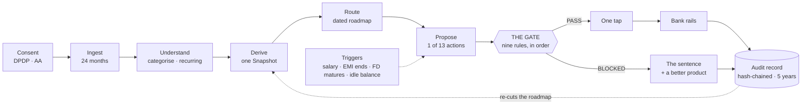

# The three diagrams

Three slides need a drawing: 5 (process flow), 7 (architecture) and — optionally — 3 or 13
(the gate itself). Mermaid source is given so nothing has to be invented; **redraw them as
native vector shapes in the deck's palette**, do not paste a rendered Mermaid PNG. Mermaid
default styling will make the deck look like a README.

Palette reminder: ink `#0E3329`, brand `#016A4D`, ground `#F6F2EA`, success `#D6EC8C`,
danger `#B3261E`, hairline `rgba(14,51,41,0.12)`.

---

## §1 — Process flow (Slide 5)

**Shape:** a left-to-right spine of eight steps, with the gate raised out of the line.
Everything is ink-on-cream except the gate, which is solid `brand` green with cream text,
and the record, which is outlined in green.

```
 CONSENT  →  INGEST  →  UNDERSTAND  →  DERIVE  →  ROUTE  →  PROPOSE  →  ⟨ GATE ⟩  →  RECORD
 DPDP,       IDBI core   categorise,   one        goal →    one action   nine rules   hash-chained,
 per block   banking     recurring,    Snapshot   dated     from a       in order     5-year
 Account     + AA        idle cash,               roadmap   closed
 Aggregator  feeds       life events              (cover    set of 13    PASS ──→ one tap ──→ bank rails
                                                  first)                 BLOCKED → the sentence
                                                                                  + a better product
```

**Draw it as:** one horizontal rail of seven plain chips, with step 7 (GATE) as a raised
green hexagon or rounded square, visibly larger, breaking the rail's baseline. Two arrows
leave the gate — one down-right to a green `PASS → one tap → executed → record` line, one
down-left to a `BLOCKED → the sentence → a better product → record` line in `danger` red.
**Both arrows end at the same RECORD block.** That is the point: a refusal is recorded
exactly like a sale.

Two dotted feedback arrows, thin and unlabelled except at their source:
- `RECORD ⇢ DERIVE` labelled *re-cuts the roadmap*
- `TRIGGERS ⇢ PROPOSE` labelled *salary · EMI ends · FD matures · idle balance*

Mermaid source, if it helps you read the topology:



---

## §2 — Architecture (Slide 7)

**Shape:** four horizontal bands, widest at the top. Bands are `groundDeep` panels with a
hairline border. **Four boxes are filled solid `brand` green** — they are where the
interesting decisions live, and the caption says so.

```
┌─ CHANNEL ─────────────────────────────────────────────────────────────────┐
│  apps/mobile — Expo · React Native · NativeWind                           │
│  Home · Plan · Uday · Grow · Protect        [Ask Uday: full-screen video]  │
│  ships as a module inside IDBI GO Mobile+   [Simulated clock ●green]       │
└───────────────────────────────────────────────────────────────────────────┘
        │ every figure on every screen          ↕ audio in · video out
┌─ API — the only process that holds a secret ──────────────────────────────┐
│  [GET /view ●green]  the one object every screen reads                    │
│  [routes/avatar ●green]  credential pool · minute budget · reaper          │
│  51 routes, all registry-declared · OpenAPI generated from the registry   │
└───────────────────────────────────────────────────────────────────────────┘
┌─ ENGINE — pure, zero I/O, server-side only ───────────────────────────────┐
│  core: categorise · recurring · derive · roadmap · dailyplan · insights   │
│  [THE GATE ●green: nine rules, earliest failure wins]                     │
│  [contracts ●green: zod schemas — the registry IS the declaration]        │
└───────────────────────────────────────────────────────────────────────────┘
┌─ DATA & PROVIDERS ────────────────────────────────────────────────────────┐
│  IDBI sandbox adapter        Account Aggregator      PostgreSQL           │
│  24 ops / 29 paths           6 calls + 2 webhooks    seeded, hash-checked │
│  from 42 captured bodies                                                  │
│                          ┆ Runway Characters ┆ LiveKit ┆  (outside, dotted)│
└───────────────────────────────────────────────────────────────────────────┘

CROSS-CUTTING, drawn as a vertical strip down the right edge, spanning all four bands:
  consent ledger · suitability service · explanation store · audit vault (5-yr)
```

**Two arrows to label explicitly, because they are the security story:**
- API → client: *"short-lived LiveKit token, never a key"*
- Client ↔ LiveKit: *"audio in · video out"* — the media never touches our server

Runway and LiveKit sit **outside** the bands, in dotted outline, to make it obvious they
are third parties and that swapping them is one interface.

---

## §3 — The gate (optional, Slide 3 or 13)

If there is room for a fourth drawing, this is the one worth the space: nine rules in three
groups, and both exits.

```
  IS THE CUSTOMER SAFE?          DOES IT FIT THE CUSTOMER?       DOES IT FIT THE GOAL?
  1 Expensive debt first         4 Within your risk profile      7 Lock-in vs. horizon
  2 Missed repayments first      5 No market risk on near goals  8 Tax benefit unavailable
  3 A buffer before lock-in      6 Only what you can spare       9 Bundled cover + investment
          │                              │                               │
          └──────────────────────────────┴───────────────────────────────┘
                                         ▼
                        ┌────────────────┴────────────────┐
              ● PASS (green #016A4D)          ● BLOCKED (red #B3261E)
              all nine passed                 the FIRST failing rule, and only that one
                                              + the sentence the customer hears
                                              + a better product, where one exists
```

Caption under it, verbatim — it is the single best sentence in the deck:

> **Rule 9, on a product IDBI sells:** *"No. It costs 3 times what a term plan costs for the
> same job, and the charges are hidden inside it. IDBI sells this one and I am still telling
> you not to buy it."*

Footnote, small: *Pure protection — term, health, the government schemes — is exempt from
rules 1–3. A customer in debt with dependants needs cover more, not less. A ULIP is not
protection, so every rule applies to it.*

---

## What not to draw

- No "AI brain", no neural-network mesh, no glowing orb
- No isometric 3D servers
- No clip-art padlock for the security band — a hairline box labelled *"the only process
  that holds a secret"* says more
- No arrows that do not carry a label. If an arrow's meaning is not worth four words, the
  boxes should be adjacent instead
